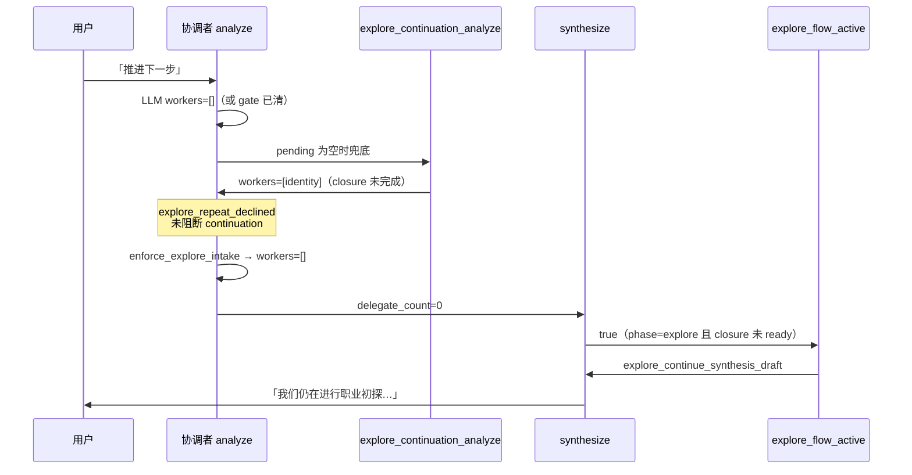
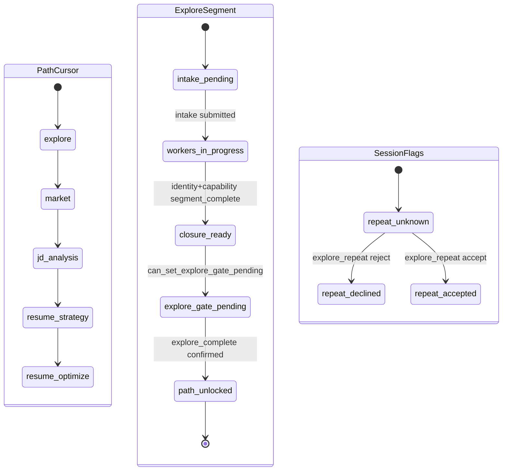

# Pipeline `current_phase` 与初探流 `explore_flow_active` 状态机 — 设计规格（讨论稿）

| 属性 | 内容 |
|------|------|
| 状态 | **已实现** |
| 版本 | **0.2.0** |
| 日期 | 2026-06-02 |
| 触发 | Demo 会话「失忆」根因分析之二：历史注入无法单独修复阶段/初探语义错乱 |
| 关联 | [task-system-pipeline-upgrade](./2026-06-01-task-system-pipeline-upgrade-design.md)、[coordinator-full-chat-history](./2026-06-02-coordinator-full-chat-history-design.md)、[profile-long-term-memory](./2026-06-02-profile-long-term-memory-design.md)、[10-会话闸门与state](../../architecture/10-会话闸门与state.md) |
| 实现计划 | [2026-06-02-pipeline-phase-explore-state.md](../plans/2026-06-02-pipeline-phase-explore-state.md) |

---

## 0. 摘要

协调者 **chat history 分窗**（v0.4）已交付，但 Demo 仍出现「用户已拒绝重做初探、JD/市场已有产物，回复仍像卡在初探」等现象。根因是 **多套并行信号未形成单一状态机**：

| 信号 | 存储 | 典型问题 |
|------|------|----------|
| `meta.current_phase` | `data/tasks/{list_id}/meta.json` | Worker 已跑 `market`/`opportunity`，**phase 仍为 `explore`** |
| `explore_gate_confirmed` | `state.json` | `explore_repeat` **reject** 可置位，**不等价** `explore_complete` |
| `explore_closure` | `state.json` | `worker_done.identity/capability=false` 时 **`explore_flow_active` 恒 true** |
| `prior_results` | `state.json` | 有 JD 链产物，但 **不驱动** `current_phase` 前进 |
| `pipeline_phase`（analyze 输出） | 当轮内存 | `infer_*` 与 `get_current_phase` **过滤口径不一致** |

本期 spec **只讨论并收敛状态语义与转换**，不重复 history 注入方案。

### 拍板摘要（2026-06-02）

| ID | 结论 |
|----|------|
| Q1 | `explore_complete` 确认后 **`current_phase → market`** |
| Q2 | `explore_repeat` reject **等价跳过深探收束**：同步 `explore_closure.completed` + **推进 phase**（见 §5.1） |
| Q3 | `explore_gate_confirmed` ⇒ **`explore_flow_active=false`** |
| Q4 | **A**：`current_phase` **仅**由显式事件写入（Worker 完成、`jump_to_phase`、`advance_current_phase`、§5.1 闸门）；**禁止**按 `prior_results` 每轮 reconcile |
| Q5 | `enforce_pipeline_phase_rules` **始终**以磁盘 **`meta.current_phase`** 过滤 workers；`infer_pipeline_phase` 仅作 LLM/追踪辅助，**不得**改变过滤 phase |
| Q6 | **一次性迁移**存量 pipeline 数据；**不**保留旧双轨/惰性 reconcile 兼容 |

---

## 一、现状与复现（Demo）

### 1.1 观测会话（内部分析样本）

| 项 | 值 |
|----|-----|
| session | `sess_4936a0a7…`（`backend/data/demo/sessions/`） |
| list | `list_f46999d2bcaa` |
| 用户可见 | `messages.json` 完整；多轮已做市场/JD |
| 协调者表现 | 空 workers + `explore_continuation`；synthesize 走 **初探兜底** 文案 |

### 1.2 磁盘快照（矛盾组合）

```json
// meta.json（节选）
{ "list_type": "pipeline", "current_phase": "explore" }

// state.json（节选，逻辑矛盾并存）
{
  "explore_gate_confirmed": true,
  "gates": { "flags": { "explore_repeat_declined": true, "explore_gate_confirmed": true } },
  "explore_closure": {
    "worker_done": { "identity": false, "capability": false },
    "completed": false,
    "gate_pending": false
  },
  "prior_results": {
    "market": { "...": "..." },
    "opportunity": { "...": "..." }
  }
}
```

### 1.3 因果链（单轮 chat）



### 1.4 关键代码锚点（现状）

| 行为 | 位置 | 现状语义 |
|------|------|----------|
| `explore_flow_active` | `session_activity.py` | `current_phase==explore` 且 `explore_closure` 存在且 **未** `is_closure_ready` |
| `explore_continuation_analyze` | `explore_closure.py` | 仅看 `is_pipeline_explore_phase` + incomplete workers；**不看** `explore_gate_confirmed` / `explore_repeat_declined` |
| `explore_repeat` reject | `api/chat.py` | `explore_repeat_declined` + 若 intake 已提交 → **`set_explore_gate_confirmed(true)`**；**不**写 `explore_closure.completed`、**不** `set_current_phase` |
| `filter_workers_for_pipeline` | `pipeline_routing.py` | `phase==explore` 且 `explore_gate_confirmed` → 允许 JD chain；但 `enforce_*` 仍按 **`current_phase`** 过滤 |
| `explore_complete` confirm | `api/chat.py` | 置 `explore_closure.completed`、`explore_gate_confirmed`、`profile.exploration.completed_at`；**仍不**自动 `current_phase=market` |
| phase 写入 | `pipeline_gates.jump_to_phase` / `advance_current_phase` | 闸门与 jump 会写 phase；**Worker 完成当前不写**（Q4 待补） |

---

## 二、问题陈述（待修复类）

### P1 — `current_phase` 与 `prior_results` 脱节

- **现象**：JD 链 Worker 已有结构化产物，`meta.current_phase` 仍为 `explore`。
- **影响**：`is_pipeline_explore_phase`、`build_session_activity`、phase 级 fallback 均按 **explore** 展示与路由。
- **根因**：完成 `market`/`opportunity` **没有** Harness 事件调用 `TaskStore.set_current_phase`。

### P2 — `explore_gate_confirmed` 多入口、语义不等价

| 入口 | 副作用 |
|------|--------|
| `explore_complete`（闸门 confirm） | `explore_closure.completed`、`profile.completed_at`、`fresh_pass`、清 explore works |
| `explore_repeat` reject + intake 已提交 | **仅** `explore_gate_confirmed=true` + `explore_repeat_declined` |

- **现象**：用户明确「不做再次初探」后，G-06 意义上已可 jump 后四步，但 **closure / UI 活动条仍显示初探进行中**。
- **与 pipeline spec G-01 张力**：G-01 以 session `explore_gate_confirmed` 解禁后四步；与「初探收束未完成」的产品叙事冲突。

### P3 — `explore_flow_active` 与「已解禁 JD」并存

- **条件**：`current_phase=explore` + `explore_closure` 未 ready → `explore_flow_active=true`。
- **现象**：`delegate_count==0` 时 synthesize **强制**初探口吻（`explore_continue_synthesis_draft`），即使用户在谈 JD/下一步。
- **与 P1/P2 叠加**：gate 已 confirmed、repeat 已 declined，仍走初探兜底。

### P4 — `explore_continuation_analyze` 与用户意图冲突

- `enforce_explore_intake` 在 `explore_repeat_declined` 时清空 workers，但 **之前或之后** continuation 仍可能塞入 `identity`/`capability`（coordinator analyze 节点顺序：continuation **在** intake enforce **之前** 写入 pending，intake 再清空——表现为 trace 有 continuation、最终无 delegate，但 synthesize 仍可能因其它路径触发初探稿）。
- **缺口**：continuation **不** 识别 `explore_repeat_declined`、`explore_gate_confirmed`、`prior_results` 已含 JD 链。

### P5 — analyze 内 `pipeline_phase` 推断 vs 过滤双轨

```text
enforce_pipeline_phase_rules:
  phase ← infer_pipeline_phase_from_workers(workers) 或 current_phase
  filter_workers_for_pipeline(..., phase=current_phase)  # 注意：过滤用 current_phase
```

- LLM 推断「应在 market」，过滤仍按 **meta explore** 裁掉非 explore primary workers → 易出现 **空 workers + explore 兜底**。

---

## 三、目标 / 非目标

### 3.1 目标（本期讨论要拍板）

1. **单一「路径光标」**：产品/UI/协调者默认只读 **`meta.current_phase`**（或显式重命名后的等价字段），避免与 `pipeline_phase` 推断长期双轨。
2. **初探「流式 UI」与「路径解禁」解耦**：`explore_flow_active` 不得单独因 `explore_gate_confirmed` 仍为 true 而覆盖已进入后段的用户对话。
3. **`explore_gate_confirmed` 语义表**：写清哪些入口可置位、各自必须同步哪些字段（closure / profile / phase）。
4. **显式状态转换**：Worker 完成、闸门 confirm、jump、repeat reject 各自对 `current_phase` / closure 的效应。
5. **continuation / synthesize 兜底规则** 与上表一致，可单测。

### 3.2 非目标

| 项 | 说明 |
|----|------|
| chat history 分窗 / `history_scope` | 见 [coordinator-full-chat-history](./2026-06-02-coordinator-full-chat-history-design.md) |
| explore 深度 6+2+1 轨道 | 仍属 pipeline-upgrade 范围；本期只处理与其 **交界** 的 phase/closure |
| 前端任务树大改 | 可消费新 `session_activity` 契约，但不展开 UI spec |
| 惰性 reconcile / 旧架构兼容 | Q6：**一次性迁移**后删除；运行期不按 `prior_results` 猜 phase |

---

## 四、概念模型（已确认）

### 4.1 三层状态（建议 SSOT 分工）



| 层 | 字段 | 职责 |
|----|------|------|
| **路径光标** | `meta.current_phase` | 用户当前主路径步；驱动 allowed_workers、activity headline、phase fallback |
| **初探段内** | `explore_closure.*` | 仅当 `current_phase==explore` 时约束 identity/capability 顺序与 `explore_complete` 闸门 |
| **会话解禁** | `explore_gate_confirmed` | G-06：允许 jump 与非 explore delegate（**不等于**「仍在初探流 UI」） |

**原则（已确认）**：

- **Q3**：`explore_gate_confirmed=true` ⇒ `explore_flow_active=false`（synthesize 不用初探兜底）；closure 未 ready 仅影响 **能否挂 `explore_complete`**。
- **Q2**：`explore_repeat_declined` ⇒ **禁止** `explore_continuation_analyze`；解禁后派工由 **磁盘 `current_phase`** + fallback / LLM 负责。
- **Q4**：`market` / `opportunity` 等 **segment_complete** 时 Harness **必须** `set_current_phase`（§5.2）；**禁止** chat 入口 reconcile。

### 4.2 `explore_flow_active`（目标态 v0.2）

| 条件 | v0（现状） | v0.1（草案 A） |
|------|------------|----------------|
| 非 pipeline / 非 explore phase | false | false |
| `explore_intake_blocked` | false | false |
| 无 `explore_closure` | false | false |
| `explore_gate_confirmed` | **不检查** | **true → false** |
| `explore_repeat_declined` | **不检查** | **true → false** |
| closure `gate_pending` | false | false |
| `is_closure_ready` | false → active | 同左 |

```python
# 目标实现 — Q3/Q2
def explore_flow_active(session_state) -> bool:
    if not is_pipeline_explore_phase(session_state):
        return False
    if session_state.get("explore_intake_blocked"):
        return False
    if is_explore_gate_confirmed(session_state):
        return False
    flags = (session_state.get("gates") or {}).get("flags") or {}
    if flags.get("explore_repeat_declined"):
        return False
    closure = session_state.get("explore_closure") or {}
    if not closure or closure.get("gate_pending"):
        return False
    return not is_closure_ready(closure)
```

---

## 五、状态转换表（已确认）

### 5.1 闸门 / 用户动作

| 事件 | `explore_gate_confirmed` | `explore_closure` | `profile.exploration` | `current_phase` |
|------|--------------------------|-------------------|----------------------|-----------------|
| intake submit | — | init / 保持 | intake 写入 | **保持 explore**（Q16） |
| `explore_complete` confirm | true | `completed=true` | `completed_at`、baseline | **→ market**（**Q1**） |
| `explore_repeat` reject + intake 已有 | true | `completed=true` | 写 `completed_at`（与 complete 对齐） | 见下表 **repeat reject 推进规则** |
| `jump_to_phase(T)` | 非 explore 需已 confirmed | 清 flag 见 `pipeline_gates` | — | → `T` |
| `explore_repeat` accept | false | reset workers | 新 baseline 流程 | → explore |

**`explore_repeat` reject 推进规则（Q2）**（在置 `explore_gate_confirmed` 与 `closure.completed` 之后，**一次** `set_current_phase`）：

| `prior_results` 条件 | 目标 phase |
|----------------------|------------|
| 已有 `opportunity`（segment_complete 或等价完成态） | `jd_analysis` |
| 仅有 `market` 完成 | `market` |
| 均无 | `market`（与 Q1 默认离开 explore 一致） |

### 5.2 Worker 完成 → `set_current_phase`（Q4-A，必须实现）

| Worker | `current_phase` 更新 | 触发点 |
|--------|----------------------|--------|
| `identity` / `capability` | 不推进 | 仅 `mark_worker_done` |
| `market` | → `market` | `segment_complete` 后 coordinator delegate 收尾 |
| `opportunity` | → `jd_analysis` | 同上 |
| `strategy` | 保持 / 配合 `strategy_complete` flag | 现有 gate 流；进入策略步时 phase 应为 `resume_strategy` |
| `optimize_confirm` | → `resume_optimize` | 现有 `advance_current_phase` |

> **禁止**：根据 `prior_results` 在 `POST /v1/chat` 入口推断并改写 phase（Q4/Q6）。

### 5.3 `enforce_pipeline_phase_rules`（Q5）

| 项 | 规则 |
|----|------|
| **过滤 phase** | **恒为** `get_current_phase(session_state)`（读 `meta.json`） |
| `pipeline_phase` / `infer_pipeline_phase_from_workers` | 可写入 analyze 结果供 LLM/ trace；**不得**传入 `filter_workers_for_pipeline(..., phase=...)` 替代磁盘 phase |
| P5 根因修复 | 删除或收窄「推断 phase 与过滤 phase 不一致」路径 |

### 5.4 `explore_continuation_analyze`

| 前置 | 行为 |
|------|------|
| `explore_repeat_declined` | **return None** |
| `explore_gate_confirmed` | **return None**（解禁后由 phase fallback / LLM 负责） |
| `explore_closure.completed` | **return None** |
| `current_phase != explore` | **return None**（已有） |
| 否则 | 维持：派下一个 incomplete explore worker |

### 5.5 存量数据迁移（Q6）

| 项 | 约定 |
|----|------|
| 范围 | 所有 `list_type=pipeline` 的 `meta.json` + 绑定 `state.json`（含 demo） |
| 方式 | **一次性脚本**（可 `make migrate-pipeline-phase` 或 pytest 附带 dry-run） |
| 规则 | 按 `prior_results` + `explore_gate_confirmed` + `gates.flags` **推导** 目标 `current_phase` 与 `explore_closure.completed`；与 §5.1–5.2 **目标态** 对齐 |
| 兼容 | **不**保留运行期惰性 reconcile、**不**保留「仅 gate 置位不写 phase」旧语义 |
| 发布后 | 新代码只认迁移后 schema；开发环境可删旧 demo 会话重建 |

---

## 六、与既有 spec 的边界

| 文档 | 关系 |
|------|------|
| [2026-06-02-coordinator-full-chat-history-design](./2026-06-02-coordinator-full-chat-history-design.md) | **已完成**；本期不改 analyze/synthesize 分窗 |
| [2026-06-01-task-system-pipeline-upgrade](./2026-06-01-task-system-pipeline-upgrade-design.md) | G-01/G-06/C2 仍有效；本期 **细化** `explore_gate_confirmed` 与 `current_phase` 同步，必要时 **修订** G-01 与 UI 活动条表述 |
| [10-会话闸门与state](../../architecture/10-会话闸门与state.md) | 实现后回写 §2 `state.json` 字段说明与 phase 图 |

---

## 七、确认记录（Q 表）

| ID | 结论 | 说明 |
|----|------|------|
| **Q1** | **自动 → `market`** | `explore_complete` 确认后立即 `set_current_phase` |
| **Q2** | **等价跳过深探收束** | `closure.completed` + `profile.completed_at` + phase 按 §5.1 表推进 |
| **Q3** | **是** | §4.2 |
| **Q4** | **A** | 显式事件写 phase；**无**运行期 reconcile |
| **Q5** | **磁盘 `current_phase`** | §5.3 |
| **Q6** | **一次性迁移** | §5.5；不保留旧架构 |

---

## 八、验收标准（实现期）

1. **复现用例**：在 `explore_gate_confirmed=true`、`explore_repeat_declined=true`、`current_phase=explore`、`prior_results` 含 market+opportunity 的 fixture 上，用户说「推进下一步」→ **不得** 输出 `explore_continue_synthesis_draft` 初探兜底；应进入 JD/phase 相关回复或派工。
2. **`explore_continuation_analyze`**：上述 fixture 返回 `None`。
3. **闸门路径单测**：`explore_repeat` reject 与 `explore_complete` 对 `explore_closure` / `current_phase` 的效应符合 §5.1 拍板列。
4. **phase 一致性**：`market` / `opportunity` **segment_complete** 后，下一次读 `meta.current_phase` 已为 §5.2 对应值（**无** chat 入口 reconcile）。
6. **迁移**：脚本 dry-run + apply 后，Demo 矛盾快照类 fixture 通过 §8.1–2。
5. **回归**：`pytest` 现有 pipeline / gate / coordinator 用例全绿；新增 ≥3 个针对本 spec 的 harness 单测。

---

## 九、风险与边界

| 风险 | 缓解 |
|------|------|
| 自动推进 phase 与 **用户 jump 回 explore** 冲突 | `jump_to_phase(explore)` 清 gate/closure 已有逻辑；需测清场后 `prior_results` 是否仍误导 LLM |
| `explore_gate_confirmed` 提前置位导致 **未建档** 进 JD | 仍保留 `check_jd_prerequisites` onboarding；与 G-01 一致 |
| 历史脏数据 phase 错误 | Q6 迁移 + Q4 禁止 reconcile；迁移前会话可能需重建 |
| 与 depth 6+2+1 轨道交叉 | closure 未 ready 时是否允许 `explore_complete` pending — 沿用 `can_set_explore_gate_pending` |

---

## 十、建议实施顺序

1. Harness：`explore_flow_active`、`explore_continuation_analyze`（§4.2、§5.4）。
2. 闸门：`explore_complete` / `explore_repeat` reject 对齐 §5.1（含 `set_current_phase`）。
3. Worker 收尾：`market` / `opportunity` **segment_complete** → §5.2 `set_current_phase`。
4. `enforce_pipeline_phase_rules`：§5.3（Q5）。
5. **迁移脚本** §5.5 + 单测；Demo 手工验证。
6. 架构 doc `10` 增量。

---

## 十一、文档变更记录

| 版本 | 日期 | 说明 |
|------|------|------|
| 0.1.0 | 2026-06-02 | 讨论稿 |
| 0.2.0 | 2026-06-02 | Q1–Q6 拍板写入；§5 定稿 |
| 0.2.0-plan | 2026-06-02 | 实现计划： [plans/2026-06-02-pipeline-phase-explore-state.md](../plans/2026-06-02-pipeline-phase-explore-state.md) |
| 0.2.1 | 2026-06-02 | 代码落地 + pytest 258 passed |

---

*文档结束 — v0.2 已确认，可进入 implementation plan 与编码。*
