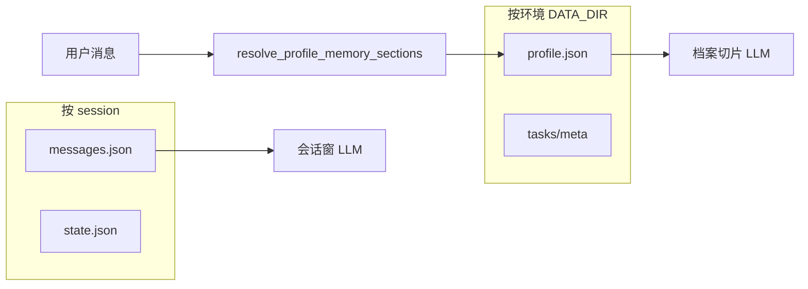
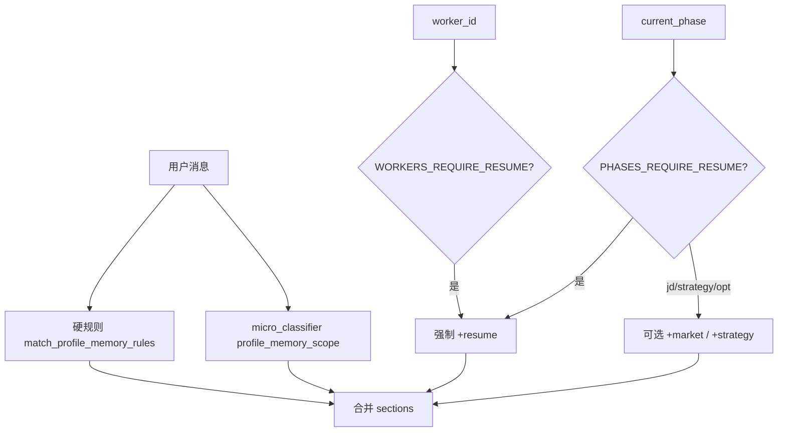
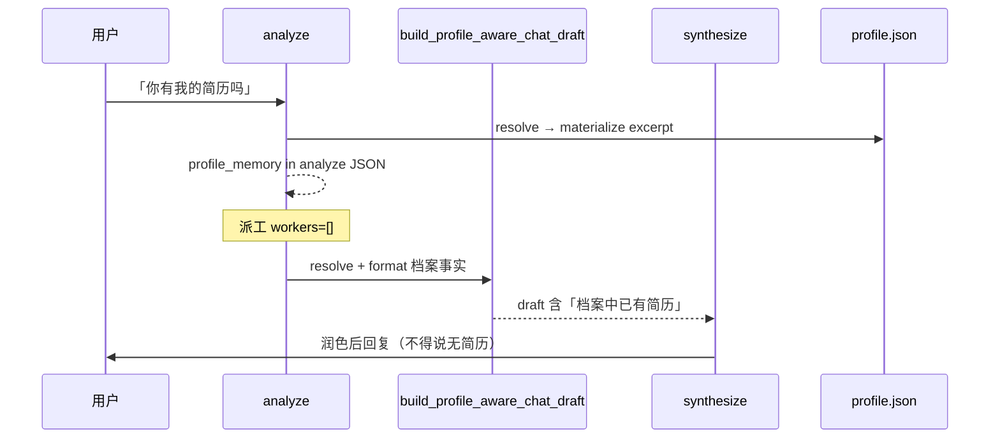

# 档案长期记忆（profile_memory）按需注入 — 设计规格

| 属性 | 内容 |
|------|------|
| 状态 | **已实现** |
| 版本 | **0.1.0** |
| 日期 | 2026-06-02 |
| 适用范围 | `ProfileStore`、`micro_classifier`、`协调者 analyze` / **synthesis draft**、Worker ReAct |
| 关联 | [10-会话闸门与state.md](../../architecture/10-会话闸门与state.md) §1.1、[chat-history spec](./2026-06-02-coordinator-full-chat-history-design.md)、[pipeline-phase spec](./2026-06-02-pipeline-phase-explore-state-design.md) |
| 实现计划 | [../plans/2026-06-02-profile-long-term-memory.md](../plans/2026-06-02-profile-long-term-memory.md) |

---

## 0. 摘要

**问题**：`data/{env}/profile.json` 为跨 session 长期事实（含初探表简历），但用户在新会话问「有没有我的简历」时，协调者仅依据 **本会话** `messages.json` 生成回复，声称「尚未拿到简历」，与任务列表 / 档案事实矛盾。

**原则**：

1. **档案 ≠ 会话历史**：`messages.json` 按 session 隔离；`profile.json` 按环境（`DATA_DIR`）共享。
2. **synthesize 只润色**：档案事实须在 **生成 `synthesis_draft` 之前** 写入 draft（或 Worker / analyze 的 LLM 输入），**不在** `build_synthesis_messages` 中重复塞入全文档案。
3. **按需加载**：根据用户当前消息（+ 当前 Worker / phase）判定加载哪些档案切片，避免每轮全量 profile。

---

## 一、存储分层（SSOT）

| 层级 | 路径 | 生命周期 | 典型内容 |
|------|------|----------|----------|
| 会话历史 | `sessions/{id}/messages.json` | 单 session | 用户/助手气泡 |
| 会话状态 | `sessions/{id}/state.json` | 单 session | 闸门、`prior_results`、`explore_closure` |
| **长期档案** | **`profile.json`** | **同环境跨 session** | 简历、`exploration`、market、strategy… |
| 任务光标 | `tasks/{list_id}/meta.json` | 绑定 session 的 pipeline | `current_phase` |

**环境隔离**：`make dev demo` → `data/demo/profile.json`；`make dev test` → `data/test/profile.json`。A 环境上传的简历，B 环境 **读不到**。

---

## 二、档案切片（section）

逻辑切片 id → `ProfileStore.get` 路径前缀：

| section id | 加载路径 | 物化字段（`profile_memory` 内） | 说明 |
|------------|----------|----------------------------------|------|
| `resume` | `resume`, `exploration` | `resume.*` | 含 `source_text` / `intake.resume_text`、`resume_on_file`、`summary` |
| `basic_intent` | `basic`, `intent` | `basic`, `intent` | 姓名、年限、薪资、目标岗等 |
| `exploration` | `exploration` | `exploration` | **不含** `intake` 全文（避免重复简历） |
| `market` | `market` | `market` | 市场分析落档 |
| `strategy` | `strategy` | `strategy` | 简历策略落档 |
| `capability` | `capability` | `capability` | 能力素材 |

物化 API：`materialize_profile_memory(sections, full_resume_text=bool)`。

### 2.1 简历字段（`resume` 切片）

| 字段 | 含义 |
|------|------|
| `resume_on_file` | `resume.source_text` 或 `exploration.intake.resume_text` 非空 |
| `intake_submitted` | `exploration.intake.submitted_at` 存在 |
| `submitted_at` | 初探表提交时间 |
| `summary` | 姓名 · 年限 · 目标岗（一行） |
| `source_excerpt` | analyze / chat draft 用，默认最多 **1200** 字 |
| `source_text` | Worker 必填场景：**全文** |

---

## 三、切片解析（resolve）

`resolve_profile_memory_sections(user_message, session_state, worker_id=None) -> list[str]`

合并顺序（去重后按固定顺序输出）：

### 3.1 硬规则（`micro_classifier_rules`）

| 触发语义 | 默认 sections |
|----------|----------------|
| 简历 / resume / cv / 履历 / 「有没有我的」 | `resume`, `basic_intent` |
| 初探 / 职业方向（无「简历」字样） | `exploration`, `resume`, `basic_intent` |
| 市场 / JD / 岗位 / 匹配 | `market`, `resume` |
| 策略 / 简历优化 | `strategy`, `resume` |
| 薪资 / 目标岗 / 建档 | `basic_intent` |
| 「有没有」「档案」 | `resume`, `basic_intent`, `exploration` |

### 3.2 微分类（`profile_memory_scope`）

| 项 | 约定 |
|----|------|
| 任务名 | `profile_memory_scope` |
| 输入 | `user_message`, `current_phase`, `worker_id`, `list_type` |
| 输出 | `{ "sections": [...], "confidence", "reason", "source" }` |
| 规则优先 | 硬规则命中则 **不调用** LLM |
| LLM 阈值 | `confidence >= history_scope_llm_accept_threshold`（默认 0.75） |
| Prompt | `platform/prompt/micro_classifier/profile_memory_scope/system.md` |

### 3.3 简历必填（产品约束）

**Worker 级（LLM 调用必须带 `resume.source_text` 全文）**：

| Worker | 说明 |
|--------|------|
| `market` | 市场分析 |
| `opportunity` | JD 分析 |
| `strategy` | 简历优化策略 |
| `resume` | 简历优化 |
| `asset` | 简历优化资产 |

常量：`WORKERS_REQUIRE_RESUME`。

**Phase 级（`current_phase` 属于下列阶段时，至少强制 `resume`；并按阶段附带 market/strategy）**：

| `current_phase` | 强制切片 |
|-----------------|----------|
| `market` | `resume` |
| `jd_analysis` | `resume`, `market` |
| `resume_strategy` | `resume`, `market`, `strategy` |
| `resume_optimize` | `resume`, `market`, `strategy` |

常量：`PHASES_REQUIRE_RESUME`。

---

## 四、注入点（与 synthesize 边界）

| 节点 | 是否注入 `profile_memory` | 简历形态 | 说明 |
|------|---------------------------|----------|------|
| **analyze** | 是 | `source_excerpt` + 标志位 | `analyze_payload.profile_memory*` |
| **synthesis draft**（无 Worker） | 是（写入 **draft 文本**） | excerpt + 事实句 | `build_profile_aware_chat_draft` |
| **synthesize LLM** | **否（不新增全文档案）** | — | 仅润色已含档案事实的 `draft`；可保留 `pipeline` / `session_activity` 纠偏阶段 |
| **Worker ReAct boot** | 是 | 必填 Worker → **全文** `source_text` | `context.profile_memory` |

### 4.1 `build_profile_aware_chat_draft`

替代纯 `chat_only_synthesis_draft` 用于 **无 delegate** 的 synthesize 分支：

1. `resolve_profile_memory_sections(user_message, session_state)`
2. `materialize_profile_memory(sections, full_resume_text=False)`
3. 拼接 `chat_only_synthesis_draft(session_state)`（含 pipeline SSOT）
4. 追加 **【本回合档案事实】** 段落（`format_profile_memory_for_draft`）

硬性提纲要求：`resume_on_file=true` 时 **不得** 声称没有用户简历。

### 4.2 Worker `delegate_context`

`attach_profile_memory_to_context(context, user_message, session_state, worker_id=...)`：

- 写入 `profile_memory`、`profile_memory_sections`
- `worker_id in WORKERS_REQUIRE_RESUME` → `full_resume_text=True`

Worker ReAct `react_boot_user` JSON 已含 `context.profile_memory`（现有 boot 结构，无需改协议形状）。

---

## 五、与相关能力边界

| 能力 | 关系 |
|------|------|
| [chat-history](./2026-06-02-coordinator-full-chat-history-design.md) | 会话 **轮次窗**；profile_memory 是 **档案切片**，正交 |
| [pipeline-phase](./2026-06-02-pipeline-phase-explore-state-design.md) | `current_phase` 影响必填切片与 `chat_only` 中的 pipeline 提纲 |
| `explore_intake_payload`（analyze 已有） | 与 `profile_memory.resume` 互补；analyze 可同时带两者 |
| `explore_continue_synthesis_draft` | **本期未改**；仍仅在 `explore_flow_active` 时使用；若问档案可考虑后续复用 `build_profile_aware_chat_draft` |

---

## 六、模块与文件

| 路径 | 职责 |
|------|------|
| `harness/profile_memory.py` | resolve / materialize / draft / attach |
| `harness/micro_classifier_rules.py` | `match_profile_memory_rules` |
| `harness/micro_classifier.py` | 任务 `profile_memory_scope` |
| `platform/prompt/micro_classifier/profile_memory_scope/system.md` | 分类 Prompt |
| `agents/lc/coordinator_llm.py` | analyze 注入 |
| `agents/graphs/coordinator.py` | delegate attach；synthesize 用 `build_profile_aware_chat_draft` |

---

## 七、验收标准

1. demo 环境：`profile.json` 已有简历 + 新 session 问「你有我的简历吗」→ 回复 **承认档案中有简历**，不要求重新粘贴全文。
2. `worker_id=opportunity` 且 `full_resume_text` → `profile_memory.resume.source_text` 非空。
3. 硬规则：「有没有我的简历」→ `resolve` 含 `resume`。
4. analyze payload 在触发切片时含 `profile_memory` / `profile_memory_sections`。
5. `build_synthesis_messages` **不**新增 `profile_memory` 全文字段（回归：仅 draft 带事实）。
6. `pytest tests/harness/test_profile_memory.py` 通过；全量 pytest 通过。

---

## 八、非目标

| 项 | 说明 |
|----|------|
| 跨环境同步 profile | 仍依赖 `DATA_DIR` 隔离 |
| 每轮全量 profile 进 LLM | 禁止；必须 resolve sections |
| 在 synthesize 阶段首次读取档案 | 禁止；事实前置到 draft / analyze / Worker |
| 替换 Worker 内 `profile_patch` 工具 | 仍保留工具写档 |

---

## 九、风险与后续

| 风险 | 缓解 |
|------|------|
| draft 与 analyze 重复简历摘录 | analyze 用 excerpt；draft 用 `format_*` 短句 |
| `explore_continue` 仍不提档案 | 后续 issue：初探兜底改 profile-aware |
| trace 不可见 sections | 可选写入 `state.profile_memory_sections` |

---

## 十、确认记录

| 版本 | 日期 | 说明 |
|------|------|------|
| 0.1.0 | 2026-06-02 | 初版：按需切片 + draft 前置 + Worker 简历必填 |
| — | — | 代码已落地：`tests/harness/test_profile_memory.py` |

---

*文档结束 — 与 `profile_memory.py` 实现保持一致。*
