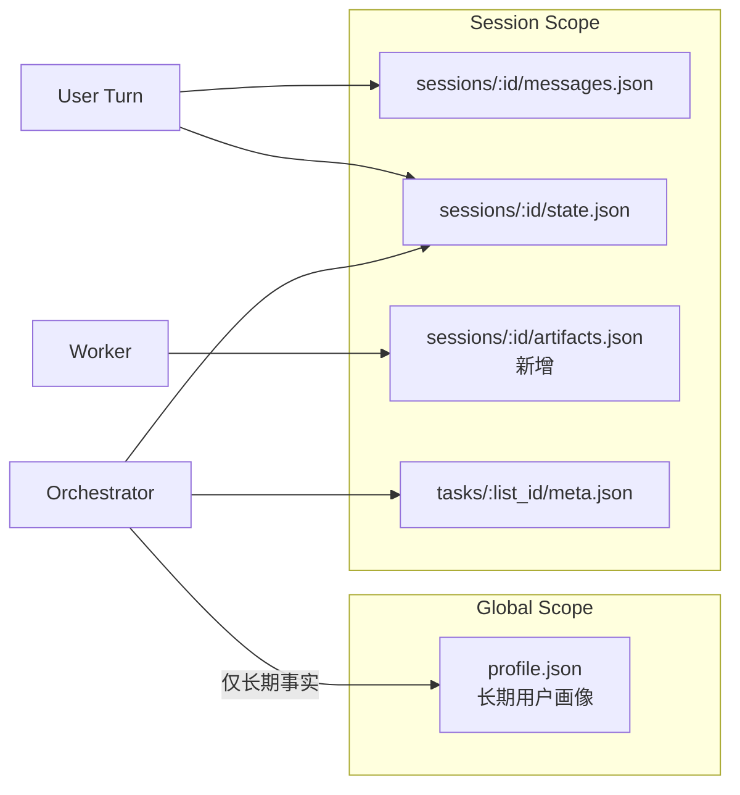

# Profile 与 Session 数据边界重构 — 设计规格

| 属性 | 内容 |
|------|------|
| 状态 | **Implemented** |
| 版本 | **0.1.0** |
| 日期 | 2026-06-02 |
| 适用范围 | `ProfileStore`、`SessionStore`、`TaskStore`、`coordinator/harness` 路由与门禁逻辑 |
| 关联 | `docs/superpowers/specs/2026-06-02-profile-long-term-memory-design.md`、`docs/superpowers/specs/2026-06-01-session-task-isolation-design.md` |

---

## 0. 摘要

### 0.1 问题定义

当前 `profile.json` 同时承载了：

1. 用户长期稳定画像（应跨会话复用）；
2. 会话过程产物（应按 `session_id` 隔离）。

这导致新 session 在未提供当前 JD 的情况下，仍可能读取旧 session 的 `market/strategy/opportunity` 产物，出现跨会话语义污染。

### 0.2 目标

- 建立明确 SSOT：**长期档案归 profile，会话事实归 session**。
- 禁止“会话态字段”继续写入全局 `profile.json`。
- 保留长期可复用价值，同时确保默认会话隔离。

### 0.3 非目标

- 本规格不涉及 UI 交互重构。
- 本规格不引入多租户/多用户账号体系。
- 本规格不修改 LLM provider 或 prompt 供应链。

---

## 1. 设计原则

1. **默认隔离**：凡与“当前会话目标/JD/阶段/gate 决策”强相关的数据，必须 session scoped。
2. **显式复用**：跨会话复用仅针对长期事实，且应可追溯来源。
3. **单一真源**：每个字段只在一个层级可写，避免双写竞争。
4. **向后兼容迁移**：旧数据可读，迁移后可回滚。

---

## 2. 存储分层与职责



---

## 3. 字段分层矩阵（核心）

## 3.1 允许跨会话（保留在 `profile`）

| 字段 | 说明 | 原因 |
|------|------|------|
| `basic` | 基础身份信息 | 长期稳定 |
| `skills` | 技能画像 | 长期稳定 |
| `intent` | 中长期职业意向 | 用户级偏好 |
| `constraints` | 约束偏好 | 用户级偏好 |
| `capability.skill_graph` / `transfer_paths` / `portfolio_summary` | 长期能力画像 | 可复用 |
| `resume.source_text` / `source_path` / `experience_bank` | 简历资产 | 长期资产 |
| `preference_tags` | 偏好标签 | 用户级偏好 |
| `outputs_index` | 简历交付列表（全局） | 产品约束：全局可见 |

## 3.2 必须会话隔离（从 `profile` 迁出）

| 现有字段 | 新归属 | 说明 |
|----------|--------|------|
| `exploration.completed_at` | `state.json` | 本会话流程进度 |
| `exploration.intake*` | `state.json` | 本会话 intake 过程态 |
| `exploration.inner_needs/desires/.../summary` | `sessions/{id}/artifacts.json` | 本会话探索产物 |
| `career.jd_override` | `state.json` | 会话级 gate 决策 |
| `market.role_families/trend_notes/opportunity_snapshots` | `sessions/{id}/artifacts.json` | 会话级 JD 分析产物 |
| `strategy.path_options/selected_strategy/risk_notes/last_reviewed_at` | `sessions/{id}/artifacts.json` | 会话级策略产物 |
| `resume.last_optimization_levels` | `state.json` | 本会话操作选择 |

## 3.3 条件复用（默认不自动注入）

| 数据类型 | 存储策略 | 注入策略 |
|----------|----------|----------|
| 历史 market/strategy 产物 | 仅保留 session artifacts | 仅在用户显式“引用上次结果”时注入 |
| exploration 结论文本 | 保留 session artifacts | 仅摘要提炼为长期事实后可入 `profile` |

---

## 4. 新增数据结构

## 4.1 `sessions/{session_id}/artifacts.json`（新增）

```json
{
  "version": 1,
  "session_id": "sess_xxx",
  "exploration": {},
  "market": {},
  "opportunity": {},
  "strategy": {},
  "resume_outputs": []
}
```

说明：
- 由会话内 worker 产物沉淀；
- 不参与跨 session 默认加载；
- 与 `state.prior_results` 区分：`prior_results` 是运行态，`artifacts` 是持久化产物态。

## 4.2 `state.json` 扩展（仅会话态）

- `explore_completed_at`
- `intake_status`
- `jd_context`
- `optimization_levels`
- `artifact_refs`（可选，显式引用历史 session 产物）

## 4.3 `profile.outputs_index` 推荐结构（全局保留）

```json
{
  "outputs_index": [
    {
      "output_id": "out_01jxxxxxxx",
      "session_id": "sess_xxx",
      "list_id": "list_xxx",
      "kind": "resume_html",
      "path": "output/demo/2026-06-02/resume_标准_AI_Agent_后端开发.html",
      "optimization_level": "标准",
      "jd_fingerprint": "7086c89ee4a67bf0",
      "created_at": "2026-06-02T13:49:00Z",
      "updated_at": "2026-06-02T13:49:00Z",
      "status": "active",
      "meta": {
        "source": "asset_worker",
        "title": "标准版简历"
      }
    }
  ]
}
```

字段约束：
- 必填：`output_id`、`session_id`、`kind`、`path`、`created_at`、`status`
- 推荐：`list_id`、`optimization_level`、`jd_fingerprint`、`updated_at`
- `status` 枚举：`active` / `deleted`

去重与唯一键建议：
- 主唯一键：`output_id`
- 兼容去重键（旧数据无 `output_id` 时）：`(session_id, kind, path)`
- 软删除策略：仅置 `status=deleted`，保留审计记录；读取默认过滤 `deleted`

---

## 5. 读写规则（硬约束）

## 5.1 写入规则

1. Worker 产生的 `market/opportunity/strategy` 结果：写 `artifacts.json`，不得写 `profile.market/profile.strategy`。
2. gate 决策、phase 决策：写 `state.json`，不得写 `profile`。
3. `profile_patch` 工具增加路径白名单：
   - 允许：`basic.*`、`skills.*`、`intent.*`、`constraints.*`、`capability.*`、`resume.source_*`、`resume.experience_bank.*`、`preference_tags.*`
   - 允许（特例）：`outputs_index`（需包含 `session_id` 元数据用于追溯）
   - 拒绝：`exploration.*`、`market.*`、`strategy.*`、`career.jd_override`。
4. `outputs_index` 写入采用 upsert：
   - 有 `output_id`：按 `output_id` 覆盖更新；
   - 无 `output_id`（兼容旧逻辑）：按 `(session_id, kind, path)` 合并。

## 5.2 读取规则

1. `jd_prerequisites`：只看 `session_state`（或 session artifacts），不看 `profile.exploration.completed_at`。
2. `profile_memory`：
   - `resume/basic/intent/capability` 来自 `profile`；
   - `market/strategy/exploration` 来自当前 `session artifacts`。
3. 跨会话引用需显式 `artifact_refs`，默认不加载。
4. `outputs` API 默认返回 `status=active` 的全局列表，并支持 `session_id`、`kind`、`created_at` 范围筛选。

---

## 6. 迁移方案

## 6.1 一次性迁移脚本

迁移目标：
- 扫描现有 `profile.json`；
- 将会话态字段迁移到当前活跃 session 的 `artifacts/state`（若无法确定归属，写入 `orphan_artifacts.json`）；
- 清理 `profile` 中违规字段。

## 6.2 迁移步骤

1. 冻结写入窗口（维护模式）。
2. 备份 `data/*/profile.json`。
3. 执行迁移脚本：
   - 生成 `sessions/{id}/artifacts.json`；
   - 清理 `profile` 会话态字段。
4. 发布新代码（带白名单写保护）。
5. 验证与回归。

## 6.3 回滚策略

- 回滚代码版本；
- 用迁移前 profile 备份恢复；
- 删除新建 `artifacts.json`（或标记失效）。

---

## 7. 接口与模块改造清单

| 模块 | 改造点 |
|------|--------|
| `ProfileStore` | 增加路径白名单校验，拒绝会话态字段写入 |
| `SessionStore` | 增加 `artifacts` 读写 API |
| `explore_intake` | intake 状态落 `state/artifacts`，不再落 `profile.exploration.intake` |
| `jd_prerequisites` | 从 session 读取 explore 完成状态 |
| `profile_memory` | source 分流：global profile + current session artifacts |
| `pipeline_phase_transition` | 不再写 `profile.exploration.completed_at` |
| `outputs` API | 保持全局列表返回；支持按 `session_id` 可选筛选 |

---

## 8. 验收标准

1. 新 session 未提供 JD 时，不得引用历史 session 的 JD 标题或结论。
2. `profile.json` 不再包含 `market/strategy/exploration.intake/career.jd_override`，但保留 `outputs_index`。
3. `profile_patch` 对违规路径返回明确错误码（如 `profile_path_forbidden`）。
4. 同一用户两个 session 并发运行，互不污染 `market/strategy` 回复内容。
5. 迁移后历史会话产物可在对应 session 下查询到。

---

## 9. 测试计划

## 9.1 单元测试

- `ProfileStore` 白名单校验；
- `profile_memory` 分流读取；
- `jd_prerequisites` 仅读 session。

## 9.2 集成测试

- A session 写入 JD 产物，B session 不应自动读到；
- `POST /v1/chat` 在新 session 中不复用旧 strategy 文本；
- outputs 默认全局返回，且可按 `session_id` 过滤。

## 9.3 回归测试

- 现有 resume 优化流程可走通；
- pipeline phase 前进与 gate 逻辑不回退；
- 旧数据迁移后可正常继续对话。

---

## 10. 风险与边界

| 风险 | 影响 | 缓解 |
|------|------|------|
| 历史逻辑高度依赖 `profile.exploration` | 可能导致 gate 判定变化 | 增量改造 + 双读过渡开关 |
| 老数据无法精确归属 session | 产物可追溯性下降 | 写入 `orphan_artifacts` 并人工补录 |
| 全局 `outputs_index` 持续增长 | 查询与去重成本上升 | 增加按 `session_id` / 时间筛选与周期性去重 |

---

## 11. 里程碑建议

1. **M1（防污染）**：白名单写保护 + `jd_prerequisites` 改 session 源。
2. **M2（数据搬迁）**：引入 `artifacts.json` + 读写迁移。
3. **M3（全面切换）**：`profile_memory` 分流、删除 profile 会话态字段依赖。
4. **M4（治理）**：历史产物引用机制与运维脚本。

---

## 12. 版本记录

| 版本 | 日期 | 说明 |
|------|------|------|
| 0.1.0 | 2026-06-02 | 首版：定义 profile/session 边界、迁移与验收 |

