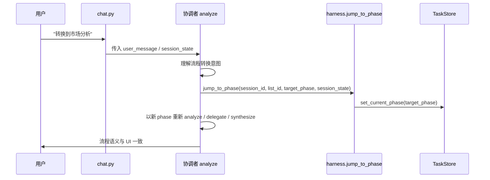

# 自然语言转换到可 jump 流程 — 协调者显式 jump 设计规格

| 属性 | 内容 |
|------|------|
| 状态 | **已实现** |
| 版本 | **0.2.0** |
| 日期 | 2026-06-07 |
| 适用范围 | `POST /v1/chat`、协调者意图识别、`jump_to_phase(...)`、`TaskStore.meta.current_phase` |
| 关联 | [task-system-pipeline-upgrade](./2026-06-01-task-system-pipeline-upgrade-design.md)、[pipeline-intent-phase-transitions](./2026-06-02-pipeline-intent-phase-transitions-design.md)、[pipeline-phase-explore-state](./2026-06-02-pipeline-phase-explore-state-design.md) |

---

## 0. 摘要

当前系统已经支持部分 **显式** `jump_to_phase(...)` 路径，但“转换到初探 / 转换到市场分析 / 转换到 JD 分析 / 转换到简历策略”这类**自然语言流程转换意图**仍然容易只停留在回复层，未必真正写入 `TaskStore.meta.current_phase`。

本 spec 定义一个新的行为边界：

1. **用户口语中的“转换到 xx 流程”视为显式用户意图**，不是普通闲聊。
2. **协调者负责理解该意图**，并将其**显式翻译为**对应的 `jump_to_phase(target_phase)`。
3. **Harness 负责真正落盘**：更新 `TaskStore.meta.current_phase`，并清理与目标不兼容的 session gate / closure 状态。
4. **同轮 analyze / delegate / synthesize** 必须使用新的 phase，保证“话说到了，任务也真的切过去了”。

> 说明：本 spec 只讨论“自然语言转换到可 jump 的流程”。不改变已有正向意图转场规则，也不把“下一步 / 继续”一类模糊表达纳入流程转换；`resume_optimize` 仍然不属于可 jump 目标。

---

## 1. 问题与目标

### 1.1 问题

| 现象 | 根因 |
|------|------|
| 用户说“转换到市场分析 / JD 分析 / 简历策略 / 初探流程”后，回复语义已经切换，但任务 UI 仍停留在旧阶段 | 自然语言流程转换没有真正接到 `jump_to_phase(target_phase)` 的写盘入口 |
| 用户以为自己已经进入目标流程，但 `TaskStore.current_phase` 没有改变 | 协调者理解了意图，却没有把结果落成显式 phase 变更 |
| 现有 `resolve_intent_phase_transition` 会因 rank 过滤把回跳 / 平行跳转直接丢掉 | 当前实现默认只接受“目标 phase 序更靠后”的前进转场 |

### 1.2 目标

| 目标 | 说明 |
|------|------|
| 识别自然语言转换意图 | 用户明确表达“转换到某个可 jump 流程”时，协调者应理解为流程转换意图 |
| 显式写 phase | 识别后应调用 `jump_to_phase(target_phase)`，让任务阶段真实切换到目标流程 |
| 同轮生效 | 本轮 chat 的 analyze / worker 派工 / synthesize 必须读取新 phase |
| 保持长期记忆 | 流程切换只改 session 的流程状态，不删除 profile.long-term memory |

### 1.3 非目标

| 非目标 | 说明 |
|--------|------|
| 自动把所有模糊表达都当流程转换 | “继续聊聊”“再说说”“下一步”不属于流程转换 |
| 修改正向阶段推进语义 | `explore -> market -> jd_analysis -> resume_strategy -> resume_optimize` 保持原逻辑 |
| 改变 `resume_optimize` 的禁止 jump 规则 | 仍然不能 `jump_to_phase(resume_optimize)` |
| 改变前置门槛对市场/JD/策略的要求 | 本 spec 仅补“自然语言转换到可 jump 流程”的显式入口 |

---

## 2. 核心定义

### 2.1 自然语言流程转换意图

以下表达视为**转换到可 jump 流程**的候选意图：

- “转换到初探流程”
- “转换到市场分析流程”
- “转换到 JD 分析流程”
- “转换到简历策略流程”
- “我想切回初探 / 市场分析 / JD 分析 / 简历策略”

> 具体理解范围可继续扩展，但必须满足“明确切换到支持 jump 的目标流程”的语义，不得把一般补充对话误判为流程转换。

### 2.2 目标流程集合

当前允许由自然语言显式转换到的目标 phase 只有：

| target_phase | 含义 | 是否可自然语言触发 |
|--------------|------|--------------------|
| `explore` | 职业初探 | 是 |
| `market` | 市场/趋势分析 | 是 |
| `jd_analysis` | JD/岗位匹配评估 | 是 |
| `resume_strategy` | 简历优化策略制定 | 是 |
| `resume_optimize` | 按策略改简历、生成交付物 | 否，仍需 `optimize_confirm` |

### 2.3 显式 jump 的含义

这里的“显式”不是指 UI 按钮，而是指：

1. 用户**明确表达**流程转换意图；
2. 协调者**理解**该意图；
3. 协调者将其**翻译成** `jump_to_phase(explore)`；
4. Harness 真的写盘。

因此，“自然语言转换到可 jump 流程”在产品语义上仍然属于**显式 jump**，只是其入口是自然语言理解。

---

## 3. 行为规格

### 3.1 总体流程

### 3.2 识别规则

| 规则 ID | 条件 | 行为 |
|---------|------|------|
| `intent_return_phase` | 用户消息明确表达“转换到初探 / 市场分析 / JD 分析 / 简历策略” | 识别为流程转换意图，目标 phase = 对应可 jump 目标 |
| `intent_return_phase` | `gates.pending` 存在且当前消息命中 gate intent | **先走 gate**，不误触发流程转换 |
| `intent_return_phase` | 仅有模糊补充表达，无明确切换到某个可 jump 流程的语义 | 不触发流程转换，继续按当前 phase 处理 |

### 3.3 执行顺序

1. `POST /v1/chat` 收到用户消息。
2. 先处理现有 gate intent。
3. 协调者进行自然语言意图识别。
4. 若识别到 `intent_return_phase`：
   - 校验目标是否属于可 jump 集合
   - `explore` 允许任意时刻跳回
   - `market / jd_analysis / resume_strategy` 仍需满足本次 session 已完成 `explore_complete`
   - 调用 `jump_to_phase(session_id, list_id, target_phase, session_state)`
   - 写入 `TaskStore.meta.current_phase = target_phase`
   - 清理与目标不兼容的 gate / closure 状态
5. 再进入协调者 analyze / delegate / synthesize。

### 3.4 状态清理

`jump_to_phase(target_phase)` 执行后，应保持以下原则：

| 项 | 处理 |
|----|------|
| `TaskStore.meta.current_phase` | 写为 `explore` |
| 当前 phase 的 work | 按既有 `jump_to_phase` 行为清理离开步 work |
| `explore_gate_confirmed` | 仅在跳回 `explore` 时按 jump 清场逻辑重置，避免直接沿用后续阶段的 gate 状态 |
| `explore_closure` | 仅在跳回 `explore` 时清理为未完成 / 未挂闸门的初探态 |
| `profile.json` | **不清除**，长期记忆保留 |

> 注：流程切换是“回到初探流程”，不是“删除已积累的长期档案”。

### 3.5 与现有前进转场的关系

| 场景 | 现有行为 | 本 spec |
|------|----------|---------|
| `explore -> market` | 允许 | 不变 |
| `market -> jd_analysis` | 允许 | 不变 |
| `jd_analysis -> resume_strategy` | 允许 | 不变 |
| `resume_strategy -> resume_optimize` | 仍需 `optimize_confirm` | 不变 |
| `market / jd_analysis / resume_strategy -> explore` | 当前只依赖显式 jump，但自然语言未稳定落盘 | **新增自然语言流程转换识别**，并显式调用 `jump_to_phase(explore)` |
| `explore -> market / jd_analysis / resume_strategy` | 当前已有显式 jump，但自然语言未稳定落盘 | **新增自然语言流程转换识别**，并显式调用 `jump_to_phase(target_phase)` |

---

## 4. 实现边界

### 4.1 推荐模块职责

| 模块 | 职责 |
|------|------|
| `agents/graphs/coordinator.py` | 在 analyze 前理解流程转换意图，决定是否触发 `jump_to_phase(target_phase)` |
| `harness/pipeline_gates.py` | 维持 `jump_to_phase` 的清场与写盘语义 |
| `harness/pipeline_intent_transition.py` | 继续承担前向意图转场；如需，可补一个专门的 flow transition resolver，但不得再用 rank 过滤吞掉可 jump 目标 |
| `api/chat.py` | 维持“把消息交给协调者”的薄入口，不再自行决定流程转换语义 |

### 4.2 允许的实现方式

以下任一方式都可接受：

1. 在协调者 analyze 节点内先理解 `intent_return_phase`，再调用 `jump_to_phase(target_phase)`。
2. 在 `POST /v1/chat` 中由协调者可复用的理解函数先返回 flow transition intent，再交由 Harness 写盘。

**不允许**：

- 仅把流程转换意图写进回复文本，不改 `current_phase`
- 依赖 `resolve_intent_phase_transition` 的前进 rank 逻辑“顺便”处理可 jump 目标
- 把“转换到初探流程”当成普通闲聊句式忽略

---

## 5. 验收标准

1. **自然语言流程切换生效**  
   在 `current_phase=explore` / `market` / `jd_analysis` / `resume_strategy` 的情况下，用户说“转换到某个可 jump 流程”，同轮 `TaskStore.meta.current_phase == 目标 phase`。

2. **UI 与阶段一致**  
   流程切换后任务 UI 显示目标流程为当前阶段，后续阶段按禁用态展示。

3. **长期记忆保留**  
   流程切换不清除 `profile.exploration.completed_at`、`resume`、`market` 等长期档案。

4. **gate 优先**  
   若当前消息命中 gate intent，仍应先走 gate，不被流程转换意图抢跑。

5. **不误伤模糊表达**  
   “继续聊聊 / 下一步 / 再说说” 不应触发流程切换。

6. **同轮生效**  
   协调者 analyze 必须读取已经切回 `explore` 的 phase，而不是旧 phase。

7. **保留原有前进转场**  
   正向 `intent_market / intent_jd_eval / intent_resume_strategy / intent_resume_optimize` 行为不变。

8. **resume_optimize 仍然受限**  
   用户自然语言即使表达“转换到简历优化”，也不能直接跳到 `resume_optimize`，必须继续遵循 `optimize_confirm` 门槛。

---

## 6. 与现有文档的关系

| 文档 | 关系 |
|------|------|
| [pipeline-intent-phase-transitions](./2026-06-02-pipeline-intent-phase-transitions-design.md) | 本 spec **补充**：自然语言转换到可 jump 流程的显式 jump 入口 |
| [task-system-pipeline-upgrade](./2026-06-01-task-system-pipeline-upgrade-design.md) | 保留 `jump_to_phase(explore / market / jd_analysis / resume_strategy)` 的约束与 `resume_optimize` 禁止直跳规则 |
| [pipeline-phase-explore-state](./2026-06-02-pipeline-phase-explore-state-design.md) | 保留 Q4-A：阶段写入仍需显式事件；本 spec 把自然语言流程转换定义成一种显式事件 |

---

## 7. 风险与注意事项

| 风险 | 处理 |
|------|------|
| 将“补充一下”误判为流程切换 | 要求命中明确流程转换语义，不做宽松猜测 |
| 流程切换后又被 analyze 误推回旧 phase | 流程切换写盘必须先于 analyze，且切换后本轮 analyze 使用新 phase |
| 清场过度导致用户上下文丢失 | 只清 session gate / closure，不清 profile 长期记忆 |

---

## 8. 备注

本 spec 仅定义“自然语言转换到可 jump 流程”的显式转场，不改变其它阶段间的前进语义。`resume_optimize` 仍然不在自然语言直跳集合内。若后续还要增加其它特殊跳转规则，应另开 spec 单独定义。
