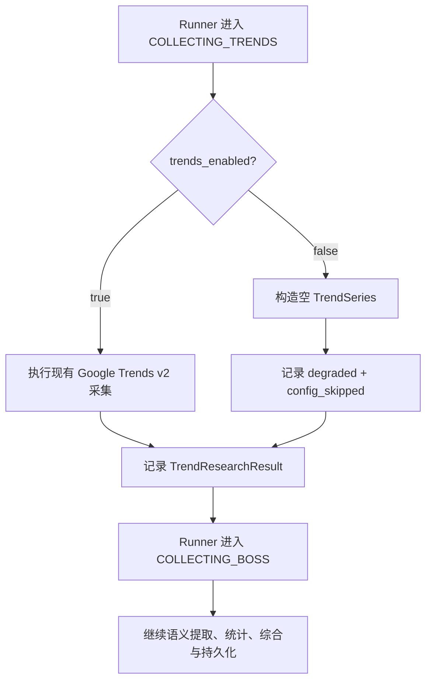

# Google Trends 开发期临时跳过设计规格

| 项目 | 内容 |
|---|---|
| 日期 | 2026-07-23 |
| 状态 | **已确认，待实现** |
| 性质 | **仅用于当前开发阶段的临时措施，不作为正式版本能力长期保留** |
| 基线 | [市场调研 BOSS + Google Trends 设计规格](./2026-07-14-market-research-boss-trends-design.md)、[Google Trends Web v2 设计规格](./2026-07-16-google-trends-web-v2-design.md) |
| 后续 | 按本 spec 编写最小实现；恢复正式流程后删除临时配置、短路判断与测试门控 |

---

## 1. 背景

当前市场调研按职业方向顺序执行：

1. `COLLECTING_TRENDS`（采集 Google Trends 搜索关注度）；
2. `COLLECTING_BOSS`（采集 BOSS 岗位）；
3. `EXTRACTING_SEMANTICS`（提取岗位语义）；
4. `CALCULATING_STATISTICS`（计算确定性统计）；
5. `SYNTHESIZING`（综合单方向报告）。

前三个阶段共享单方向 `600s` 有效预算；人工登录或验证的等待时间暂停计时，统计和综合阶段不计入该预算。

当前开发阶段暂时不需要真实访问 Google Trends，但仍需继续执行 BOSS 采集、岗位语义提取、统计、综合、持久化和报告交付。由于后续 `DirectionResult`（单方向正式结果）和存储校验要求存在 `trend_result`（趋势调研结果），不能简单删除 Trends 阶段或令结果为空。

## 2. 目标

1. 通过一个开发期配置暂时禁止 Google Trends 页面采集。
2. 跳过 Trends 后继续执行完整的 BOSS 市场调研链路。
3. 复用现有 `degraded`（技术降级）结果与报告分支，不增加长期业务状态。
4. 保持 Runner、预算、正式数据模型、存储、综合、报告和前端接口不变。
5. 将临时行为限制在 Google Trends 采集模块内部，便于后续直接删除。

## 3. 非目标

本 spec 不包含：

- 新增 `skipped` 等正式趋势来源状态；
- 修改市场调研阶段顺序或状态机；
- 为 Trends 和 BOSS 拆分或重新分配预算；
- 修改调研方案中的 `trends_keywords`（Google Trends 搜索关键词）；
- 修改正式结果、复用索引或存储校验结构；
- 新增报告渲染分支、前端状态或用户控制入口；
- 更新 README、架构文档或既有 Google Trends 设计规格；
- 新增 `trends_enabled=False`（关闭趋势采集）路径的自动化测试；现有真实采集测试只增加配置门控，关闭时跳过、开启时执行原测试逻辑。

## 4. 核心决策

### 4.1 临时配置

在 `MarketResearchSettings`（市场调研设置）中增加：

```python
trends_enabled: bool = True
```

- `trends_enabled`（是否启用趋势采集）：控制 `GoogleTrendsCollector.collect` 是否真实访问 Google Trends 页面。
- 代码默认值为 `True`，表示未提供配置覆盖时继续执行现有 Google Trends v2 采集实现，避免临时开发措施成为正式运行默认行为。
- 当前开发环境在 `.env` 中显式设置为 `False` 时跳过 Google Trends 页面采集。
- 配置随进程启动读取；修改环境变量后需要重启后端才能生效。

对应环境变量：

```env
MARKET_RESEARCH__TRENDS_ENABLED=false
```

版本库只在 `backend/.env.example` 增加该配置及临时用途说明，不修改或提交用户现有的 `backend/.env`。要让当前开发实例实际跳过采集，开发者必须在自己的 `backend/.env` 中加入同一配置，或在启动后端时通过进程环境显式设置为 `false`；否则代码默认值 `True` 会继续执行真实采集。

### 4.2 短路位置

临时判断放在 `GoogleTrendsCollector.collect`（采集 Google Trends 数据）接口内部，并位于任何页面导航、页面状态读取、等待或重试之前。

Runner 和调用方继续按原方式调用该接口，不感知新的流程分支。这样可以保持模块接口不变，把临时实现集中在 Google Trends 采集模块内。

配置关闭时，`collect` 必须：

1. 保留冻结方案中的 `trends_keywords`；
2. 构造没有周度数据点的 `TrendSeries`（趋势原始序列）；
3. 构造 `TrendDiagnostic`（趋势诊断），其中 `page_state` 为 `config_skipped`；
4. 通过现有确定性分析函数生成 `TrendResearchResult`；
5. 返回现有 `source_status="degraded"`（技术降级）结果；
6. 不访问或操作传入的浏览器页面。

现有 `TrendDiagnostic.attempt`（趋势诊断尝试次数）只允许 `1` 或 `2`。配置跳过没有发生真实页面加载，因此短路结果中的 `attempt=1` 只是满足现有模型约束的临时兼容占位值，不表示已经执行过第一次页面尝试，也不得据此统计页面访问次数。

### 4.3 状态语义

不修改 `TrendSourceStatus`（趋势来源状态）定义。临时跳过沿用：

```text
source_status = degraded
diagnostic.page_state = config_skipped
```

- `source_status`（趋势来源状态）继续使用现有技术降级分支，避免增加临时正式状态。
- `diagnostic.page_state`（趋势诊断页面状态）在内部记录 `config_skipped`，供开发排查时识别配置短路。
- 不要求报告或前端识别 `config_skipped`。

### 4.4 阶段与预算

保留 `COLLECTING_TRENDS` 阶段。配置关闭时，该阶段只完成配置判断和内存结果构造，随后立即进入 `COLLECTING_BOSS`。

继续沿用单方向 `600s` 共享有效预算：

- 不为跳过 Trends 重新分配、缩短或人为扣减预算；
- 不调用页面等待、刷新、限流退避或人工验证流程；
- 函数调用产生的自然毫秒级耗时无需特殊归零；
- 未被 Trends 消耗的预算自然留给 BOSS 采集和岗位语义提取。

## 5. 运行流程



短路路径不得执行以下行为：

- Google Trends URL 导航；
- 页面字段、DOM 或无障碍表格读取；
- 页面刷新；
- 429 或瞬时错误等待；
- Google 人工验证等待；
- Google Trends 页面截图或页面审计。

专用 Chrome 仍按原流程创建和关闭，因为后续 BOSS 采集仍需要同一个浏览器会话。

## 6. 报告行为

不为临时跳过增加独立报告分支。`PlainTextMarketReportRenderer`（纯文本市场报告渲染器）继续按现有 `source_status != "success"` 分支输出来源限制，例如：

```text
来源限制：Google Trends 数据未完整可用，本次不据此作趋势判断。
```

降级结果没有周度数据，但现有 `analyze_trend_series`（分析趋势序列）仍会为每个冻结关键词生成一项 `keyword_analyses`（关键词趋势分析），其中年度变化和月度变化均为空。因此报告会逐关键词输出“年度数据不足”，但不会输出关键词均值、变化方向或排名。

现有综合 Worker 约束、趋势边界说明和报告结尾说明保持不变。本 spec 不要求用户可见内容区分“配置主动跳过”与“页面数据未获取到”。

## 7. 变更范围

允许修改：

| 文件 | 变更 |
|---|---|
| `backend/career_os/platform/market_research/settings.py` | 增加临时 `trends_enabled` 配置字段 |
| `backend/career_os/platform/market_research/trends.py` | 在 `collect` 的页面操作前增加配置短路并复用现有降级结果构造逻辑 |
| `backend/.env.example` | 增加 `MARKET_RESEARCH__TRENDS_ENABLED=false` 及临时说明 |
| `backend/tests/platform/test_market_research_trends.py` | 为现有真实采集测试增加配置门控；关闭时跳过，开启时执行原测试逻辑 |

禁止扩散修改到：

- `runner.py`；
- `models.py`；
- `store.py`；
- `synthesis.py`；
- `renderer.py`；
- 前端代码；
- 其他说明文档；
- 除 `backend/tests/platform/test_market_research_trends.py` 外的测试文件。

如果实现发现必须修改上述禁止范围，说明最小设计假设不成立，应停止实现并重新评审，而不是自行扩大范围。

## 8. 验收标准

### 8.1 配置关闭

当 `MARKET_RESEARCH__TRENDS_ENABLED=false` 时：

1. 市场调研仍进入原有 `COLLECTING_TRENDS` 阶段；
2. 不真实访问 Google Trends 页面；
3. 方向上下文得到 `source_status="degraded"` 的 `TrendResearchResult`；
4. 内部诊断的 `page_state` 为 `config_skipped`；
5. 冻结的 Trends 关键词保留，周度数据点为空；
6. 调研继续进入 BOSS 采集及后续阶段；
7. 报告沿用现有趋势降级内容；
8. Trends 不产生页面等待、重试或人工验证预算消耗。

### 8.2 配置开启

当 `MARKET_RESEARCH__TRENDS_ENABLED=true` 时：

1. 行为与本 spec 实施前一致；
2. 继续执行 Google Trends v2 页面导航、状态识别、有限重试、表格解析和确定性分析；
3. 不改变 BOSS 及后续市场调研行为。

### 8.3 验证方式

本次不新增 `trends_enabled=False` 路径的自动化测试。现有真实采集测试使用配置门控：配置关闭时明确跳过，不执行页面采集断言；配置开启时仍可执行原有 Google Trends v2 状态机、重试、解析和分析测试。当前临时方案的实施验收只要求在开发环境显式关闭配置并运行相关测试和标准非 LLM 测试入口，不要求随后再以 `trends_enabled=True` 重跑同一组 Trends 测试。真实采集路径的重新执行与验收延后到临时方案退出阶段。

## 9. 临时方案退出

该配置不是正式产品能力。Google Trends 恢复稳定开发后：

1. 先将开发环境 `MARKET_RESEARCH__TRENDS_ENABLED` 改为 `true`，恢复真实链路验收；
2. 删除 `trends_enabled` 配置字段；
3. 删除 `GoogleTrendsCollector.collect` 中的配置短路；
4. 删除 `backend/.env.example` 中的临时配置；
5. 删除 `test_market_research_trends.py` 中随临时配置增加的测试门控，恢复默认执行真实采集测试；
6. 不需要迁移 `TrendSourceStatus`，因为本方案没有增加正式状态；
7. 已产生的 `degraded + config_skipped` 结果继续符合现有数据模型和存储校验。

## 10. 最终决议

采用配置驱动的最小短路方案：Google Trends 采集模块在配置关闭时返回现有技术降级结果，Runner 和所有下游模块保持不变。该设计以低修改面和易删除为优先级，不将开发期跳过行为提升为长期产品接口。
