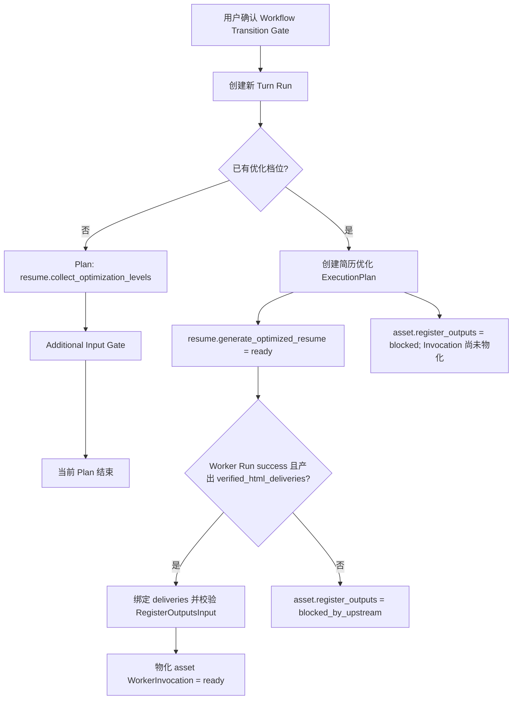
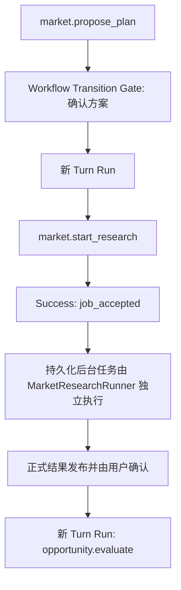
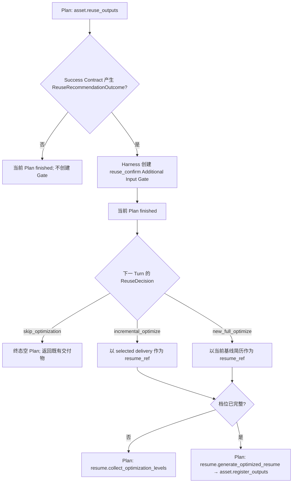

# 强类型 WorkerInvocation 与 ExecutionPlan 设计规格

| 属性 | 内容 |
|------|------|
| 状态 | **已确认：按最终架构一次性重写，不保留迁移期兼容 seam；纯规划链在后续独立 Spec/Plan 中直接接入 pipeline** |
| 版本 | **2.0.0** |
| 日期 | 2026-07-23 |
| 适用范围 | Coordinator 路由、Worker 注册表、Harness 委托、Worker Prompt、ReAct Runner、执行计划与测试替身 |
| 后续规格 | [全局失败机制设计规格](./2026-07-23-global-failure-mechanism-design.md) |
| 实施计划 | [强类型 WorkerInvocation 与 ExecutionPlan Implementation Plan](../plans/2026-07-23-typed-worker-invocation-execution-plan.md) |
| 领域语言 | [CONTEXT.md](../../../CONTEXT.md) |

---

## 1. 背景与现场证据

当前 Coordinator 主要使用 `worker_id`（Worker 标识）字符串描述派工：

```python
pending_workers: list[str]
current_worker_id: str | None
```

`WorkerRunner`（Worker 运行函数）接收：

```python
runner(worker_id, goal, session_state, context)
```

这套接口只说明“由哪个 Worker 执行用户原话”，没有说明“本次 Worker Run 要执行哪一种业务动作”。同一个 Worker 承担多个动作时，只能从自然语言、Pipeline 阶段和零散 Session 状态猜测职责。

2026-07-22 demo 日志暴露了直接后果：

1. Coordinator 创建 `resume → asset` 字符串队列。
2. `resume`（简历智能体）没有形成可验证的 HTML 交付物。
3. 队列仍继续执行 `asset`（资产智能体）。
4. 最终回复直接采用最后一个 Worker 的摘要，用户反复看到“我的角色主要负责资产登记和复用建议”。

同类歧义还存在于：

- `market`：提出方案、修订方案、启动已确认方案；
- `identity`：首次初探、初探复盘；
- `capability`：首次能力探索、复盘、JD 后经历深挖；
- `strategy`：JD 投递策略、无 JD 长期规划；
- `resume`：收集优化档位、生成优化简历；
- `asset`：复用建议、产物登记、产物删除。

现有 mock 还会默认补充真实路径不存在的控制事实：

- resume 未收到档位时默认使用“标准”；
- asset 未收到动作类型时默认使用“登记”。

这些默认值使测试无法暴露真实 Worker 缺少调用契约的问题。

## 2. 核心问题

问题不只是字段缺失，而是现有派工模块的接口过浅：

- 调用方必须知道如何拼接 `goal`、`context`、Session 状态和 Prompt 分支；
- Worker 自己决定当前 mode、Skill 和 Tool；
- 队列只有顺序，没有依赖与必需产物；
- Tool 权限按 Worker 粗粒度开放，不能限制到本次业务动作；
- 输出只按 Worker Schema 校验，不能绑定本次动作的成功条件；
- 真实 Runner 与 mock 对缺省输入的处理不一致。

删除这套字符串派工接口后，如果这些知识重新散落到 Coordinator、Prompt、Runner 和测试中，说明新模块仍然过浅。本规格要求把这些知识收敛到一个强类型注册表和一个小的执行计划接口后面。

## 3. 目标

1. 使用 `worker_id + run_kind`（Worker 标识 + 业务动作）唯一描述一次 Worker 调用意图。
2. 由 LLM 提出 `InvocationProposal`（调用提议），由 Harness 构建 `ExecutionPlanNodeSpec`（计划节点规格）；只有全部输入来源满足时才物化不可变 `WorkerInvocation`（Worker 调用）。
3. 把外部动态性限制在 Proposal/Registry 解析 seam，以及 Worker 输出解析与 Invocation/输出配对 seam；`resolve()` 成功后必须返回由 `Literal` discriminator 区分的闭合 `WorkerInvocation` 联合，输出解析和配对成功后必须返回闭合 `WorkerStructuredOutput` 联合，使 Runner、具体 Success Contract 和下游绑定可以由 Pyright 静态缩窄。
4. 使用泛型代码注册表统一关联每个 Run Kind 的准备输入、完整输入、具体 Invocation、具体 Worker 结构化输出、Tool、Skill、Gate、执行策略、确定性成功契约和命名 Outcome 类型。
5. 允许一次创建多个 Plan 节点，但依赖上游结果的节点不得提前伪造输入完整的 WorkerInvocation。
6. 只有依赖、类型化 Outcome 绑定、Gate、授权与上游必需产物满足，并成功物化 WorkerInvocation 的节点才能进入 `ready`。
7. 第一版串行执行 ready 节点；`claim_next()` 必须在一个 Plan 状态转换中完成节点选择、`ready → running` 和 Worker Run 编号绑定，不引入 Turn 内 Worker 并发。
8. Prompt 采用 Worker 基础 Prompt、Run Kind 专用 Prompt、Harness 已预加载 required Skill 正文块与 Invocation 摘要组合；Harness 冻结能力包络，但 ReAct Worker LLM 仍在该包络内自主决定 Tool/optional Skill 的调用时机、顺序与参数。
9. required Skill 由 Harness 在第一次 Worker LLM 调用前按名称与 mode 强制预加载；任一必需 Skill 加载失败都禁止启动 Runner，不允许依赖模型自行调用 `load_skill`。optional Skill 则由 Worker LLM 在 Definition 显式授权的集合内按需选择。
10. 对输入完整、动作唯一且没有模型推理价值的步骤，Harness 可以使用注册的确定性 Adapter；不得为了统一形式强制经过 Worker LLM，也不得把 ReAct 内部动态决策预先编码进 Harness。
11. 真实 ReAct Runner、确定性 Adapter、mock、stub 和测试统一消费同一个闭合 WorkerInvocation 联合类型。
12. 在本规格内完成确定性 Success Contract 验收与类型化 Outcome 提取，为 ExecutionPlan 提供可信结果，并为后续全局失败机制提供稳定的 operation purpose、关键性与语义 Judge 选择依据。
13. 在 `running → finished` 时把 `PlanNodeResult` 持久化到 ExecutionPlan 节点，使跨多次推进的 fan-in 不依赖 Coordinator 外置结果字典。
14. 将 `market.start_research` 的后台 Job 创建、持久化且被 `MarketResearchRunner.start()` 接受的事实验收为当前 Worker Run 的立即成功 Outcome，同时保持后台 Job 独立执行；正式 Job Run 与 Job ExecutionPlan 由后续全局失败机制引入。
15. 将 `asset.reuse_outputs` 的复用建议与用户决策分离：Worker 和确定性 Success Contract 只产生经过验证的 `ReuseRecommendationOutcome`，Harness 基于该 Outcome 创建 `reuse_confirm` Additional Input Gate；当前 Plan 结束，用户选择“跳过优化 / 基于已有版本增量优化 / 新建完整优化”后创建新 Turn，并按选择创建新的终态空 Plan 或简历优化 Plan。
16. 为产物建立稳定的 `output_id`（产物编号），并把索引升级为带 `index_version`（索引版本）的强类型快照；登记和删除必须以 compare-and-set 方式验证预期版本。
17. 为删除产物引入绑定 Session、产物、操作和索引版本的显式授权；调用方只能提交 `output_id + authorization_id + expected_index_version`，不能把可变文件路径当作删除身份。
18. 将等待 `operation_authorization` 的活动 `ExecutionPlan`、`SuspendedWorkerRun` 与闭合 `OperationContinuation` 联合序列化进 Session 存储；ReAct 分支持久化消息、迭代和待执行 Tool Call，确定性分支持久化 Adapter、Invocation 与冻结 operation，第二次请求携带确认后恢复同一个 Plan、节点、Invocation、Worker Run 和原执行点。
19. 为市场调研确认新增并持久化 `confirmation_id`（确认编号），使启动研究可以验证“哪一次确认”而不只验证可变的 plan 状态。
20. 把宽泛的 `ProfilePatch` 收敛为按 `patch_kind` 区分的闭合联合，确保 Worker 结构化输出通过解析 seam 后不再携带任意 JSON。
21. 在全局失败机制落地前使用临时闭合 `WorkerExecutionResult` 表达成功、失败、异步接收和等待授权；Runner 不得用“只返回成功结构化输出”的接口隐藏失败路径。
22. 等待授权的 Plan 终结时原子保存最近完整终态 Plan、按 confirmation 唯一的紧凑终态回执，并把唯一 `current_execution` 从 `AuthorizationSuspendedExecution` 切换为 `NoCurrentExecution`；同步 Plan 只在当前请求内运行，完成后直接保存为最近终态 Plan。只有真正跨请求、尚未结束且不等待授权的 Plan 才使用独立 `AsynchronousExecution`，后台 Job 由自身生命周期管理，不能冒充异步 Plan。
23. 由唯一 `ExecutionPlanRequestService` 负责加载和 compare-and-set 提交完整 `SessionExecutionState`；Coordinator 只读取冻结聚合并返回闭合 `ExecutionPlanStateTransition`，不直接持有 SessionStore。
24. `SessionExecutionState` 是阶段、完整 Task 控制状态、闭合 Gate、Artifact 引用与版本、唯一 `CurrentExecution`、最近终态 Plan 和 confirmation 回执的唯一事实源；旧 `state.json`、`artifacts.json` 和 TaskStore 阶段不再作为兼容投影或运行时读取来源。
25. 当前本地存储采用每个 `DATA_DIR` 单写入进程约束，进程内继续使用 `session_revision` compare-and-set，并以临时文件、fsync 和原子 replace 发布单个聚合 JSON。
26. `ExecutionPlanRequestService` 负责 confirmation 校验、授权、claim、冻结 operation 执行和 receipt 提交；独立 `ExecutionPlanResumeHandler` 在 receipt 已持久化后恢复原 Worker 并推进 Plan。ResumeHandler 可以调用 LLM、Runner 和 Harness operation seam，但不能直接写 Session。
27. 确定性 Adapter 通过 `complete_from_committed_receipt()` 把已提交 operation 结果转换为结构化 Worker 结果；恢复路径不得再次调用该 operation。

## 4. 非目标

本规格不包含：

- operation 失败分类、重试、幂等、补偿和断路器；由后续全局失败机制规格定义；
- required Skill 预加载失败后的重试、降级或用户消息分类；本规格只实现结构化 fail-fast，并保证失败时不调用 Worker LLM；
- Worker Run、Turn Run、Job Run 的完整失败状态与聚合；由后续规格定义；
- ReAct 运行完整性聚合、受约束语义 Judge 和 `partial_success`、`outcome_unknown` 等最终 Run 状态；由后续全局失败机制规格定义；
- Turn 内 Worker 并行执行；
- 跨 Turn、跨 Workflow Transition Gate、跨进程或应用重启后接管并继续执行 ExecutionPlan；唯一例外是同一 Session、同一运行实例内，为完成 `operation_authorization` 而跨两次 HTTP 请求恢复已持久化的活动 Plan。旧运行实例快照只按第 5.10 节做 interrupted 终态收敛，不执行 continuation；
- 任何旧 `DATA_DIR` 的 Session、Task、Artifact、Output Index 或 `pending_workers` 数据迁移与兼容读取；新实现只在干净数据目录中创建最终格式；
- 用户主动取消正在执行的通用 Worker Run；
- 预先规划 ReAct 内部全部动态 operation；
- 取消 Worker LLM 在 Invocation 授权范围内对 Tool 调用时机、顺序、参数和 optional Skill 的自主判断；
- 修改市场调研 Job 的现有方向并行、等待人工验证或安全取消语义；
- 纯规划请求的类型化 Worker/ExecutionPlan 改造和 `strategy.career_plan` Run Kind；本期不提供 legacy Adapter、旁路执行或旧 `list_type="plan"` 兼容，后续按 v2.2 Roadmap 在独立 Spec/Plan 中直接接入 pipeline；
- 为提高速度而合并或跳过既有业务 Gate。
- 允许 LLM 或运行时配置在不修改代码、不增加具体类型和不通过静态检查的情况下动态发明新的 Worker Run Kind；

## 5. 领域模型

### 5.1 InvocationProposal

`InvocationProposal`（调用提议）是 Coordinator LLM 对“应该执行什么”的最小决策：

```python
class InvocationProposal(BaseModel):
    worker_id: WorkerId
    run_kind: str
```

| 字段 | 含义 | 作用 |
|------|------|------|
| `worker_id` | Worker 标识 | 选择 identity、market、resume 等职责主体 |
| `run_kind` | 业务动作 | 选择该 Worker 本次执行的明确动作 |

LLM 不得提供：

- Tool 白名单；
- Skill 必需性；
- Success Contract；
- 依赖关系；
- Required Outcome；
- 授权范围；
- operation 失败策略。

这些控制事实只属于 Harness。

`InvocationProposal.run_kind` 保留为 `str` 是刻意的：它位于 LLM/JSON Proposal 输入 seam，只能在运行时校验。端到端静态类型保证分两次恢复：`WorkerInvocationRegistry.resolve()` 成功后，调用及其输入恢复为闭合具体类型；Worker 原始输出在输出解析 seam 按该 Invocation 对应的 `structured_output_model` 校验并确认配对后，结构化输出才恢复为闭合具体类型。未注册字符串、未验证输出或 Invocation/输出不匹配组合都不能越过各自 seam。

### 5.2 WorkerRunDefinition

`WorkerRunDefinition`（Worker 动作定义）是代码注册表中的唯一事实来源：

```python
TPreparedInput = TypeVar("TPreparedInput", bound=BaseModel)
TInput = TypeVar("TInput", bound=BaseModel)
TInvocation = TypeVar("TInvocation", bound="WorkerInvocationBase")
TWorkerOutput = TypeVar("TWorkerOutput", bound=BaseModel)
TOutcome = TypeVar("TOutcome", bound="VerifiedOutcomeBase")
ExecutionStrategy = Literal["react", "deterministic"]
PipelinePhase = Literal[
    "explore",
    "market",
    "jd_analysis",
    "resume_strategy",
    "resume_optimize",
]


class PipelineExecutionScope(BaseModel):
    model_config = ConfigDict(frozen=True, extra="forbid")

    list_type: Literal["pipeline"] = "pipeline"
    phase: PipelinePhase


ExecutionScope: TypeAlias = PipelineExecutionScope

SkillName = Literal[
    "career-inner-exploration",
    "career-jd-alignment",
    "resume-module-optimize",
]
SkillMode = Literal[
    "exploration_first",
    "exploration_review",
    "capability_bank",
    "jd_alignment",
]


@dataclass(frozen=True)
class SkillRequirement:
    name: SkillName
    mode: SkillMode | None


@dataclass(frozen=True)
class OutcomeDefinition(Generic[TOutcome]):
    output_model: type[TOutcome]

    @property
    def name(self) -> OutcomeName:
        return self.output_model.outcome_name


@dataclass(frozen=True)
class WorkerRunDefinition(
    Generic[
        TPreparedInput,
        TInput,
        TInvocation,
        TWorkerOutput,
        TOutcome,
    ],
):
    definition_id: str
    worker_id: WorkerId
    run_kind: RunKind
    description: str
    when_to_use: tuple[str, ...]
    allowed_scopes: frozenset[ExecutionScope]
    prepared_input_model: type[TPreparedInput]
    input_model: type[TInput]
    invocation_model: type[TInvocation]
    structured_output_model: type[TWorkerOutput]
    allowed_operations: frozenset[str]
    required_skills: tuple[SkillRequirement, ...]
    optional_skills: tuple[SkillRequirement, ...]
    execution_strategy: ExecutionStrategy
    deterministic_adapter_id: str | None
    emitted_outcomes: tuple[OutcomeDefinition[TOutcome], ...]
    success_contract_id: str
    success_contract: SuccessContract[
        TInvocation,
        TWorkerOutput,
        TOutcome,
    ]
    semantic_judge_mode: Literal["never", "when_needed", "required"]
```

| 字段 | 含义 | 作用 |
|------|------|------|
| `definition_id` | 稳定定义编号 | Trace、测试和策略引用 |
| `worker_id` | Worker 标识 | 绑定职责主体 |
| `run_kind` | 业务动作 | 绑定本次运行类型 |
| `description` | 动作说明 | 生成 LLM 可见索引 |
| `when_to_use` | 适用场景 | 帮助 Coordinator 选择动作 |
| `allowed_scopes` | 允许的执行范围 | 以结构化 `list_type="pipeline" + phase` 阻止越级调用；本期闭合 Worker 目录只接受 `PipelineExecutionScope` |
| `prepared_input_model` | 已有输入模型 | 表达 Plan 创建时已经冻结、但可能仍等待上游 Outcome 的具体类型 |
| `input_model` | 完整输入模型 | 在调用对应 Worker LLM 前校验全部必需输入 |
| `invocation_model` | 具体调用类型 | 将该 Run Kind 绑定到具有 `Literal` discriminator 和具体 `inputs` 类型的 Invocation 类 |
| `structured_output_model` | Worker 结构化输出模型 | 固定该 Invocation 可以交给 Success Contract 验收的具体输出类型 |
| `allowed_operations` | 本动作允许的 operation | 生成 Tool 可见集合并做运行期授权 |
| `required_skills` | 必需 Skill 要求 | 使用结构化 `name + mode` 描述 Harness 必须在第一次 Worker LLM 调用前成功预加载的能力；任一失败都不得启动 Runner |
| `optional_skills` | 可选 Skill 要求 | 使用结构化 `name + mode` 描述可以按需加载的能力；加载失败可交给后续失败策略处理 |
| `execution_strategy` | 执行策略 | 明确选择 ReAct Runner 或确定性 Adapter，Harness 不得根据 Run Kind 临时猜测 |
| `deterministic_adapter_id` | 确定性 Adapter 编号 | `execution_strategy="deterministic"` 时选择唯一 Adapter；ReAct 动作必须为 `None` |
| `emitted_outcomes` | 类型化命名结果定义 | 同时声明 Outcome 名称和具体 Pydantic 输出模型，供契约与依赖绑定引用 |
| `success_contract_id` | 确定性成功契约编号 | 选择本规格实现的业务验收与命名 Outcome 提取规则 |
| `success_contract` | 具体成功契约实现 | 由泛型签名静态关联具体 Invocation、Worker 输出与允许产生的 Outcome；编号仅用于 Trace 和快照 |
| `semantic_judge_mode` | 语义 Judge 模式 | 决定是否需要语义完成度判断 |

`RunKind`、`OutcomeName`、`SkillName` 与 `SkillMode` 是代码中闭合的 `Literal` 联合。`SkillRequirement`（Skill 要求）把 Skill 名称与具体 mode 固定为一个不可变控制事实：有 mode 的 Skill 必须声明 mode，无 mode 的 Skill 只能使用 `None`，不能把 `career-inner-exploration:exploration_first` 之类复合字符串留给运行时拆分。具体 `VerifiedOutcome` 类通过 `outcome_name: ClassVar[Literal[...]]` 唯一声明名称，`OutcomeDefinition.name` 从输出模型派生，避免“字符串名称与模型类型”形成两份可配错事实。

`ExecutionScope`（执行范围）把任务列表类型与阶段拆成两个字段：`list_type`（任务列表类型）在本期固定为 `pipeline`，`phase`（Pipeline 阶段）只能取当前代码 `PIPELINE_PHASES` 中的真实值。禁止使用 `pipeline/explore` 复合字符串，也禁止用裸 `None` 同时表达列表类型和阶段。`list_type="plan"` 的纯规划请求不属于本期接口；最终实现不得为它保留 legacy Adapter 或通用 fallback，后续由独立纯规划链 Spec/Plan 直接扩展 pipeline。

泛型参数化本身不能让 Pyright 根据同一个 dataclass 的宽泛 `worker_id: WorkerId` 与 `run_kind: RunKind` 字段恢复五个具体泛型实参。因此每个本期 Run Kind 还必须定义一个具体 `WorkerRunDefinition` 子类，并把 `worker_id`、`run_kind` 收窄为对应 `Literal`：

```python
@dataclass(frozen=True)
class ResumeGenerateOptimizedResumeDefinition(
    WorkerRunDefinition[
        GenerateOptimizedResumePreparedInput,
        GenerateOptimizedResumeInput,
        GenerateOptimizedResumeInvocation,
        GenerateOptimizedResumeOutput,
        VerifiedHtmlDeliveriesOutcome,
    ],
):
    worker_id: Literal["resume"]
    run_kind: Literal["generate_optimized_resume"]
```

`AnyWorkerRunDefinition` 必须显式枚举全部 15 个具体 Definition 子类，不能只枚举同一泛型基类的参数化别名，也不能退化为 `WorkerRunDefinition[Any, ...]`、未参数化 `WorkerRunDefinition` 或其他宽泛别名。这样按 `worker_id + run_kind` 分支时，Pyright 才能同时缩窄 Definition 类和五个泛型关联。注册表使用强类型代码注册，不得把裸 `BaseModel` 或字符串 Outcome 集合带过 `resolve()` seam。纯数值、非安全参数未来可以由配置覆盖，但 Worker、Run Kind、类型关系、Tool、Skill、阶段、依赖、执行策略和成功契约不得由外部 JSON 改写。

### 5.3 OutcomeBinding 与 RequiredOutcome

`OutcomeBinding`（结果绑定定义）在代码中静态关联上游 Outcome、下游准备输入和完整输入。`RequiredOutcome`（必需结果）只在 Plan 快照中保存稳定绑定编号和来源节点，不再使用 `target_input_field: str` 动态写字段：

```python
TTargetPrepared = TypeVar("TTargetPrepared", bound=BaseModel)
TTargetInput = TypeVar("TTargetInput", bound=BaseModel)


@dataclass(frozen=True)
class OutcomeBinding(
    Generic[TOutcome, TTargetPrepared, TTargetInput],
):
    binding_id: OutcomeBindingId
    source: OutcomeDefinition[TOutcome]
    prepared_input_model: type[TTargetPrepared]
    input_model: type[TTargetInput]
    bind: Callable[[TTargetPrepared, TOutcome], TTargetInput]


class RequiredOutcome(BaseModel):
    model_config = ConfigDict(frozen=True, extra="forbid")

    source_node_id: str
    binding_id: OutcomeBindingId
    minimum: int | None = None
```

| 字段 | 含义 | 作用 |
|------|------|------|
| `source_node_id` | 上游 Plan 节点编号 | 确定结果来自当前 Plan 的哪个节点 |
| `binding_id` | 强类型绑定编号 | 定位代码注册的 OutcomeBinding；绑定函数的入参和返回值由 Pyright 检查 |
| `minimum` | 最小有效数量 | 约束列表类结果不能为空 |

例如 `bind_verified_html_deliveries()`（绑定已验证 HTML 交付物）必须具有：

```python
def bind_verified_html_deliveries(
    prepared: RegisterOutputsPreparedInput,
    outcome: VerifiedHtmlDeliveriesOutcome,
) -> RegisterOutputsInput: ...
```

函数含义与作用：

- `prepared`（已准备输入）：asset 节点在 Plan 创建时已经冻结的其他业务事实。
- `outcome`（已验证结果）：resume 确定性 Success Contract 产生的具体类型。
- 返回的 `RegisterOutputsInput`（登记产物完整输入）：已经包含 deliveries，可以用于物化 `RegisterOutputsInvocation`。

若绑定函数接收错误 Outcome、返回错误输入模型或把结果写入不存在字段，Pyright strict 必须在代码合并前失败。Required Outcome 仍必须来自上游 Success Contract 已验证的结果，不能直接读取任意 `prior_results` 或用户可见摘要。

### 5.4 ExecutionPlanNodeSpec

`ExecutionPlanNodeSpec`（计划节点规格）是 Harness 在 Plan 创建时冻结的执行意图和输入来源。它不是 WorkerInvocation，不能交给 Runner：

```python
class ExecutionPlanNodeSpec(BaseModel, Generic[TPreparedInput]):
    model_config = ConfigDict(frozen=True, extra="forbid")

    node_id: str
    definition_id: str
    worker_id: WorkerId
    run_kind: RunKind
    goal: str
    prepared_inputs: TPreparedInput
    required_outcomes: tuple[RequiredOutcome, ...]
    allowed_operations: frozenset[str]
    required_skills: tuple[SkillRequirement, ...]
    optional_skills: tuple[SkillRequirement, ...]
    execution_strategy: ExecutionStrategy
    deterministic_adapter_id: str | None
    success_contract_id: str
    semantic_judge_mode: Literal["never", "when_needed", "required"]


class RegisterOutputsNodeSpec(
    ExecutionPlanNodeSpec[RegisterOutputsPreparedInput]
):
    worker_id: Literal["asset"]
    run_kind: Literal["register_outputs"]
    prepared_inputs: RegisterOutputsPreparedInput


# 其余 14 个 Run Kind 同样定义具体 Node Spec。
PreparedExecutionPlanNodeSpec: TypeAlias = Annotated[
    IdentityNodeSpec
    | CapabilityNodeSpec
    | MarketNodeSpec
    | OpportunityNodeSpec
    | StrategyNodeSpec
    | ResumeNodeSpec
    | AssetNodeSpec,
    Field(discriminator="worker_id"),
]
```

| 字段 | 含义 | 作用 |
|------|------|------|
| `node_id` | Plan 节点编号 | 在 Invocation 尚未物化时建立依赖、结果和 Trace 关联 |
| `definition_id` | 动作定义编号 | 证明本次调用使用哪个注册定义 |
| `worker_id` | Worker 标识 | 决定基础 Prompt 与职责主体 |
| `run_kind` | 业务动作 | 决定专用 Prompt 与输入模型 |
| `goal` | 面向模型的具体目标 | 只描述本动作，不代替控制字段 |
| `prepared_inputs` | 已冻结的具体准备输入 | 保存 Plan 创建时已存在的 Session、request 与 Artifact 事实；类型由具体 Run Kind 决定 |
| `required_outcomes` | 尚需绑定的上游结果 | 声明结果来源、数量约束和强类型绑定编号 |
| `allowed_operations` | 允许 operation 快照 | 防止运行中注册表变化或越权 |
| `required_skills` | 必需 Skill Requirement 快照 | 保存 Harness 必须在 Runner 前按名称与 mode 预加载的能力 |
| `optional_skills` | 可选 Skill Requirement 快照 | 保存未来允许按需加载的名称与 mode |
| `execution_strategy` | 执行策略快照 | 冻结 ReAct 或 deterministic 选择，避免运行时注册表变化改写路径 |
| `deterministic_adapter_id` | 确定性 Adapter 编号快照 | deterministic 节点绑定唯一 Adapter；ReAct 节点固定为 `None` |
| `success_contract_id` | 确定性成功契约编号 | 选择业务验收与命名 Outcome 提取规则 |
| `semantic_judge_mode` | Judge 模式 | 固定本次 Worker Run 的判定要求 |

`prepared_inputs` 必须是 Plan 创建时的深冻结快照，后续 Session 状态变化不得改写。每个 Run Kind 都有具体的 `ExecutionPlanNodeSpec[PreparedInput]` 特化类型，所有特化类型组成同样按 `worker_id + run_kind` 缩窄的闭合 `PreparedExecutionPlanNodeSpec` 联合。存在 Required Outcome 的节点在 Plan 创建时只保存 Node Spec，不得创建缺少业务输入的 WorkerInvocation。

#### 5.4.1 深冻结不变量

`ConfigDict(frozen=True)`（冻结模型字段）只禁止重新给 Pydantic 字段赋值，不会自动冻结字段内部的 `list`、`dict` 或 `set`。因此，本规格中的“深冻结”不是只设置 `frozen=True`，而是要求从 Node Spec、WorkerInvocation、PlanNodeResult 和 VerifiedOutcome 可以到达的全部业务值都不可原地修改：

- 有序集合使用 `tuple`，无序集合使用 `frozenset`；
- 结构化对象使用同样配置为 `frozen=True, extra="forbid"` 的具体子模型，不使用可变 `dict` 保存已解析业务事实；
- 已解析的 PreparedInput、完整 Input、WorkerStructuredOutput 和 VerifiedOutcome 不得声明 `list`、`dict`、`set`、`MutableSequence`、`MutableMapping` 或可变 Pydantic 子模型字段；
- `session_state` 与 `turn_request` 在 Proposal 解析 seam 已经分别恢复为冻结 `SessionExecutionState` 与具体 `NewExecutionPlanTurnRequest`；`prepare()` 只能从这两个闭合模型复制必要事实并重新校验为具体不可变 PreparedInput，不能接收或保留任意请求字典；
- `OutcomeBinding.bind()` 必须根据不可变 PreparedInput 与 VerifiedOutcome 创建新的完整 Input，不得修改任一入参或复用其中的可变容器；
- `resolve()` 必须根据完整 Input 创建新的 WorkerInvocation，不得通过浅复制把调用方可变对象带过解析 seam。

例如优化档位应声明为 `levels: tuple[OptimizationLevel, ...]`，而不是 `levels: list[OptimizationLevel]`；需要键值结构时应定义具体 frozen 子模型，而不是使用 `dict[str, Any]`。深冻结保证 Plan 审核、Trace 记录和 Worker 实际执行看到的是同一个输入快照。

### 5.5 WorkerInvocation

`WorkerInvocation` 是节点的全部输入绑定完成并通过 `input_model` 校验后生成的不可变调用快照。它不是一个带 `BaseModel inputs` 的开放容器，而是全部合法调用类型组成的闭合联合：

```python
class WorkerInvocationBase(BaseModel):
    model_config = ConfigDict(frozen=True, extra="forbid")

    invocation_id: str
    node_id: str
    definition_id: str
    goal: str
    allowed_operations: frozenset[str]
    required_skills: tuple[SkillRequirement, ...]
    optional_skills: tuple[SkillRequirement, ...]
    execution_strategy: ExecutionStrategy
    deterministic_adapter_id: str | None
    success_contract_id: str
    semantic_judge_mode: Literal["never", "when_needed", "required"]


class GenerateOptimizedResumeInvocation(WorkerInvocationBase):
    worker_id: Literal["resume"]
    run_kind: Literal["generate_optimized_resume"]
    inputs: GenerateOptimizedResumeInput


class RegisterOutputsInvocation(WorkerInvocationBase):
    worker_id: Literal["asset"]
    run_kind: Literal["register_outputs"]
    inputs: RegisterOutputsInput


ResumeInvocation: TypeAlias = Annotated[
    CollectOptimizationLevelsInvocation
    | GenerateOptimizedResumeInvocation,
    Field(discriminator="run_kind"),
]
AssetInvocation: TypeAlias = Annotated[
    ReuseOutputsInvocation
    | RegisterOutputsInvocation
    | DeleteOutputInvocation,
    Field(discriminator="run_kind"),
]

# IdentityInvocation、CapabilityInvocation 等也按 worker_id 分组。
WorkerInvocation: TypeAlias = Annotated[
    IdentityInvocation
    | CapabilityInvocation
    | MarketInvocation
    | OpportunityInvocation
    | StrategyInvocation
    | ResumeInvocation
    | AssetInvocation,
    Field(discriminator="worker_id"),
]
```

| 字段 | 含义 | 作用 |
|------|------|------|
| `invocation_id` | 本次调用编号 | 关联 Worker Run 和 Trace |
| `node_id` | 所属 Plan 节点编号 | 证明该调用由哪个已验证节点规格物化 |
| `definition_id` | 动作定义编号 | 证明本次调用使用哪个注册定义 |
| `worker_id` | Worker 标识 Literal | 作为外层 discriminator，决定基础 Prompt、职责主体和 Worker 子联合 |
| `run_kind` | 业务动作 Literal | 作为 Worker 子联合 discriminator，决定专用 Prompt 与具体输入模型 |
| `goal` | 面向模型的具体目标 | 只描述本动作，不代替控制字段 |
| `inputs` | 已验证的具体输入模型 | 保存当前输入快照与已验证的上游 Outcome；静态类型随 `worker_id + run_kind` 缩窄 |
| `allowed_operations` | 允许 operation 快照 | 防止运行中注册表变化或越权 |
| `required_skills` | 必需 Skill 快照 | 成功契约所需能力 |
| `optional_skills` | 可选 Skill 快照 | 允许有控制的降级 |
| `execution_strategy` | 执行策略快照 | Runner Registry 据此选择 ReAct 或确定性 Adapter |
| `deterministic_adapter_id` | 确定性 Adapter 编号 | 只在 deterministic 调用中非空，不能由 Harness 临时补写 |
| `success_contract_id` | 确定性成功契约编号 | 选择业务验收与命名 Outcome 提取规则 |
| `semantic_judge_mode` | Judge 模式 | 固定本次 Worker Run 的判定要求 |

目录中的 15 个 Run Kind 必须各自拥有一个具体 Invocation 类。由于 `exploration_first`、`exploration_revisit` 等 `run_kind` 会跨 Worker 重名，不能只用 `run_kind` 做全局 discriminator；必须先按 `worker_id` 缩窄到 Worker 子联合，再按 `run_kind` 缩窄到具体 Invocation，或使用等价的稳定复合 discriminator。

例如 Runner 在匹配 `worker_id == "asset"` 且 `run_kind == "register_outputs"` 后，Pyright 必须推导 `invocation.inputs` 为 `RegisterOutputsInput`，而不是 `BaseModel` 或 `Any`。Invocation 一经创建不得修改，也不得因 Session 状态变化重新物化。用户改变参数或业务目标时，旧 Invocation 不重写，必须创建新的 Turn Run 与 ExecutionPlan。

### 5.6 ContractEvaluation

`ContractEvaluation`（确定性契约验收结果）只表达可由代码和本地事实确定的业务验收结论，不承担 Failure 分类、重试、语义 Judge 或最终 Worker Run 状态聚合：

Worker 原始输出是区别于 Proposal 的第二个动态输入 seam。Runner 必须先根据已解析 Invocation 找到同一 `WorkerRunDefinition.structured_output_model`，完成 Pydantic 校验并返回闭合 `WorkerStructuredOutput` 联合中的具体模型。`DeterministicSuccessContractRegistry.evaluate()` 的两个参数在公开类型上仍是两个独立闭合联合，因此 Pyright 不负责证明调用点传入的一定是同一 Definition 的 Invocation/输出组合；Registry 必须在进入具体 `SuccessContract` handler 前完成配对检查，不匹配时返回契约违反。配对成功后，具体 `SuccessContract[TInvocation, TWorkerOutput, TOutcome]` 才提供三者之间的静态关联。

```python
WorkerStructuredOutput: TypeAlias = (
    ExplorationFirstOutput
    | ExplorationRevisitOutput
    | CapabilityExplorationOutput
    | CapabilityRevisitOutput
    | JdBankDeepDiveOutput
    | MarketPlanProposalOutput
    | MarketPlanRevisionOutput
    | MarketResearchAcceptedOutput
    | OpportunityEvaluationOutput
    | JdApplicationStrategyOutput
    | OptimizationLevelRequestOutput
    | GenerateOptimizedResumeOutput
    | ReuseOutputsOutput
    | RegisterOutputsOutput
    | DeleteOutputOutput
)


class VerifiedOutcomeBase(BaseModel):
    model_config = ConfigDict(frozen=True, extra="forbid")

    outcome_name: ClassVar[OutcomeName]
    name: OutcomeName


class VerifiedHtmlDeliveriesOutcome(VerifiedOutcomeBase):
    outcome_name: ClassVar[Literal["verified_html_deliveries"]] = (
        "verified_html_deliveries"
    )
    name: Literal["verified_html_deliveries"] = outcome_name
    value: tuple[VerifiedHtmlDelivery, ...]


VerifiedOutcome: TypeAlias = (
    ExplorationDraftOutcome
    | BankDeltaOutcome
    | MarketPlanProposalOutcome
    | JobAcceptedOutcome
    | OpportunityAssessmentOutcome
    | StrategyArtifactOutcome
    | OptimizeTransitionOutcome
    | OptimizationLevelRequestOutcome
    | VerifiedHtmlDeliveriesOutcome
    | ReuseRecommendationOutcome
    | RegisteredDeliveriesOutcome
    | DeletedOutputOutcome
)


class ContractSatisfied(BaseModel, Generic[TOutcome]):
    model_config = ConfigDict(frozen=True, extra="forbid")

    satisfied: Literal[True]
    verified_outcomes: tuple[TOutcome, ...]
    violations: tuple[()] = ()


class ContractUnsatisfied(BaseModel):
    model_config = ConfigDict(frozen=True, extra="forbid")

    satisfied: Literal[False]
    verified_outcomes: tuple[()] = ()
    violations: tuple[str, ...]


ContractEvaluation: TypeAlias = (
    ContractSatisfied[TOutcome] | ContractUnsatisfied
)


class SuccessContract(
    Protocol,
    Generic[TInvocation, TWorkerOutput, TOutcome],
):
    def evaluate(
        self,
        invocation: TInvocation,
        structured_output: TWorkerOutput,
    ) -> ContractEvaluation[TOutcome]: ...


# 每个名称都指向具有 Literal worker_id/run_kind 的具体 Definition 子类，
# 子类继承时展开全部五个具体泛型参数。
AnyWorkerRunDefinition: TypeAlias = (
    IdentityExplorationFirstDefinition
    | IdentityExplorationRevisitDefinition
    | CapabilityExplorationFirstDefinition
    | CapabilityExplorationRevisitDefinition
    | CapabilityJdBankDeepDiveDefinition
    | MarketProposePlanDefinition
    | MarketRevisePlanDefinition
    | MarketStartResearchDefinition
    | OpportunityEvaluateDefinition
    | StrategyJdApplicationDefinition
    | ResumeCollectOptimizationLevelsDefinition
    | ResumeGenerateOptimizedResumeDefinition
    | AssetReuseOutputsDefinition
    | AssetRegisterOutputsDefinition
    | AssetDeleteOutputDefinition
)


class DeterministicSuccessContractRegistry:
    def evaluate(
        self,
        invocation: WorkerInvocation,
        structured_output: WorkerStructuredOutput,
    ) -> ContractEvaluation[VerifiedOutcome]: ...

    def validate_startup(
        self,
        definitions: tuple[AnyWorkerRunDefinition, ...],
    ) -> None: ...
```

字段和函数含义：

- `VerifiedOutcome`（已验证结果联合）：所有可跨节点传播的具体 Outcome 类型；每个变体同时固定名称和值模型。
- `satisfied`（是否满足）：Literal discriminator，用于把验收结果缩窄为成功或不满足。
- `verified_outcomes`（已验证命名结果）：只保存契约验收通过、且由 `WorkerRunDefinition.emitted_outcomes` 声明的类型化结果；ExecutionPlan 只能消费这里的值。
- `violations`（契约违反原因）：记录稳定、非用户展示的验收原因，例如空交付物、路径不存在、HTML 不完整或档位不一致。
- `SuccessContract.evaluate`（执行具体确定性契约）：静态关联一个具体 Invocation、对应的具体 Worker 结构化输出和允许产生的具体 Outcome；传错任意一端都使 Pyright 失败。
- `DeterministicSuccessContractRegistry.evaluate`（分派确定性契约）：按已缩窄 Invocation 选择唯一规则，通过注入的 Artifact/Index verifier Adapter 检查 Invocation 输入、Worker 结构化输出和本地事实，并返回闭合 Outcome 联合。
- `validate_startup`（校验契约目录）：拒绝缺少实现、重复契约编号、未声明 Outcome 或契约产出名称越界。

Registry 的 `evaluate()` 实现必须对 Invocation 和 `WorkerStructuredOutput` 做穷尽式联合缩窄，仅在二者属于同一 Definition 时调用其 `SuccessContract`；不匹配组合在进入 handler 前返回契约违反。所有分支末尾使用 `assert_never()` 固化闭合性，因此新增 Invocation 或 Worker 输出变体但未补分派分支时，Pyright 必须失败。

`resume.generate_optimized_resume` 第一版至少验证：

- `html_deliveries` 数量不少于 Invocation 请求的档位数量，且至少为一；
- 每份交付物路径真实存在；校验器分别对允许输出根目录与交付物调用 `resolve(strict=True)`，再验证交付物规范路径仍位于规范根目录下，拒绝 `..` 穿越和指向根目录外的符号链接；
- 文件通过完整 HTML 文档校验；
- 每份交付物档位与 `WorkerInvocation.inputs` 中冻结的优化档位一致；
- 只有全部确定性条件满足时才产生 `verified_html_deliveries`。

Pydantic 输出 Schema 只证明结构可解析，`WorkerExecutionCompleted` 只证明本期 Runner 正常结束并解析了输出；两者都不得直接产生 verified Outcome。后续全局失败机制复用同一个 Registry，把运行完整性、operation 事实和可选 Judge 与 `ContractEvaluation` 聚合，不得重新实现另一份确定性契约目录。

契约 Registry 接受验证依赖，不在内部自行创建文件系统、Store 或 Harness。当前 plan 使用现有本地文件与索引校验 Adapter；后续全局失败机制使用由 OperationResult/运行证据支持的 Adapter。两者替换的是事实读取 Adapter，不是契约规则本身。

### 5.7 ExecutionPlanNode

```python
class ExecutionPlanNode(BaseModel):
    model_config = ConfigDict(frozen=True, extra="forbid")

    spec: PreparedExecutionPlanNodeSpec
    invocation: WorkerInvocation | None = None
    result: "PlanNodeResult | None" = None
    depends_on: tuple[str, ...]
    order: int
    scheduling_status: InvocationSchedulingStatus
    worker_run_id: str | None = None
    blocked_reason: str | None = None
```

| 字段 | 含义 | 作用 |
|------|------|------|
| `spec` | 不可变节点规格 | 保存动作、当前输入快照、能力和 Required Outcome 绑定 |
| `invocation` | 已物化 Worker 调用 | 只有输入完整并校验通过后才存在 |
| `result` | 已持久化节点结果 | 只在 `running → finished` 时写入，并作为后续多次 `advance()` 重算依赖的唯一结果来源 |
| `depends_on` | 上游 Plan 节点编号 | 建立有向依赖 |
| `order` | 同层稳定顺序 | 第一版串行选择 ready 节点 |
| `scheduling_status` | 调度状态 | 区分未执行、可执行、已执行和被上游阻断 |
| `worker_run_id` | Worker Run 编号 | 节点启动后关联执行记录 |
| `blocked_reason` | 阻断原因 | 解释为何没有执行 |

节点必须满足以下不变量：

- `planned`、`blocked`、`blocked_by_upstream` 和 `invalid` 节点不得持有伪造或输入不完整的 Invocation；
- `ready`、`running` 和 `finished` 节点必须持有已经完整验证的 Invocation；
- `ready` 节点的 `worker_run_id` 必须为空；`running` 和 `finished` 节点必须持有非空 Worker Run 编号；
- `finished` 节点必须持有 `result`，其余状态的节点不得持有 `result`；
- `result.plan_id`、`result.node_id` 与 `result.worker_run_id` 必须分别等于所属 Plan、`spec.node_id` 与节点冻结的 `worker_run_id`；
- `invocation.node_id` 必须等于 `spec.node_id`；
- 同一节点只允许物化一次；重复 `advance()` 不得生成新的 Invocation；
- 同一节点结果只允许持久化一次；对 finished 节点重复提交结果属于过期输入，必须拒绝整批推进；
- 只有 `ExecutionPlanExecutor.claim_next()` 可以把节点从 `ready` 转换为 `running` 并绑定 `worker_run_id`，Coordinator 和 Runner 不得分别改写这两个字段。

### 5.8 Invocation 调度状态

```text
planned
blocked
ready
running
finished
blocked_by_upstream
invalid
```

| 状态 | 含义 |
|------|------|
| `planned` | Node Spec 已创建但尚未计算依赖和输入绑定 |
| `blocked` | 依赖或 Required Outcome 尚未满足，尚未物化 Invocation |
| `ready` | 依赖、输入绑定和启动前 Gate 已满足，Invocation 已物化；ReAct 运行中才出现的 operation authorization 尚不在此时伪造为已满足 |
| `running` | 节点已经由 `claim_next()` 原子认领并绑定唯一 Worker Run 编号；该编号是本节点唯一允许启动的执行 |
| `finished` | Worker Run 已达到终态，具体结果看 Worker Run 状态 |
| `blocked_by_upstream` | 上游未成功或必需结果缺失，不会执行 |
| `invalid` | 节点定义、依赖或输入本身不合法 |

调度状态与 Worker Run 执行状态必须分离。未执行的下游节点不得伪造一个 failed 或 cancelled Worker Run。

### 5.9 ExecutionPlan

```python
class ExecutionPlan(BaseModel):
    model_config = ConfigDict(frozen=True, extra="forbid")

    plan_id: str
    turn_run_id: str
    execution_scope: ExecutionScope
    nodes: tuple[ExecutionPlanNode, ...]
    created_at: datetime
```

| 字段 | 含义 | 作用 |
|------|------|------|
| `plan_id` | 计划编号 | 关联整个 Turn 内的计划事件 |
| `turn_run_id` | 所属 Turn Run | 限制计划生命周期 |
| `execution_scope` | 已验证的执行范围 | 同时冻结任务列表类型与 Pipeline 阶段；用于校验全部 Run Kind，且只有 `list_type="pipeline"` 时才把其中 `phase` 作为阶段推进目标 |
| `nodes` | Plan 节点集合 | 保存节点规格、可选 Invocation、finished 节点的持久化结果、依赖和调度状态；是节点结果的唯一事实来源 |
| `created_at` | 创建时间 | 回放计划形成时点 |

ExecutionPlan 只属于当前 Turn Run：

- `operation_authorization` 可以让当前 Plan 等待并在同一进程内继续；
- `workflow_transition` 结束当前 Plan，用户确认后创建新 Turn Run 和新 Plan；
- `additional_input` 结束当前 Plan，用户补充后创建新 Turn Run 和新 Plan；
- 应用重启时由本规格的最小启动收敛把活动 Plan 当前节点标记为 interrupted，不恢复执行；后续全局失败机制补充完整 Failure 分类；
- `market.start_research` 只负责创建并持久化后台任务；当前实现继续由独立 `MarketResearchRunner` 推进。正式 Job Run 与 Job ExecutionPlan 不属于本规格。

ExecutionPlan 节点上的 `result` 是本 Plan 累积结果的唯一事实来源。Coordinator 不得再保存 `plan_node_results` 或其他按 node_id 建立的平行结果字典；它只把本次新完成节点的结果提交给 `advance()`，然后采用返回的新 Plan。

### 5.10 活动 ExecutionPlan 的 Session 快照

`operation_authorization`（操作授权）是本规格唯一允许跨两次 HTTP 请求继续同一个 ExecutionPlan 的 Gate。只保存 Plan 和 Invocation 不能恢复原执行点；Session 存储必须同时保存完整活动计划、不可替换的暂停身份，以及按 `continuation_kind`（续跑类型）区分 ReAct 与确定性执行的闭合 continuation：

本节所有 `canonical_*_json` 使用同一规范：JSON 对象键按 Unicode 码点排序，分隔符固定为 `(",", ":")`，UTF-8 输出、`ensure_ascii=False`、`allow_nan=False`，不保留无意义空白；摘要统一为该规范字符串 UTF-8 字节的 SHA-256 小写十六进制值。参数生成、账本、receipt 构造和 Session 解析必须复用同一个实现，不能各自选择序列化选项。

```python
class PendingToolCall(BaseModel):
    model_config = ConfigDict(frozen=True, extra="forbid")

    tool_call_id: str
    operation_name: str
    canonical_arguments_json: str
    arguments_hash: str

    @model_validator(mode="after")
    def validate_arguments_integrity(self) -> Self: ...


class OperationCallRejectedResult(BaseModel):
    model_config = ConfigDict(frozen=True, extra="forbid")

    status: Literal["rejected"]
    operation_call_id: str
    operation_name: str
    code: Literal[
        "tool_not_visible",
        "operation_not_registered",
        "resource_state_changed",
        "arguments_binding_changed",
        "budget_exhausted",
        "policy_denied",
    ]
    reason: str


class CommittedOperationReceipt(BaseModel):
    model_config = ConfigDict(frozen=True, extra="forbid")

    authorization_id: str
    operation_call_id: str
    operation_name: str
    arguments_hash: str
    canonical_result_json: str
    result_hash: str
    committed_at: datetime

    @model_validator(mode="after")
    def validate_result_integrity(self) -> Self: ...


class WorkerMessageSnapshot(BaseModel):
    model_config = ConfigDict(frozen=True, extra="forbid")

    role: Literal["system", "user", "assistant", "tool"]
    content: str | None
    tool_call_id: str | None = None
    operation_name: str | None = None
    tool_calls: tuple[PendingToolCall, ...] = ()

    @model_validator(mode="after")
    def validate_role_shape(self) -> Self: ...


class ReActOperationContinuation(BaseModel):
    model_config = ConfigDict(frozen=True, extra="forbid")

    continuation_kind: Literal["react"]
    messages: tuple[WorkerMessageSnapshot, ...]
    completed_iterations: int
    pending_tool_call: PendingToolCall
    remaining_tool_calls: tuple[PendingToolCall, ...] = ()
    resume_action: Literal["execute_pending_tool"]

    @model_validator(mode="after")
    def validate_tool_call_batch(self) -> Self: ...


class DeterministicOperationContinuation(BaseModel):
    model_config = ConfigDict(frozen=True, extra="forbid")

    continuation_kind: Literal["deterministic"]
    adapter_id: str
    operation_call_id: str
    operation_name: str
    canonical_arguments_json: str
    arguments_hash: str
    resume_action: Literal["execute_deterministic_operation"]

    @model_validator(mode="after")
    def validate_arguments_integrity(self) -> Self: ...


OperationContinuation = Annotated[
    ReActOperationContinuation | DeterministicOperationContinuation,
    Field(discriminator="continuation_kind"),
]


class SuspendedWorkerRun(BaseModel):
    model_config = ConfigDict(frozen=True, extra="forbid")

    plan_id: str
    node_id: str
    worker_run_id: str
    invocation_id: str
    invocation: WorkerInvocation
    continuation: OperationContinuation
    suspended_at: datetime


class OperationAuthorizationWait(BaseModel):
    model_config = ConfigDict(frozen=True, extra="forbid")

    confirmation_id: str
    authorization_id: str
    plan_id: str
    node_id: str
    worker_run_id: str
    invocation_id: str
    operation_name: str
    operation_call_id: str
    arguments_hash: str
    authorization_status: Literal[
        "waiting",
        "authorized",
        "operation_committed",
        "rejected",
    ]
    active_resume_attempt_id: str | None = None
    committed_receipt: CommittedOperationReceipt | None = None
    requested_at: datetime
    rejected_at: datetime | None = None

    @model_validator(mode="after")
    def validate_authorization_state(self) -> Self:
        if self.authorization_status == "waiting":
            if (
                self.active_resume_attempt_id is not None
                or self.committed_receipt is not None
                or self.rejected_at is not None
            ):
                raise ValueError("waiting authorization cannot have claim, receipt, or rejection")
        elif self.authorization_status == "authorized":
            if self.committed_receipt is not None or self.rejected_at is not None:
                raise ValueError("authorized operation cannot have committed receipt or rejection")
        elif self.authorization_status == "operation_committed":
            if self.active_resume_attempt_id is not None:
                raise ValueError("operation_committed cannot retain active claim")
            if self.committed_receipt is None:
                raise ValueError("operation_committed requires committed receipt")
            if self.rejected_at is not None:
                raise ValueError("operation_committed cannot have rejection")
        else:
            if self.active_resume_attempt_id is not None or self.committed_receipt is not None:
                raise ValueError("rejected authorization cannot have claim or receipt")
            if self.rejected_at is None:
                raise ValueError("rejected authorization requires rejected_at")

        receipt = self.committed_receipt
        if receipt is not None and (
            receipt.authorization_id != self.authorization_id
            or receipt.operation_call_id != self.operation_call_id
            or receipt.operation_name != self.operation_name
            or receipt.arguments_hash != self.arguments_hash
        ):
            raise ValueError("committed receipt identity mismatch")
        return self


class AuthorizationSuspendedExecution(BaseModel):
    model_config = ConfigDict(frozen=True, extra="forbid")

    execution_kind: Literal["authorization_suspended"] = "authorization_suspended"
    schema_version: Literal[2] = 2
    runtime_instance_id: str
    execution_plan: ExecutionPlan
    suspended_worker_run: SuspendedWorkerRun
    waiting_authorization: OperationAuthorizationWait
    persisted_at: datetime

    @model_validator(mode="after")
    def validate_suspended_identity(self) -> Self: ...


class OperationConfirmationTerminalReceipt(BaseModel):
    model_config = ConfigDict(frozen=True, extra="forbid")

    confirmation_id: str
    authorization_id: str
    plan_id: str
    node_id: str
    worker_run_id: str
    invocation_id: str
    operation_name: str
    operation_call_id: str
    arguments_hash: str
    disposition: Literal["completed", "rejected", "interrupted"]
    terminal_node_status: Literal[
        "success",
        "partial_success",
        "failed",
        "cancelled",
        "interrupted",
    ]
    terminal_plan_hash: str
    finalized_at: datetime

    @model_validator(mode="after")
    def validate_terminal_identity(self) -> Self: ...
```

Session、Task 控制状态与 Artifact 引用不再分散到 `state.json`、`artifacts.json` 和 TaskStore 阶段文件，而是一次性重写为单个权威聚合。以下模型是最终持久化 schema 的组成部分，不是留给实现阶段补写的占位类型：

```python
TaskListLifecycleStatus: TypeAlias = Literal[
    "not_started",
    "ready",
    "active",
    "completed",
    "abandoned",
]
TaskItemStatus: TypeAlias = Literal[
    "pending",
    "active",
    "completed",
    "blocked",
    "cancelled",
]


class SessionTaskItem(BaseModel):
    model_config = ConfigDict(frozen=True, extra="forbid")

    task_id: str
    title: str
    description: str | None = None
    kind: Literal["milestone", "work"]
    pipeline_phase: PipelinePhase
    status: TaskItemStatus
    parent_milestone_id: str | None = None
    blocked_by: tuple[str, ...] = ()
    sort_order: int
    requires_user_confirm: bool = False


class SessionTaskState(BaseModel):
    model_config = ConfigDict(frozen=True, extra="forbid")

    list_id: str | None = None
    list_type: Literal["pipeline"] = "pipeline"
    lifecycle_status: TaskListLifecycleStatus
    current_milestone_id: str | None = None
    tasks: tuple[SessionTaskItem, ...] = ()

    @model_validator(mode="after")
    def validate_task_state(self) -> Self: ...


class VersionedArtifactRef(BaseModel):
    model_config = ConfigDict(frozen=True, extra="forbid")

    artifact_id: str
    version: Annotated[int, Field(ge=1)]


class RegisteredOutputStateRef(BaseModel):
    model_config = ConfigDict(frozen=True, extra="forbid")

    output_id: str
    index_version: Annotated[int, Field(ge=1)]


class ExplorationArtifactState(BaseModel):
    model_config = ConfigDict(frozen=True, extra="forbid")

    exploration: VersionedArtifactRef | None = None


class MarketArtifactState(BaseModel):
    model_config = ConfigDict(frozen=True, extra="forbid")

    draft_plan: VersionedArtifactRef | None = None
    confirmed_plan: VersionedArtifactRef | None = None
    active_job: VersionedArtifactRef | None = None
    latest_result: VersionedArtifactRef | None = None
    accepted_result: VersionedArtifactRef | None = None


class OpportunityArtifactState(BaseModel):
    model_config = ConfigDict(frozen=True, extra="forbid")

    assessment: VersionedArtifactRef | None = None


class StrategyArtifactState(BaseModel):
    model_config = ConfigDict(frozen=True, extra="forbid")

    strategy: VersionedArtifactRef | None = None
    optimize_transition: VersionedArtifactRef | None = None


class ResumeArtifactState(BaseModel):
    model_config = ConfigDict(frozen=True, extra="forbid")

    baseline_resume: VersionedArtifactRef | None = None
    verified_deliveries: tuple[RegisteredOutputStateRef, ...] = ()


class SessionArtifactState(BaseModel):
    model_config = ConfigDict(frozen=True, extra="forbid")

    exploration: ExplorationArtifactState
    market: MarketArtifactState
    opportunity: OpportunityArtifactState
    strategy: StrategyArtifactState
    resume: ResumeArtifactState


class WorkflowTransitionGate(BaseModel):
    model_config = ConfigDict(frozen=True, extra="forbid")

    gate_kind: Literal["workflow_transition"] = "workflow_transition"
    gate_id: str
    name: Literal[
        "explore_complete",
        "market_research_required",
        "market_result_confirmation",
        "optimize_confirm",
    ]
    source_plan_id: str
    source_node_id: str
    from_phase: PipelinePhase
    to_phase: PipelinePhase


class OptimizationLevelGate(BaseModel):
    model_config = ConfigDict(frozen=True, extra="forbid")

    gate_kind: Literal["optimization_levels"] = "optimization_levels"
    gate_id: str
    source_plan_id: str
    source_node_id: str
    available_levels: tuple[OptimizationLevel, ...]


class ReuseDecisionGate(BaseModel):
    model_config = ConfigDict(frozen=True, extra="forbid")

    gate_kind: Literal["reuse_decision"] = "reuse_decision"
    gate_id: str
    source_plan_id: str
    source_node_id: str
    eligible_candidates: tuple[RegisteredOutputStateRef, ...]
    allowed_actions: tuple[
        Literal[
            "skip_optimization",
            "incremental_optimize",
            "new_full_optimize",
        ],
        ...,
    ]


class MarketResultFollowUpGate(BaseModel):
    model_config = ConfigDict(frozen=True, extra="forbid")

    gate_kind: Literal["market_result_follow_up"] = "market_result_follow_up"
    gate_id: str
    source_plan_id: str
    source_node_id: str
    rejected_result: VersionedArtifactRef
    allowed_actions: tuple[
        Literal[
            "rerun_with_revised_conditions",
            "rerun_with_same_conditions",
            "pause_market_research",
        ],
        ...,
    ]


SessionPendingGate: TypeAlias = Annotated[
    WorkflowTransitionGate
    | OptimizationLevelGate
    | ReuseDecisionGate
    | MarketResultFollowUpGate,
    Field(discriminator="gate_kind"),
]


class NoCurrentExecution(BaseModel):
    model_config = ConfigDict(frozen=True, extra="forbid")

    execution_kind: Literal["none"] = "none"


class AsynchronousExecution(BaseModel):
    model_config = ConfigDict(frozen=True, extra="forbid")

    execution_kind: Literal["asynchronous"] = "asynchronous"
    schema_version: Literal[1] = 1
    asynchronous_execution_id: str
    runtime_instance_id: str
    execution_plan: ExecutionPlan
    persisted_at: datetime

    @model_validator(mode="after")
    def validate_asynchronous_execution(self) -> Self: ...


CurrentExecution: TypeAlias = Annotated[
    NoCurrentExecution
    | AsynchronousExecution
    | AuthorizationSuspendedExecution,
    Field(discriminator="execution_kind"),
]


class SessionExecutionState(BaseModel):
    model_config = ConfigDict(frozen=True, extra="forbid")

    schema_version: Literal[1] = 1
    session_id: str
    session_revision: int
    task_state: SessionTaskState
    pipeline_phase: PipelinePhase
    pending_gate: SessionPendingGate | None
    artifacts: SessionArtifactState
    current_execution: CurrentExecution
    last_terminal_execution_plan: ExecutionPlan | None
    operation_confirmation_receipts: tuple[
        OperationConfirmationTerminalReceipt, ...
    ] = ()

    @model_validator(mode="after")
    def validate_execution_state(self) -> Self: ...

    @classmethod
    def initial(cls, session_id: str) -> "SessionExecutionState": ...
```

`SessionExecutionState`（Session 执行聚合）是新系统阶段、Gate、完整 Task 控制状态、Artifact 引用与版本、当前 ExecutionPlan、最近终态 Plan 和 confirmation 回执的唯一事实源。它固定写入每个 Session 目录中的一个 `execution-state.json`；一次 Turn 中共同变化的字段只能通过该文件的一次 revision CAS 发布。聊天消息可以继续使用独立追加日志，但不能保存或覆盖上述执行事实。新系统只从干净 `DATA_DIR` 创建 schema v1 聚合，不读取或迁移旧 Session、Task、Artifact 文件，也不建立兼容投影。

`current_execution`（当前执行槽位）通过 discriminator 保证跨请求尚未结束的 Plan 只保存一次：没有跨请求 Plan 使用 `NoCurrentExecution`；真正异步、跨请求、尚未结束且不等待授权的 Plan 使用 `AsynchronousExecution`；等待 operation authorization 的 Plan 使用 `AuthorizationSuspendedExecution`。普通同步 Plan 只在当前 HTTP 请求的 TurnHandler 内运行，不写入 `current_execution`，完成时直接把完整终态 Plan 写入 `last_terminal_execution_plan`。`AuthorizationSuspendedExecution` 从首次实现即使用 `schema_version=2`，用于共同保存完整 Plan、`SuspendedWorkerRun`、ReAct/确定性 continuation 和通用 `operation_call_id`。本期没有请求分支可以构造 `AsynchronousExecution`，该分支只把未来异步 Plan 与同步执行、授权暂停明确区分；后台市场 Job 在启动被接受后使当前节点与 Plan 正常终结，后续进度由 Job 自身状态管理，不能创建 `AsynchronousExecution`。

`SessionTaskState.validate_task_state()`（验证任务控制状态）必须保证：`task_id` 与 `sort_order` 各自唯一；`current_milestone_id` 必须引用 `kind="milestone"` 的现有任务；work 的 `parent_milestone_id` 必须引用现有 milestone，milestone 不得声明 parent；`blocked_by` 中的编号必须存在、不得自引用、不得重复，并且整个依赖图无环；`lifecycle_status="not_started"` 时不得存在 `list_id`、当前里程碑或任务，其他生命周期必须存在 `list_id`；完成或废弃的列表不得保留 active 任务。`SessionExecutionState.validate_execution_state()` 只验证单个快照内部不变量：`pending_gate` 非空时 `current_execution` 必须是 `NoCurrentExecution`；`AsynchronousExecution` 必须至少含一个未终态节点且不得含 awaiting-authorization 节点；`AuthorizationSuspendedExecution` 必须且只能含当前授权暂停点；Task 当前里程碑、`pipeline_phase` 和 Gate 的 from/to 阶段必须一致；`MarketResultFollowUpGate.rejected_result` 必须等于 `artifacts.market.latest_result` 且 `accepted_result=None`；confirmation 回执编号必须唯一。Artifact 版本是否倒退必须由 `SessionStore` 在 CAS 时比较 current/next 两个聚合，不能由只看到单个快照的模型 validator 猜测。

`SessionExecutionState.initial(session_id)`（创建初始 Session 执行聚合）固定返回 `schema_version=1`、`session_revision=0`、`pipeline_phase="explore"`、`SessionTaskState(lifecycle_status="not_started")`、五类空 Artifact 状态、`pending_gate=None`、`current_execution=NoCurrentExecution()`、`last_terminal_execution_plan=None` 和空 confirmation 回执。调用方不能自行拼装另一套初始默认值。

`GET /v1/tasks`（读取当前任务状态接口）只从当前 Session 的 `SessionExecutionState.task_state` 生成单个当前 pipeline 投影；它不返回旧 TaskStore 的历史列表，也不为展示另建任务事实源。最终响应固定为：

```python
class CurrentTasksResponse(BaseModel):
    model_config = ConfigDict(frozen=True, extra="forbid")

    session_id: str
    session_revision: int
    task_state: SessionTaskState
    all_tasks_completed: bool
```

`session_revision`（Session 修订号）告诉前端该任务投影来自哪一版聚合，用于丢弃乱序刷新；`all_tasks_completed`（任务是否全部完成）只能由当前 `task_state` 的 lifecycle 和任务终态确定性计算，不能再扫描历史列表。`SessionTaskState` 回答“现在要做什么”，历史执行由 `last_terminal_execution_plan` 与 Trace 审计。

字段含义与作用：

- `confirmation_id`（确认编号）：唯一标识面向用户的本次确认请求；第二次请求必须原样携带，不能只发送“同意”。
- `task_state`（Task 控制状态）：保存本 Session 的任务列表生命周期、当前里程碑和可执行工作引用；替代旧 TaskStore 中会与阶段或 Gate 同步变化的控制事实。
- `pipeline_phase`（Pipeline 阶段）：保存当前唯一阶段，供路由、Gate 和 Plan Builder 共同读取；旧 TaskStore 的 `current_phase` 不再是事实源。
- `pending_gate`（待处理 Gate）：保存按 discriminator 闭合的当前 Gate；Gate 消费和新 Plan 发布必须在同一次聚合 CAS 中完成。
- `artifacts`（Artifact 状态）：保存冻结 `artifact_id` 或 `output_id`、版本和由字段位置表达的业务关联，不保存正文、文件路径、展示 DTO 或任意字典；旧 `artifacts.json` 不再被读取。`VersionedArtifactRef`（版本化 Artifact 身份引用）只保存 Artifact 编号和版本；`RegisteredOutputStateRef`（已登记产物状态引用）只保存稳定产物编号和创建该引用时的全局索引版本，实际内部路径只由 `OutputIndexStore` 解析。
- `latest_result`（最新市场结果引用）保存最近完成、等待用户确认或已被拒绝的市场结果，用于展示和审计；`accepted_result`（已接受市场结果引用）只在 `market_result_confirmation` 被确认时指向同一个版本，只有它能满足 JD/策略下游依赖。新市场结果写入时先清空旧 `accepted_result`；拒绝只保留 `latest_result` 并创建后续选择 Gate，不能让未接受结果继续向下游传播。
- `authorization_id`（授权编号）：唯一标识确认成功后允许 Harness 消费的操作授权；它由第一次请求预先生成并冻结，但只有匹配的 confirmation 被成功消费后才能交给具体 operation 执行路径。
- `plan_id`（计划编号）、`node_id`（节点编号）、`worker_run_id`（Worker 运行编号）和 `invocation_id`（调用编号）：共同证明恢复的是原执行身份，不能重新规划或重新创建 Invocation。
- `operation_name`（操作名称）和 `arguments_hash`（参数摘要）：把确认绑定到具体副作用及其冻结参数，防止确认被换用于另一条操作。
- `runtime_instance_id`（运行实例编号）：阻止应用重启或另一进程把快照误当作可恢复执行；旧实例中已经持久化的 rejected 决定继续收敛为 cancelled，其余未完成快照先收敛为 interrupted，后续全局失败机制再补充完整 Failure。
- `session_revision`（Session 修订号）：为保存、恢复和清理快照提供 compare-and-set 条件，避免两个请求重复消费同一确认。
- `active_resume_attempt_id`（活动恢复尝试编号）：在授权已持久化但操作尚未提交时，以 compare-and-set 独占当前恢复执行权；没有持有该编号的请求不得执行 continuation 中冻结的 operation。
- `operation_call_id`（操作调用编号）：为一次冻结 operation 提供与执行策略无关的稳定身份；ReAct 分支固定等于待执行 `tool_call_id`，确定性分支由 Harness 在暂停前生成，不能在恢复时重建。
- `CommittedOperationReceipt`（已提交操作凭据）：持久化授权编号、操作调用编号、操作、参数摘要、规范化结果、结果摘要和提交时间；ReAct 恢复器用该编号重建原 `tool_call_id` 对应的 tool 消息，确定性恢复器直接完成 Adapter 结果，不根据“目标已不存在”等间接状态猜测结果。
- `committed_receipt`（已提交凭据）：`waiting` 和未提交的 `authorized` 状态必须为空；`operation_committed` 必须非空、没有活动 claim，且与授权、操作调用编号、操作和参数摘要完全一致。
- `rejected_at`（拒绝时间）：只在用户明确拒绝当前 confirmation 后非空；`rejected` 是不产生副作用的终态，不能再进入 claim 或 receipt 提交。
- `execution_plan`（执行计划）：序列化完整冻结 Plan，包括正在等待授权的节点、Invocation 和已经持久化的上游结果。
- `WorkerMessageSnapshot`（Worker 消息快照）：保存恢复 ReAct 所需的 system/user/assistant/tool 消息；assistant 消息以不可变 `tool_calls` 保存模型原始调用顺序，tool 消息保存对应 `tool_call_id`，不保留可变字典。
- `OperationCallRejectedResult`（操作调用拒绝结果）：为恢复后已经失效的冻结 Tool Call 提供闭合、可序列化的拒绝结果；`code`（拒绝码）表达稳定机器分类，`reason`（拒绝原因）提供可审计说明，二者都不能伪装为 operation 执行失败或成功。
- `PendingToolCall`（待执行工具调用）：保存模型生成的 Tool Call 编号、操作名、规范化参数 JSON 和参数摘要；确认后执行这里冻结的参数，不能重新让模型生成。
- `ReActOperationContinuation`（ReAct 操作续跑点）：保存已完成迭代数、完整消息快照、当前待授权 Tool Call、同一 assistant 消息中尚未执行的后续 Tool Call，以及唯一允许的恢复动作。
- `DeterministicOperationContinuation`（确定性操作续跑点）：保存确定性 Adapter 编号、操作调用编号、冻结 operation 和规范化参数；它不包含模型消息或迭代，也不得伪造 Tool Call。
- `OperationContinuation`（操作续跑点联合）：通过 `continuation_kind` 把两种恢复协议闭合起来；恢复器必须穷尽分派，不能按字段存在性猜测执行策略。
- `SuspendedWorkerRun`（已暂停 Worker Run）：把 continuation 绑定到同一个 Plan、节点、Worker Run、Invocation 和具体 Invocation 快照；恢复时任何身份不一致都必须拒绝。
- `last_terminal_execution_plan`（最近终态执行计划）：保存最近一次从活动快照完成、拒绝或中断收敛后的完整 Plan，用于让 Presenter、API 和审计读取同一终态事实。
- `operation_confirmation_receipts`（操作确认终态回执集合）：按 `confirmation_id` 唯一索引已经终结的确认请求；活动快照清除后，相同确认只能返回该终态回执，不能重新规划、重新授权或重新执行 operation。本 plan 不删除该集合中的回执；TTL、归档和清理策略由后续全局失败机制统一设计。
- `OperationConfirmationTerminalReceipt`（操作确认终态回执）：紧凑保存 confirmation、authorization、Plan、节点、Worker Run、Invocation、终结方式、节点终态和 Plan 摘要，用于验证重复请求命中同一次终结；它不是第二份完整 Plan，也不能替代 `last_terminal_execution_plan` 的展示和审计用途。
- `terminal_plan_hash`（终态计划摘要）：对规范化终态 ExecutionPlan 计算的 SHA-256 摘要，用于证明回执与原子保存的完整终态 Plan 一致。

快照内容完整性同样属于模型不变量，不能只校验外层身份：

- `PendingToolCall.validate_arguments_integrity()`（校验待执行参数完整性）必须解析 `canonical_arguments_json`，用项目唯一 canonical serializer 重新序列化并要求字节完全一致，再按统一 SHA-256 UTF-8 算法重算 `arguments_hash`；JSON 不合法、不是规范形式或摘要不一致时在 Session JSON 解析阶段拒绝。
- `CommittedOperationReceipt.validate_result_integrity()`（校验已提交结果完整性）必须对 `canonical_result_json` 执行相同的解析、规范化重序列化和字节一致性检查，再重算 `result_hash`；不得用外层字段相等替代结果内容校验。
- `WorkerMessageSnapshot.validate_role_shape()`（校验消息角色形态）必须要求 system/user 消息的 `content is not None`，且没有 `tool_call_id`、`operation_name` 或 `tool_calls`；assistant 消息没有单个 `tool_call_id/operation_name`，并且满足 `content is not None` 或 `tool_calls` 非空，Tool Call 按原顺序保存；tool 消息必须携带非空 `tool_call_id + operation_name` 和 `content is not None`，且不能再携带 `tool_calls`。消息快照只负责忠实保存 LLM 协议，空字符串是否属于合法业务输入由 API 的 `ChatRequest` 校验，不在恢复模型中重复收紧。
- `ReActOperationContinuation.validate_tool_call_batch()`（校验 Tool Call 批次）必须要求 `completed_iterations >= 0`，当前与剩余 Tool Call 编号唯一，并证明 `pending_tool_call + remaining_tool_calls` 正好是最近一条 assistant 消息中尚未出现对应 tool 消息的有序后缀；不得重复、重排或注入另一条 assistant 消息的调用。
- `DeterministicOperationContinuation.validate_arguments_integrity()`（校验确定性参数完整性）使用与 `PendingToolCall` 相同的规范化 JSON 和摘要算法，保证确定性恢复也不能用被修改的参数继续。

`AuthorizationSuspendedExecution.validate_suspended_identity()`（校验授权暂停执行身份）必须验证 Plan、节点、Worker Run、Invocation、operation、`operation_call_id` 和参数摘要在 `execution_plan`、`suspended_worker_run`、continuation 与 `waiting_authorization` 之间完全一致。ReAct continuation 的 `operation_call_id` 必须等于 `pending_tool_call.tool_call_id`；确定性 continuation 的 `adapter_id` 必须等于 Invocation Definition 已冻结的 `deterministic_adapter_id`。这些不变量必须在 Session JSON 解析时失败，不能等到执行副作用前才由调用方发现。

强保证要求每个可进入 `operation_authorization` 的 operation 都注册持久化的 `authorization_id → canonical result` 底层账本；只保证调用进程内去重的 Tool 不得标记为可授权副作用。当前实现范围内，`asset.delete_output` 由 `OutputIndexStore.deletion_receipts` 提供该账本。其他 operation 若没有等价持久化 ledger，启动完整性检查必须拒绝其 `requires_authorization=True` 配置，而不是在中断窗口冒险重放副作用。

`SessionStore`（Session 存储）必须提供少量原子接口：

```python
class SessionStore:
    def load_execution_state(
        self,
        session_id: str,
    ) -> SessionExecutionState: ...

    def commit_execution_turn(
        self,
        next_state: SessionExecutionState,
        *,
        expected_session_revision: int,
    ) -> SessionExecutionState: ...

    def suspend_execution_turn(
        self,
        next_state: SessionExecutionState,
        *,
        expected_session_revision: int,
    ) -> SessionExecutionState: ...

    def authorize_operation_confirmation(
        self,
        *,
        session_id: str,
        confirmation_id: str,
        next_state: SessionExecutionState,
        expected_session_revision: int,
    ) -> SessionExecutionState: ...

    def reject_operation_confirmation(
        self,
        *,
        session_id: str,
        confirmation_id: str,
        next_state: SessionExecutionState,
        expected_session_revision: int,
    ) -> SessionExecutionState: ...

    def claim_authorized_operation(
        self,
        *,
        session_id: str,
        authorization_id: str,
        resume_attempt_id: str,
        next_state: SessionExecutionState,
        expected_session_revision: int,
    ) -> SessionExecutionState: ...

    def release_authorized_operation_attempt(
        self,
        *,
        session_id: str,
        authorization_id: str,
        resume_attempt_id: str,
        next_state: SessionExecutionState,
        expected_session_revision: int,
    ) -> SessionExecutionState: ...

    def commit_authorized_operation_result(
        self,
        *,
        session_id: str,
        plan_id: str,
        authorization_id: str,
        resume_attempt_id: str,
        receipt: CommittedOperationReceipt,
        next_state: SessionExecutionState,
        expected_session_revision: int,
    ) -> SessionExecutionState: ...

    def resuspend_active_execution_plan(
        self,
        next_state: SessionExecutionState,
        *,
        previous_authorization_id: str,
        expected_session_revision: int,
    ) -> SessionExecutionState: ...

    def finalize_active_execution_plan(
        self,
        *,
        session_id: str,
        plan_id: str,
        next_state: SessionExecutionState,
        expected_session_revision: int,
    ) -> SessionExecutionState: ...
```

函数含义与作用：

- `load_execution_state`（读取 Session 执行聚合）：从唯一 `execution-state.json` 读取并验证完整冻结聚合；不存在时只为干净新 Session 创建初始模型，不回退读取旧文件。
- `commit_execution_turn`（提交本轮执行聚合）：验证 `next_state.session_revision == expected_session_revision + 1`，逐个比较 current/next 中同一 Artifact 槽位的身份与版本并拒绝版本倒退，再在一次文件 CAS 中共同发布阶段、Gate、Task 控制状态、Artifact 引用和 Plan 变化；任一验证或写入失败都保留完整旧聚合。其他接收完整 `next_state` 的命名 CAS 复用同一个跨版本比较器。
- `suspend_execution_turn`（暂停本轮执行）：第一次请求遇到授权点时，要求 `next_state.current_execution` 为完整 `AuthorizationSuspendedExecution` 且 `pending_gate=None`，以 Session 修订号为条件原子发布完整聚合，然后才能向用户返回确认请求。
- `authorize_operation_confirmation`（授权待执行操作）：校验确认编号和 Session 修订号；`waiting` 原子推进为 `authorized`，同一确认在 `authorized` 时幂等返回当前快照，在 `operation_committed` 时只返回已提交证据，不再次执行；错误、跨 Session 或对应另一确认的请求必须拒绝。
- `reject_operation_confirmation`（拒绝待执行操作）：校验确认编号和 Session 修订号，把 `waiting → rejected` 原子持久化；随后调用方以同一 Plan/节点/Worker Run 身份生成 `status="cancelled"` 且 Outcome 为空的 `PlanNodeResult`，推进下游为 `blocked_by_upstream`，写入可审计 Trace，并通过 `finalize_active_execution_plan()` 原子保存终态 Plan/回执和清除活动快照。已经 authorized、committed 或绑定不匹配时不能改写为 rejected。
- `claim_authorized_operation`（认领已授权操作）：仅在状态为 `authorized` 且 `active_resume_attempt_id=None` 时，以 compare-and-set 写入本次恢复尝试编号；只有认领成功的请求可以执行 continuation 中冻结的 operation。
- `release_authorized_operation_attempt`（释放恢复尝试）：仅当副作用尚未确认提交且本次尝试在提交前失败时，按相同恢复尝试编号清空占用，允许后续请求从同一 continuation 恢复。
- `commit_authorized_operation_result`（提交已授权操作结果）：底层幂等副作用存储按 `authorization_id` 返回结果后，要求当前请求持有匹配的 `resume_attempt_id`，并以一次 compare-and-set 同时保存 `CommittedOperationReceipt`、完成 `authorized → operation_committed` 和清空活动尝试编号；不能先标记 committed 再单独保存 Tool 结果。
- `resuspend_active_execution_plan`（再次暂停授权计划）：同一 ReAct Worker Run 继续后若遇到新的授权点，只允许以当前 `operation_committed` 授权为前置身份，验证完整 `next_state` 仍是同一 `AuthorizationSuspendedExecution` 并原子替换其中的 `SuspendedWorkerRun/OperationContinuation/OperationAuthorizationWait`；不得并存两份活动授权或复用旧 confirmation。确定性 Adapter 完成唯一冻结 operation 后终结，不调用该接口。
- `finalize_active_execution_plan`（终结授权暂停计划）：按 Plan、confirmation 和 Session 修订号，验证完整 `next_state` 已把 `current_execution` 变为 `NoCurrentExecution`，并在同一次 compare-and-set 中保存 `last_terminal_execution_plan`、追加或幂等读取同一 `OperationConfirmationTerminalReceipt`。同步完成的 Plan 同样不进入当前执行槽位；本接口不能在终结时偷偷创建 `AsynchronousExecution`。不得先清除授权暂停执行再分别保存终态；同一 confirmation 的相同回执幂等返回，不同 Plan、摘要、终态或身份的重放必须冲突。

每个写接口都接收完整 `next_state`，并验证 `next_state.session_revision == expected_session_revision + 1`。`ExecutionPlanRequestService` 按 transition 类型执行固定映射：`CommitExecutionPlanTurnTransition → commit_execution_turn()`、`SuspendExecutionPlanTransition → suspend_execution_turn()`、恢复后的再次暂停 → `resuspend_active_execution_plan()`、`FinalizeExecutionPlanTransition → finalize_active_execution_plan()`。授权、拒绝、claim、释放和 receipt 提交使用各自命名 CAS。SessionStore 不从局部 snapshot、patch 或调用参数重新拼装阶段、Gate、Task、Artifact 与 Plan。

SessionStore 的 compare-and-set 只解决同一写入进程内的并发请求，不伪装成多进程事务。本地持久化采用单写入进程模型：

- 应用组合根在构造任何可写 Store 和运行旧实例扫描前，必须先通过 `DataDirectoryWriterLease.acquire(data_dir, runtime_instance_id)`（取得数据目录写入租约）对当前 `DATA_DIR` 获取进程级排他文件锁；同一数据目录已有活跃写入进程时启动失败，不降级为无锁写入。
- `DataDirectoryWriterLease`（数据目录写入租约）表示当前进程对一个 `DATA_DIR` 的唯一写权限，作用是让 Session 聚合、Output Index 和启动扫描共享同一单写入假设；进程退出或文件描述符关闭时由操作系统释放。
- `SessionStore` 的所有聚合更新仍在进程内锁中校验 `expected_session_revision`，但实际落盘只发布一个 `execution-state.json`：写入同目录临时文件，完成 `flush + fsync` 后执行原子 `replace`，再同步父目录。进程中断不能产生阶段、Gate、Artifact 和 Plan 的跨文件半提交。
- 本 plan 不支持两个应用进程共享同一 `DATA_DIR` 并并发写入；若未来需要多进程部署，必须另行设计跨进程事务，而不是在每个调用方零散增加文件锁。

恢复协议固定为：

1. 第一次请求认领节点并运行到副作用操作前；ReAct Runner 把消息、迭代和待执行 Tool Call 冻结为 `ReActOperationContinuation`，确定性 Runner 把 Adapter、操作调用编号和规范化参数冻结为 `DeterministicOperationContinuation`；Harness 再生成面向请求的 `confirmation_id` 与面向 operation 的 `authorization_id`。
2. Harness 先通过 `suspend_execution_turn()` compare-and-set 持久化 `current_execution=AuthorizationSuspendedExecution` 的完整下一版聚合，成功后才返回暂停响应；持久化失败不得向用户声称已经暂停。
3. 第二次请求必须提供同一 `session_id + confirmation_id`。Harness 加载快照并验证运行实例、Plan、节点、Worker Run、Invocation、操作调用编号、操作名和参数摘要。
4. `decision="reject"` 时先持久化 `waiting → rejected`，再把当前节点以 `cancelled` 终结、阻断下游并写入 Trace，最后调用 `finalize_active_execution_plan()` 原子保存终态 Plan/回执并清除活动快照；不能执行 continuation。`decision="confirm"` 时先持久化为 `authorized`；同一确认的后续请求可以幂等读取该状态，但必须再用新的 `resume_attempt_id` 认领 `active_resume_attempt_id`。只有认领成功者能执行 continuation 中冻结的 operation；其他并发请求返回稳定冲突，不得重新调用 Coordinator、重新创建 Plan/Invocation/Worker Run、重新请求 LLM 生成 Tool Call，或重新选择确定性 Adapter。
5. operation 使用 `authorization_id` 作为底层幂等键。首次提交或底层账本返回同一键的既有结果后，Harness 规范化结果并构造 `CommittedOperationReceipt`；SessionStore 原子持久化 receipt 与 `operation_committed` 后，ReAct Runner 才把结果追加为绑定原 `tool_call_id` 的 tool 消息。本次 `confirmation_id` 只授权当前 `pending_tool_call`，不得扩散为同一 assistant 消息中兄弟 Tool Call 的批量授权。
6. `remaining_tool_calls` 是同一 assistant 消息中被冻结的有序批次。当前调用完成后按原 `tool_call_id` 和原顺序逐项处理，不重新生成、删除或重排。每个兄弟调用在真正执行前都必须重新校验：该 Invocation 下的 Tool 可见性、`OperationRegistry` 定义、当前资源/状态、冻结参数 binding 与摘要、预算、策略和当前授权要求。无需授权且仍合法的调用才能执行并追加匹配 tool 消息；下一项仍需授权时必须生成新的 `confirmation_id + authorization_id`，把该项设为新 `pending_tool_call`、保留其后冻结后缀，并通过 `resuspend_active_execution_plan()` 原子再次暂停；旧 confirmation 不能消费新授权点。
7. 若兄弟调用因恢复后的资源、状态、预算、策略或权限变化而失效，Harness 不产生副作用，并把 `OperationCallRejectedResult` 的 canonical JSON 作为原 `tool_call_id` 对应的 tool 消息内容；该结果只回答这次冻结调用，不改变兄弟调用顺序。只有该 assistant 消息中的每个 Tool Call 都具有一条匹配成功或结构化拒绝的 tool 消息后，Runner 才把 `completed_iterations` 增加 1 并再次请求 LLM。确定性 Runner 则直接把结果交给原 Adapter 的完成分支。
8. 若请求在 operation 提交后、receipt 持久化前中断，后续尝试必须从底层持久化的 `authorization_id → operation result` 账本取得同一结果，再调用 `commit_authorized_operation_result()`；不能重新产生副作用。若 receipt 已持久化但 Runner 尚未继续，后续同一 confirmation 从 receipt 按 `continuation_kind` 恢复，不再次执行 operation。
9. ReAct Runner 继续后遇到另一条需授权 Tool Call 时，通过 `resuspend_active_execution_plan()` 原子替换活动快照；确定性 Adapter 完成当前唯一 operation 后必须终结本 Worker Run，不得产生第二个动态授权点。Plan 终结时调用 `finalize_active_execution_plan()`，不能只清除快照。恢复执行必须在 `finally` 收尾：已取得底层结果则完成 receipt 提交，确认未提交才释放相同尝试编号。若进程整体退出，`runtime_instance_id` 变化后由启动扫描处理：已持久化 rejected 继续 cancelled 收敛，其余活动状态按 interrupted 收敛。
10. 活动快照中的 `operation_committed` confirmation 只能恢复 receipt，`rejected` confirmation 只能进入终态收敛；终结后相同 confirmation 只从 `operation_confirmation_receipts` 返回稳定终态回执，两者永远不再执行 operation。身份不匹配、过期、错误确认或 continuation 无法解析时都拒绝恢复。

公开聊天入口不从自然语言猜测授权。`ChatRequest`（聊天请求）增加闭合控制输入：

```python
class OperationConfirmationInput(BaseModel):
    model_config = ConfigDict(frozen=True, extra="forbid")

    confirmation_id: str
    decision: Literal["confirm", "reject"]


class UploadedAttachmentRef(BaseModel):
    model_config = ConfigDict(frozen=True, extra="forbid")

    attachment_kind: Literal["uploaded"] = "uploaded"
    attachment_id: str
    display_name: str


class OutputAttachmentInput(BaseModel):
    model_config = ConfigDict(frozen=True, extra="forbid")

    attachment_kind: Literal["output"] = "output"
    output_id: str
    display_name: str | None = None


TurnAttachment: TypeAlias = Annotated[
    UploadedAttachmentRef | OutputAttachmentInput,
    Field(discriminator="attachment_kind"),
]


class ChatRequest(BaseModel):
    model_config = ConfigDict(extra="forbid")

    session_id: str | None = None
    message: str = ""
    attachments: tuple[TurnAttachment, ...] = ()
    market_action: Literal["start_confirmed_plan"] | None = None
    operation_confirmation: OperationConfirmationInput | None = None
```

- `operation_confirmation`（操作确认输入）：明确绑定面向用户的 confirmation 和本次确认/拒绝决定；只有前端确认控件携带该对象时才能改变授权状态，文本“同意”“继续”或其他自由文本不能单独授予权限。
- `decision`（授权决定）：`confirm` 恢复原活动 Plan；`reject` 走上述 cancelled 收敛，不创建新 Plan、Invocation 或 Worker Run。
- 普通聊天仍要求 `message` 或附件至少一项有效；只有携带非空 `session_id + operation_confirmation` 的授权请求可以使用空消息。`market_action` 与 `operation_confirmation` 不能同时出现。
- 两阶段产物删除端点不伪造 `ChatRequest`；它们把 URL 与请求体解析成同一个内部授权命令，并复用相同的 Session 状态机和 ExecutionPlan 请求模块。

API DTO 校验后必须转换为闭合的内部请求联合；`preset_proposals` 和 `request_context: dict[str, Any]` 不再属于请求 seam：

```python
class ChatTurnRequest(BaseModel):
    model_config = ConfigDict(frozen=True, extra="forbid")

    request_kind: Literal["chat_turn"] = "chat_turn"
    session_id: str
    message: str
    attachments: tuple[TurnAttachment, ...] = ()


class MarketStartRequest(BaseModel):
    model_config = ConfigDict(frozen=True, extra="forbid")

    request_kind: Literal["market_start"] = "market_start"
    session_id: str
    confirmation: MarketPlanConfirmationRef


class OutputDeletionTargetSummary(BaseModel):
    model_config = ConfigDict(frozen=True, extra="forbid")

    output_id: str
    owner_session_id: str
    kind: Literal["resume_html"]
    display_name: str
    observed_index_version: Annotated[int, Field(ge=0)]


class DeleteOutputRequest(BaseModel):
    model_config = ConfigDict(frozen=True, extra="forbid")

    request_kind: Literal["delete_output"] = "delete_output"
    session_id: str
    output_id: str
    expected_index_version: Annotated[int, Field(ge=0)]


class WorkflowTransitionDecisionInput(BaseModel):
    model_config = ConfigDict(frozen=True, extra="forbid")

    decision_kind: Literal["workflow_transition"] = "workflow_transition"
    gate_id: str
    decision: Literal["confirm", "reject"]


class OptimizationLevelDecisionInput(BaseModel):
    model_config = ConfigDict(frozen=True, extra="forbid")

    decision_kind: Literal["optimization_levels"] = "optimization_levels"
    gate_id: str
    levels: Annotated[tuple[OptimizationLevel, ...], Field(min_length=1)]


class ReuseDecisionInput(BaseModel):
    model_config = ConfigDict(frozen=True, extra="forbid")

    decision_kind: Literal["reuse_decision"] = "reuse_decision"
    gate_id: str
    action: Literal[
        "skip_optimization",
        "incremental_optimize",
        "new_full_optimize",
    ]
    selected_output_id: str | None = None


class MarketResultFollowUpDecisionInput(BaseModel):
    model_config = ConfigDict(frozen=True, extra="forbid")

    decision_kind: Literal["market_result_follow_up"] = "market_result_follow_up"
    gate_id: str
    action: Literal[
        "rerun_with_revised_conditions",
        "rerun_with_same_conditions",
        "pause_market_research",
    ]
    revision_request: str | None = None

    @model_validator(mode="after")
    def validate_follow_up_input(self) -> Self: ...


GateDecisionInput: TypeAlias = Annotated[
    WorkflowTransitionDecisionInput
    | OptimizationLevelDecisionInput
    | ReuseDecisionInput
    | MarketResultFollowUpDecisionInput,
    Field(discriminator="decision_kind"),
]


class GateDecisionRequest(BaseModel):
    model_config = ConfigDict(frozen=True, extra="forbid")

    request_kind: Literal["gate_decision"] = "gate_decision"
    session_id: str
    decision: GateDecisionInput


class ChatOperationConfirmationBinding(BaseModel):
    model_config = ConfigDict(frozen=True, extra="forbid")

    confirmation_origin: Literal["chat"] = "chat"


class DeleteOutputConfirmationBinding(BaseModel):
    model_config = ConfigDict(frozen=True, extra="forbid")

    confirmation_origin: Literal["delete_output"] = "delete_output"
    output_id: str
    expected_index_version: Annotated[int, Field(ge=0)]


OperationConfirmationBinding: TypeAlias = Annotated[
    ChatOperationConfirmationBinding | DeleteOutputConfirmationBinding,
    Field(discriminator="confirmation_origin"),
]


class OperationConfirmationRequest(BaseModel):
    model_config = ConfigDict(frozen=True, extra="forbid")

    request_kind: Literal["operation_confirmation"] = "operation_confirmation"
    session_id: str
    confirmation: OperationConfirmationInput
    binding: OperationConfirmationBinding


NewExecutionPlanTurnRequest: TypeAlias = Annotated[
    ChatTurnRequest
    | MarketStartRequest
    | DeleteOutputRequest
    | GateDecisionRequest,
    Field(discriminator="request_kind"),
]


ExecutionPlanRequest: TypeAlias = Annotated[
    ChatTurnRequest
    | MarketStartRequest
    | DeleteOutputRequest
    | GateDecisionRequest
    | OperationConfirmationRequest,
    Field(discriminator="request_kind"),
]
```

- `ExecutionPlanRequest`（执行计划请求）：是聊天、市场启动、产物删除、Gate 决策和 operation confirmation 的唯一公开内部请求联合；每个分支携带调用方拥有的完整外部事实，资源快照解析、冻结摘要和持久化 binding 由 RequestService 内部完成。
- `NewExecutionPlanTurnRequest`（新执行本轮请求）：排除 operation confirmation，供 `ExecutionPlanTurnHandler` 创建新 Plan；固定请求由 Handler 从具体分支产生 Harness Proposal，不能由 API 额外传入 `preset_proposals`。
- `TurnAttachment`（本轮附件）：只允许已登记上传附件身份或稳定 `output_id`，不允许客户端路径和任意字典。
- `OutputDeletionTargetSummary`（产物删除目标摘要）：由 `ExecutionPlanRequestService` 内部注入的 Output Index resolver 在处理 `DeleteOutputRequest` 时从同一版本快照解析，冻结产物编号、所属 Session、类型、展示名称和观察到的全局索引版本，不包含内部路径。API 只传 `session_id + output_id + expected_index_version` 这些外部事实，不能预读 Store 或拼装 `frozen_target`；RequestService 完成交叉校验后才把摘要交给 TurnHandler 和等待授权响应。
- `OperationConfirmationBinding`（操作确认来源绑定）：区分聊天确认与删除端点确认。删除分支把 URL 中的 `output_id` 和请求期望版本带入唯一 RequestService，由其与授权快照交叉验证；API 不直接读取 `current_execution` 完成业务校验。
- `GateDecisionInput`（Gate 决策输入）：按 Gate 生命周期保存已解析的结构化决定；RequestService 必须校验 `gate_id` 与当前 `pending_gate` 完全匹配。`MarketResultFollowUpDecisionInput` 只有选择 `rerun_with_revised_conditions` 时必须携带非空 `revision_request`，其他动作不得携带该字段。

当前强类型 Plan 还必须提供最小重启收敛：应用组合根生成新的 `runtime_instance_id` 并取得当前 `DATA_DIR` 的 `DataDirectoryWriterLease` 后，启动扫描只处理旧实例留下的活动快照，且不接管 continuation。若快照已经持久化为 `authorization_status="rejected"`，扫描必须沿原拒绝决定把当前节点收敛为 `cancelled` 并生成 disposition=`rejected` 的终态回执，不能把用户拒绝改写成 interrupted；其余 waiting、authorized 或 operation_committed 快照才用原 Plan/节点/Worker Run 身份生成 `status="interrupted"` 且 Outcome 为空的 `PlanNodeResult`。两种分支都推进下游为 `blocked_by_upstream`、写入带稳定 confirmation/Plan 身份的可审计 Trace，再调用 `finalize_active_execution_plan()` 原子保存更新后的终态 Plan/回执并清除活动快照。重复扫描或重复 confirmation 从终态回执幂等返回，不重复写终态；Trace 的最终 exactly-once 投递留给后续全局失败机制，本 plan 只要求重复事件携带同一稳定身份以便去重。授权 TTL、自动过期和完整 Failure 分类仍由后续全局失败机制实现。

### 5.10.1 Operation Definition 与授权元数据

Tool 是模型可见的调用形式，operation 是有业务意义的执行身份，两者不能共享同一个浅注册表。授权、持久化结果账本、唯一领域 handler 和后续失败策略都归独立 `OperationRegistry`（操作注册表）所有；`ToolDefinition` 只保留 Tool 名称、可见角色和参数 Schema，`ToolRegistry` 不保存或执行 handler。

```python
class DurableOperationResult(BaseModel):
    model_config = ConfigDict(frozen=True, extra="forbid")

    authorization_id: str
    operation_call_id: str
    operation_name: str
    arguments_hash: str
    canonical_result_json: str
    result_hash: str


class DurableResultLedger(Protocol):
    ledger_id: str
    durability: Literal["persistent", "test_only"]
    supported_operations: frozenset[str]

    def load_committed_result(
        self,
        *,
        authorization_id: str,
        operation_call_id: str,
        operation_name: str,
        arguments_hash: str,
    ) -> DurableOperationResult | None: ...

    def save_committed_result(
        self,
        result: DurableOperationResult,
    ) -> DurableOperationResult: ...


class DurableResultLedgerRegistry:
    def get(self, ledger_id: str) -> DurableResultLedger: ...

    def validate_startup(self) -> None: ...


class OperationHandler(Protocol):
    operation_name: str

    def execute(
        self,
        *,
        authorization_id: str | None,
        operation_call_id: str,
        canonical_arguments_json: str,
    ) -> object: ...


class OperationDefinition(BaseModel):
    model_config = ConfigDict(frozen=True, extra="forbid")

    operation_name: str
    requires_authorization: bool
    durable_result_ledger_id: str | None = None


@dataclass(frozen=True)
class ResolvedOperation:
    definition: OperationDefinition
    handler: OperationHandler


class OperationRegistry:
    def resolve(self, operation_name: str) -> ResolvedOperation: ...

    def validate_startup(
        self,
        *,
        durable_ledgers: DurableResultLedgerRegistry,
    ) -> None: ...
```

字段和函数含义与作用：

- `DurableOperationResult`（持久化操作结果）：保存账本返回的授权、调用、操作、参数摘要和规范化结果身份；Harness 只能从该模型构造 `CommittedOperationReceipt`，不得从异常字符串或当前外部状态猜测首次结果。
- `DurableResultLedger`（持久化结果账本接口）：只负责保存和查询已经提交的规范化 operation receipt，不拥有业务副作用的首次执行权，也不是领域 handler。当前由 Harness 调用 `authorization_id` 幂等的领域 handler；后续全局失败机制由唯一 `OperationExecutor` 包装同一个 handler。
- `load_committed_result()`（读取已提交结果）：按授权、调用、operation 和参数摘要查询首次持久化结果；没有结果时返回 `None`，不能因此自行执行业务副作用。
- `save_committed_result()`（保存已提交结果）：保存领域 handler 已产生的规范化结果；相同身份的重复保存返回同一结果，不同身份冲突明确拒绝。它必须由领域 handler 的持久化事务或可恢复 journal 协议调用，Harness 不能在不可幂等副作用之后用一次独立写入冒充原子提交。
- `ledger_id`（账本编号）：唯一标识一个持久化账本 Adapter，供 operation 定义稳定引用。
- `durability`（持久化级别）：区分真实持久化 Adapter 的 `persistent` 与仅供依赖注入测试使用的 `test_only`；应用启动目录只接受 `persistent`，进程内 fake 不能进入默认目录。
- `supported_operations`（支持的操作集合）：声明该账本能保存和查询哪些 operation 的已提交 receipt，启动校验据此拒绝错误绑定；它不授予账本执行业务副作用的能力。
- `DurableResultLedgerRegistry.get()`（获取持久化账本）：按账本编号返回唯一 Adapter；未知或重复编号明确失败。
- `DurableResultLedgerRegistry.validate_startup()`（校验账本目录）：验证编号唯一、声明的持久化级别合法、支持的 operation 非空且没有含糊绑定；该检查只能证明注册元数据与绑定一致，不能仅凭 `durability="persistent"` 声明证明 Adapter 跨进程持久化。
- `OperationHandler`（领域操作处理器）：执行一个已经冻结并通过 Harness 校验的 operation；`operation_name` 必须与注册项相同，授权编号、调用编号和规范化参数由执行 seam 注入，不能由 Prompt 或调用方替换。
- `ResolvedOperation`（已解析操作）：把唯一 `OperationDefinition` 与唯一 handler Adapter 绑定为同一个注册结果；调用方不能取得定义后再临时传入另一实现。
- `operation_name`（操作名称）：唯一标识业务操作，供 Invocation 的 `allowed_operations`、Tool 映射、授权、Trace 和后续 `OperationExecutor` 共用。
- `requires_authorization`（是否需要授权）：声明执行冻结 operation 前是否必须进入 `operation_authorization`；调用方和 Prompt 不能临时覆盖。
- `durable_result_ledger_id`（持久化结果账本编号）：指向能按 `authorization_id` 返回首次规范化结果的唯一账本；不需要授权时必须为空，需要授权时必须非空。
- `OperationRegistry.resolve`（解析操作）：按操作名称一次返回唯一冻结定义和唯一 handler Adapter；未知操作、重复定义、重复 handler 或定义/handler 名称错配都明确失败。
- `OperationRegistry.validate_startup`（校验操作目录）：验证名称唯一、每项恰有一个同名 handler、授权与 ledger 字段组合合法、ledger 已注册且声明为持久化，并确保每个 Worker Definition 的 allowed operation 都能解析；实际持久性由每个默认 ledger Adapter 的重启/重建一致性测试证明。

当前执行流程固定为：Harness 只调用 `OperationRegistry.resolve(operation_name)` 取得绑定的定义和 handler，不能从 Tool Registry 或调用点接收另一 handler。需要持久化幂等结果时，Harness 先通过 Definition 绑定的 ledger 查询是否已有相同冻结身份的 receipt；若不存在，则调用已解析、以 `authorization_id` 为幂等键的领域 handler。handler 必须把副作用事实与 `save_committed_result()` 放入同一持久化事务，或使用可恢复 journal 保证重试只返回首次结果；恢复时 Harness 只通过 `load_committed_result()` 查询已提交结果，不能再次猜测或重放副作用。`asset.delete_output` 的 handler 是绑定 `OutputIndexStore.delete_authorized()` 的 Adapter，它把删除结果持久化在同一个索引提交协议中。

后续全局失败机制必须深化该模块：`OperationPolicyRegistry` 和唯一 `OperationExecutor` 调用同一个 `OperationRegistry.resolve()`，不得接受调用方临时传入 handler，也不得复制 operation 名称、授权要求、ledger 绑定或建立第二条副作用执行 seam。Session Grant 只表达可跨 Worker Run 复用的授权范围，不拥有当前 operation 的 confirmation、claim、continuation 或 receipt 状态。

### 5.11 产物身份、索引版本与删除授权

文件路径是产物的位置，不是产物身份。产物索引采用**单用户全局快照**：唯一事实来源固定为 `settings.data_dir / "outputs-index.json"`，覆盖全部 Session 的产物；条目继续保存 `session_id` 供筛选和授权。`index_version` 是全局版本，因此任一 Session 的成功登记或删除都会使版本递增，其他 Session 基于旧快照发起的写入会得到版本冲突并重新读取。产物索引升级为显式版本化模型：

```python
class RegisteredDeliveryRef(BaseModel):
    model_config = ConfigDict(frozen=True, extra="forbid")

    output_id: str
    path: str
    session_id: str
    kind: Literal["resume_html"]
    created_at: datetime
    list_id: str | None = None
    optimization_level: OptimizationLevel | None = None
    jd_fingerprint: str | None = None


class OutputDeletionReceipt(BaseModel):
    model_config = ConfigDict(frozen=True, extra="forbid")

    authorization_id: str
    operation_call_id: str
    operation_name: Literal["delete_output"] = "delete_output"
    arguments_hash: str
    session_id: str
    output_id: str
    expected_index_version: int
    new_index_version: int
    canonical_result_json: str
    result_hash: str
    deleted_at: datetime


class OutputIndexSnapshot(BaseModel):
    model_config = ConfigDict(frozen=True, extra="forbid")

    schema_version: Literal[2] = 2
    index_version: int
    entries: tuple[RegisteredDeliveryRef, ...]
    deletion_receipts: tuple[OutputDeletionReceipt, ...] = ()


class OutputDeleteAuthorization(BaseModel):
    model_config = ConfigDict(frozen=True, extra="forbid")

    authorization_id: str
    session_id: str
    output_id: str
    operation: Literal["delete_output"] = "delete_output"
    expected_index_version: int
    issued_at: datetime
```

字段含义与作用：

- `output_id`（产物编号）：登记时生成、之后不变的稳定身份；路径移动或展示名变化不能改变它。
- `path`（存储路径）：由索引内部解析的当前位置；API 和 Tool 不得用它代替身份。
- `kind`（产物类型）：第一版固定为 `resume_html`，供全局列表稳定筛选；不能从文件扩展名临时猜测。
- `list_id`（任务列表编号）与 `jd_fingerprint`（JD 指纹）：保存新系统登记产物时已经验证的业务关联；不从旧索引迁移或猜测。
- `index_version`（索引版本）：每次成功登记或删除严格递增 1，失败或版本冲突不得递增。
- `authorization_id`（授权编号）：唯一标识一次删除授权；第一次成功副作用只能发生一次，之后携带完全相同绑定的重试返回首次持久化结果，不再次删除或递增版本。
- `expected_index_version`（预期索引版本）：把登记或删除绑定到用户看到并确认的索引快照，防止确认后索引已变化仍误删。
- `deletion_receipts`（删除回执集合）：保存已完成授权的 `authorization_id`、目标身份和首次成功版本，用于进程重启后幂等返回原结果；它不是可删除产物条目。
- `operation_call_id`（操作调用编号）、`arguments_hash`（参数摘要）、`canonical_result_json`（规范化结果）和 `result_hash`（结果摘要）：让删除回执可以无损映射为 `DurableOperationResult`，恢复时不根据“文件已经不存在”反推首次结果。

`OutputIndexStore`（产物索引存储）隐藏路径解析、版本比较和索引写入：

```python
class OutputIndexStore:
    def read_snapshot(
        self,
        *,
        session_id: str | None = None,
    ) -> OutputIndexSnapshot: ...

    def register(
        self,
        *,
        session_id: str,
        deliveries: tuple[VerifiedHtmlDelivery, ...],
        expected_index_version: int,
    ) -> OutputRegistrationResult: ...

    def delete_authorized(
        self,
        authorization: OutputDeleteAuthorization,
    ) -> OutputDeletionResult: ...


class OutputIndexDeletionLedgerAdapter(DurableResultLedger):
    ledger_id: Literal["output_index_deletions"]
    durability: Literal["persistent"]
    supported_operations: frozenset[Literal["delete_output"]]

    def __init__(self, output_index: OutputIndexStore) -> None: ...
```

- `read_snapshot`（读取索引快照）：读取同一个全局版本；`session_id=None` 返回全部条目，提供 Session 时只过滤 `entries`，但保留相同的全局 `index_version`，不得生成 Session 私有版本。
- `register`（登记产物）：为新交付物生成 `output_id`，比较预期版本并原子发布新快照。
- `delete_authorized`（执行授权删除）：只接受绑定完整上下文的授权对象，内部由 `output_id` 解析路径并原子删除文件与索引项；同一 `authorization_id` 与相同绑定重复调用时返回 receipt 中的首次成功结果且不改变索引，同一编号绑定不同 Session、产物、操作或预期版本时拒绝。
- `OutputIndexDeletionLedgerAdapter`（产物删除结果账本适配器）：与删除 handler 共享同一个 `OutputIndexStore`，把索引快照中的 `OutputDeletionReceipt` 映射为通用 `DurableOperationResult`。它不调用 `delete_authorized()`；首次 `save_committed_result()` 只能由 Store 的删除提交协议在同一次 journal/索引发布过程中完成，外部尝试为尚未提交删除事实的授权单独写 receipt 必须返回 `deletion_fact_missing`。

授权必须绑定 `session_id + output_id + operation + expected_index_version`，不可跨 Session、跨产物、跨操作或跨索引版本复用。公开 `GET /outputs` 返回 `schema_version + index_version + outputs_index`；`session_id` 和 `kind` 只过滤响应条目，不改变版本语义。每个公开条目以 `output_id` 作为唯一身份；展示名、类型、档位等是展示字段，内部 `path` 不返回给前端。

查看与聊天附件同样使用稳定身份：

- `GET /outputs/{output_id}/view`（查看产物）接收 `output_id`，由 `OutputIndexStore` 校验条目仍活动并解析内部路径；旧 `/outputs/view?path=...` 接口直接删除，不保留错误转换 Adapter。
- 前端 `OutputsPanel`（产物面板）用 `output_id` 作为列表 key、打开链接和拖拽引用；显示名由 API 的展示字段提供，不能通过路径切分生成。
- `OutputAttachmentRef`（产物附件引用）保存 `output_id` 和可选展示名；聊天附件解析器通过 `OutputIndexStore` 取得当前内部路径并验证 Session/资源范围，不能接受客户端提供的路径。
- 复用建议、`ReuseDecisionGate`、查看、附件、登记和删除共享同一 `output_id`；文件重命名或移动不得使已有外部引用失效。

删除使用独立的两阶段产物 API，但内部必须复用与 `/v1/chat` 相同的类型化 ExecutionPlan 请求服务、Builder、Executor、Runner、授权恢复和唯一 operation 执行 seam，不能建立直接调用 `OutputIndexStore.delete_authorized()` 的 API 快捷路径：

1. `POST /outputs/{output_id}/delete-confirmations` 接收 `session_id + expected_index_version`。API 只构造 `DeleteOutputRequest`；`ExecutionPlanRequestService` 从同一全局索引快照读取、交叉验证并冻结删除对象摘要，再通过类型化请求模块跳过 Coordinator LLM analyze。Handler 在内部生成唯一固定的 `asset.delete_output` Proposal，仍经 `ExecutionPlanBuilder`、`ExecutionPlanExecutor`、delegate 和确定性 Runner 运行到 `operation_authorization`。只有 `AuthorizationSuspendedExecution + SuspendedWorkerRun + DeterministicOperationContinuation + confirmation_id + authorization_id` 已作为 `SessionExecutionState.current_execution` 的唯一授权暂停分支持久化后才返回 `confirmation_id` 和删除对象摘要；该请求不产生删除副作用。
2. `POST /outputs/{output_id}/delete-confirmations/{confirmation_id}/confirm` 接收同一 `session_id + expected_index_version`，把 URL 中的 `output_id` 与请求版本构造成 `DeleteOutputConfirmationBinding`。RequestService 校验 Session、冻结版本、confirmation 与快照中的 Plan/节点/Invocation/operation binding 全部一致，再调用授权暂停 Plan 恢复入口；它不重新运行 Coordinator analyze、不创建新 Plan/Invocation/Worker Run，并通过 `OperationRegistry.resolve("delete_output")` 得到的幂等领域 handler 执行一次删除。后续全局失败机制仍调用同一个 Registry。相同绑定的重复确认从 durable ledger 和 Session receipt 幂等返回首次类型化结果，不再次删除或递增版本。

`delete-confirmations`（删除确认集合）表示为某个稳定 `output_id` 创建和消费授权确认，而不是把 `confirmation_id` 当成删除授权本身；`confirmation_id`（确认编号）用于恢复原活动 Plan，`authorization_id`（授权编号）仍是领域 handler 和持久化 receipt 的幂等身份。第一次响应中的删除对象摘要只来自被冻结的索引条目，用于向用户展示，不成为第二份产物事实来源。

新系统只从干净 `DATA_DIR` 启动：`OutputIndexStore` 在 `outputs-index.json` 不存在时直接创建 `index_version=0, outputs=(), deletion_receipts=()` 的最终 schema 快照。它不得读取、合并、清理或迁移旧 `profile.outputs_index`；发现旧格式文件不会触发兼容路径。ProfileStore、handler、API 和 Worker Contract 都不得读写 `profile.outputs_index`，`OutputIndexStore` 从第一次启动起就是唯一事实来源。

文件系统与 JSON 索引无法依赖单个数据库事务，因此“原子删除”必须实现为可恢复的存储协议，而不是先删文件再尝试写索引：

1. 校验授权和预期版本，并把目标文件在同一文件系统内原子重命名到隔离区，同时写入带 `authorization_id` 的删除 journal。
2. 以临时文件 + atomic replace 发布 `index_version + 1` 的新索引快照，其中目标 `output_id` 已不可解析，并在同一快照追加绑定该授权和新版本的 `OutputDeletionReceipt`。
3. 索引提交成功后清理隔离文件和临时 journal，但永久保留快照中的 receipt；提交前失败则把隔离文件原子移回。
4. 进程崩溃后的首次读取先查 receipt，再按 journal 判断索引版本：已有相同绑定 receipt 时完成隔离文件清理并返回首次结果；未提交时回滚文件。恢复过程幂等。

因此 API 可观察到的状态只有“旧版本仍可解析”或“新版本已删除”两种；不得出现索引仍指向已经永久删除文件的半提交状态。

### 5.12 市场方案确认身份

`confirmation_id` 必须持久化在市场研究方案上，并通过类型化引用传给启动动作：

```python
class MarketResearchPlan(BaseModel):
    # 其余既有字段保持不变。
    confirmation_id: str | None = None


class MarketPlanConfirmationRef(BaseModel):
    model_config = ConfigDict(frozen=True, extra="forbid")

    confirmation_id: str
    plan_id: str
    plan_version: int
    plan_hash: str
    confirmed_at: datetime
    session_id: str
```

- `confirmation_id`（确认编号）：标识某一版本方案的一次有效确认。
- `plan_version`（方案版本）和 `plan_hash`（方案摘要）：证明确认对应的内容未被修订。
- `confirmed_at`（确认时间）：记录确认事实形成时间。
- `session_id`（Session 编号）：防止确认跨会话使用。

方案仍为 draft 时 `confirmation_id` 必须为空；第一次从 draft 确认时生成并持久化。对内容未变化的已确认方案重复确认必须幂等返回同一编号；任何修订都清除旧编号，修订后的再次确认必须生成新编号。`market.start_research` 必须同时验证 confirmation、方案版本、摘要、状态和 Session 身份。

### 5.13 闭合 ProfilePatch

`ProfilePatch`（画像补丁）不能继续使用任意 `value: JSON`。第一版按业务语义建立闭合联合：

```python
class ExplorationProfilePatch(BaseModel):
    patch_kind: Literal["exploration"]
    value: ExplorationDraft


class ExperienceBankProfilePatch(BaseModel):
    patch_kind: Literal["experience_bank"]
    value: ExperienceBankDelta


class OpportunityAssessmentProfilePatch(BaseModel):
    patch_kind: Literal["opportunity_assessment"]
    value: OpportunityAssessment


class JdStrategyProfilePatch(BaseModel):
    patch_kind: Literal["jd_strategy"]
    value: StrategyArtifact


class ResumeOptimizationProfilePatch(BaseModel):
    patch_kind: Literal["resume_optimization"]
    value: ResumeOptimizationFacts


ProfilePatch = Annotated[
    ExplorationProfilePatch
    | ExperienceBankProfilePatch
    | OpportunityAssessmentProfilePatch
    | JdStrategyProfilePatch
    | ResumeOptimizationProfilePatch,
    Field(discriminator="patch_kind"),
]
```

`patch_kind`（补丁类型）让解析器和 Pyright 同时缩窄 `value`（补丁值）的具体业务模型。Harness Adapter 可以在 Profile 持久化 seam 把闭合补丁转换为现有存储操作，但 `WorkerStructuredOutput`、Success Contract、Runner 和 ExecutionPlan 之间不得重新暴露任意 JSON、裸路径或通用 `op/value` 三元组。

## 6. WorkerRunDefinition 注册表

### 6.1 模块接口

注册表模块应提供少量、稳定接口：

```python
class WorkerInvocationRegistry:
    def get_definition(
        self, worker_id: WorkerId, run_kind: str
    ) -> AnyWorkerRunDefinition: ...

    def build_llm_index(
        self,
        *,
        selectable_scopes: frozenset[ExecutionScope],
    ) -> list[dict[str, Any]]: ...

    def prepare(
        self,
        proposal: InvocationProposal,
        *,
        node_id: str,
        goal: str,
        target_scope: ExecutionScope,
        session_state: SessionExecutionState,
        turn_request: NewExecutionPlanTurnRequest,
        required_outcomes: tuple[RequiredOutcome, ...],
    ) -> PreparedExecutionPlanNodeSpec: ...

    def resolve(
        self,
        spec: PreparedExecutionPlanNodeSpec,
        *,
        source_results: tuple["PlanNodeResult", ...],
    ) -> WorkerInvocation: ...

    def validate_startup(self) -> None: ...
```

函数含义与作用：

- `get_definition`（获取动作定义）：在动态 Proposal seam 按 Worker 与 Run Kind 返回闭合 `AnyWorkerRunDefinition` 联合中的唯一动作定义。
- `build_llm_index`（构建模型索引）：只投影 Harness 已判定为本轮可选择执行范围中的动作说明；当前阶段和合法前向目标阶段可以同时出现，但该索引不授予阶段转换权限。
- `prepare`（准备计划节点）：校验动作允许在已经验证的结构化执行范围中运行，并校验 Gate，冻结当前已存在输入与能力快照，生成不可执行的 ExecutionPlanNodeSpec。
- `resolve`（物化 Worker 调用）：按 `RequiredOutcome.source_node_id` 从带来源身份的 `PlanNodeResult` 中选择结果，再通过注册的强类型 `OutcomeBinding.bind` 绑定 Success Contract 已验证的具体 Outcome，使用输入模型校验完整输入并生成闭合联合中的具体 WorkerInvocation。
- `validate_startup`（启动校验）：在应用启动时拒绝重复定义、缺少 Prompt、Tool、Skill、Success Contract 或依赖规则。

调用方不应自行读取注册表内部字典或拼接 Tool/Skill 列表。

`resolve()` 是 WorkerInvocation 的唯一创建入口，但不是 Plan 节点的创建入口。没有 Required Outcome 的节点可以在 Plan 初始化时以空 `source_results` 立即 resolve；依赖上游结果的节点必须保持 blocked，直到 Executor 能从 Plan 节点上已持久化的 `PlanNodeResult` 中同时确认来源节点、终态与具体 Outcome 后才能 resolve。仅传递脱离来源的 `tuple[VerifiedOutcome, ...]` 会丢失 `source_node_id` 约束，禁止作为公开接口。

### 6.2 唯一事实来源

现有 `config/workers.registry.json` 不再作为运行时行为事实来源。

允许两种后续实现：

1. 删除该 JSON，Coordinator 索引直接由代码注册表生成；
2. 将其改为构建时生成的只读投影，供人工检查。

无论采用哪种方式，运行时不得同时读取手写 JSON 与代码定义，否则仍会产生双事实来源。

### 6.3 启动完整性检查

`validate_startup()` 至少验证：

- `(worker_id, run_kind)` 唯一；
- `definition_id` 唯一；
- 15 个合法 Run Kind 各有且只有一个具体 Invocation 变体，并全部进入闭合联合；
- 15 个 Definition 都是带 Literal `worker_id + run_kind` 的具体子类，能够由 Pyright 从 `AnyWorkerRunDefinition` 联合缩窄，而不是同一泛型基类的参数化别名；
- 每个 Definition 的 `prepared_input_model`、`input_model`、`invocation_model` 与具体泛型参数一致；
- `allowed_scopes` 中每个范围都固定为 `list_type="pipeline"`，并携带 `PIPELINE_PHASES` 中的具体阶段；`list_type="plan"` 不得进入类型化目录；
- `input_model` 是可实例化的 Pydantic 模型；
- `prepared_input_model`、`input_model`、`structured_output_model` 与 emitted Outcome 模型递归只包含不可变集合或 frozen 具体子模型，不包含可原地修改的业务字段；
- 所有 allowed operation 已注册；
- 任一 operation 若标记 `requires_authorization=True`，必须引用唯一、持久化且能按 `authorization_id` 返回首次规范化结果的 durable ledger；进程内缓存不满足该要求；
- `execution_strategy` 与 `deterministic_adapter_id` 一致：ReAct 动作没有 Adapter 编号，deterministic 动作引用唯一已注册 Adapter；
- required/optional Skill 的名称、mode 与允许 Worker 组合有效，同一 Requirement 不会重复，且 required 与 optional 集合不重叠；
- 确定性 Success Contract 存在且在 `DeterministicSuccessContractRegistry` 中唯一；
- semantic judge mode 合法；
- Worker 基础 Prompt 与 Run Kind Prompt 存在；
- emitted outcome 名称唯一、输出模型属于闭合 `VerifiedOutcome` 联合且可被依赖规则引用；
- 每个 `OutcomeBinding` 的来源 Outcome 模型、下游准备输入模型和完整输入模型与上下游 Definition 一致；
- 已解析接口不存在 `Any`、裸 `BaseModel inputs` 或 `Mapping[str, Any]` 形式的 Invocation/Outcome 逃生口；
- 依赖模板无环；
- 同等条件下不存在两个无法区分的动作定义。

任何一项失败都拒绝启动，不能在真实对话中降级猜测。

### 6.4 静态检查与运行时校验的责任边界

Python 是解释执行语言，但 Pyright 在代码运行前分析注解。两层保证不能互相替代：

| 层 | 检查对象 | 能发现的问题 |
|----|----------|--------------|
| Pyright strict | 开发者编写的 Definition、Invocation 分支、具体 Success Contract handler 与 OutcomeBinding | 传错具体 Invocation、访问错误 inputs 字段、具体 Contract 接收错误 Worker 输出、返回错误 Outcome、binder 返回错误下游输入 |
| Pydantic/Registry runtime | Proposal JSON、Worker 原始输出、Session/Artifact 数据和字符串 ID | 未注册 `run_kind`、外部字段缺失、值格式错误、非法阶段或 Gate，以及 Invocation/Worker 输出不属于同一 Definition |
| `validate_startup()` | 闭合目录和值级引用 | Literal 目录遗漏、Definition ID 重复、Prompt/Tool/Skill 缺失，以及 Python 类型系统不能表达的注册值一致性 |

因此“端到端强类型”不是声称 LLM 输入输出能被静态分析，而是把不可信动态数据限制在两个明确 seam：Proposal 解析 seam，以及 Worker 输出解析与 Invocation/输出配对 seam。`prepare()/resolve()` 之后的调用与输入、输出解析和配对之后的结构化输出、具体 Contract handler 返回的结果，以及下游绑定，都必须恢复为闭合具体类型；后续代码不能依赖未校验字符串配对或 `Any` 逃生。

## 7. 第一版 Run Kind 目录

下表定义目标目录，不把关键模型字段留给实施阶段临时决定。字段名后的 `?` 表示可选；所有字符串编号均为 `Annotated[str, Field(min_length=1)]`，所有有序集合均为 tuple，引用类字段均使用 frozen、`extra="forbid"` 的具体引用模型。`PreparedInput` 只含 Plan 创建时已有事实，`Input` 是绑定 Required Outcome 后可交给 Runner 的完整输入。

每一行都必须映射到一个具体 `WorkerInvocation` 变体、具体完整输入模型、具体 Worker 结构化输出模型及零到多个具体 `VerifiedOutcome` 变体；表中的字符串只用于文档、Trace 与外部 Proposal，不得替代这些代码类型。

| Worker | Run Kind | 业务含义 | 必需输入 | 允许 operation | Skill | 执行策略 | 命名结果 |
|--------|----------|----------|----------|----------------|-------|----------|----------|
| identity | `exploration_first` | 首次身份初探 | 初探 intake、聊天窗口、Profile 摘要 | `profile_patch` | `career-inner-exploration` + `exploration_first` 必需预加载 | ReAct | `exploration_draft` |
| identity | `exploration_revisit` | 身份复盘 | 已有 exploration、变化原因、聊天窗口 | `profile_patch` | `career-inner-exploration` + `exploration_review` 必需预加载 | ReAct | `exploration_draft` |
| capability | `exploration_first` | 首次能力与经历探索 | 简历引用、intake、已有能力事实 | `resume_read`、`profile_patch` | `career-inner-exploration` + `capability_bank` 必需预加载 | ReAct | `bank_delta` |
| capability | `exploration_revisit` | 能力复盘 | 已有 experience bank、变化原因 | `resume_read`、`profile_patch` | `career-inner-exploration` + `capability_bank` 必需预加载 | ReAct | `bank_delta` |
| capability | `jd_bank_deep_dive` | JD 后经历素材补齐 | JD/机会引用、experience bank、简历引用 | `resume_read`、`profile_patch` | `career-inner-exploration` + `capability_bank` 必需预加载 | ReAct | `bank_delta` |
| market | `propose_plan` | 创建待确认调研方案 | 已完成初探与能力摘要 | 无业务写 Tool；输出提案 | 无 | ReAct | `market_plan_proposal` |
| market | `revise_plan` | 修订未消费方案 | 当前方案引用、用户修改要求 | 无业务写 Tool；输出完整提案 | 无 | ReAct | `market_plan_proposal` |
| market | `start_research` | 启动已确认方案 | 已确认 plan_id | `market_research` | 无 | deterministic：`market.start_research` | `job_accepted` |
| opportunity | `evaluate` | 评估 JD/机会 | 已确认正式市场结果、JD 指纹、Profile 事实 | `profile_patch` | 无 | ReAct | `opportunity_assessment` |
| strategy | `jd_application` | 生成 JD 投递策略 | opportunity 结果、市场结果、Profile 事实 | `profile_patch` | `career-jd-alignment` + `jd_alignment` 必需预加载 | ReAct | `strategy_artifact`、`optimize_transition` |
| resume | `collect_optimization_levels` | 询问并校验优化档位 | 可选档位目录、已确认策略引用 | 无写 Tool | 无 | deterministic：`resume.collect_optimization_levels` | `optimization_level_request` |
| resume | `generate_optimized_resume` | 生成优化 HTML | 至少一个档位、策略引用、简历引用、能力事实 | `resume_read`、`write_resume_html`、`profile_patch` | `resume-module-optimize` + `None` 必需预加载 | ReAct | `verified_html_deliveries` |
| asset | `reuse_outputs` | 生成历史产物复用建议 | 已登记产物候选、当前目标 | 无写 Tool；只输出建议，由 Harness 基于已验证 Outcome 创建 `reuse_confirm` Additional Input Gate | 无 | ReAct | `reuse_recommendation` |
| asset | `register_outputs` | 登记新 HTML 产物 | `verified_html_deliveries` | `register_outputs_index` | 无 | deterministic：`asset.register_outputs` | `registered_deliveries` |
| asset | `delete_output` | 删除指定产物 | `output_id`、Session 授权和预期索引版本 | `delete_output` | 无 | deterministic：`asset.delete_output` | `deleted_output` |

### 7.1 十五个具体类型与字段目录

以下类名和字段是第一版代码目录的必需部分。每一行都必须同时建立具体 `PreparedInput`、完整 `Input`、Node Spec、Invocation、WorkerStructuredOutput、零到多个 Outcome、泛型完整的 Definition 与 Success Contract；不得以通用 `dict`、裸 `BaseModel` 或一个 Worker 级输出模型代替。

| Worker.Run Kind | 允许执行范围 | PreparedInput / Input 的具体类型与字段 | WorkerStructuredOutput 的具体类型与字段 | VerifiedOutcome 与确定性契约 |
|---|---|---|---|---|
| `identity.exploration_first` | `list_type="pipeline"`、`phase="explore"` | `ExplorationFirstPreparedInput` = `intake: ExplorationIntake`、`conversation_window: tuple[ConversationMessageSnapshot, ...]`、`profile_summary: ProfileSummarySnapshot?`；`ExplorationFirstInput` 字段相同 | `ExplorationFirstOutput` = `draft: ExplorationDraft`、`profile_patch: ExplorationProfilePatch?` | `ExplorationDraftOutcome(value: ExplorationDraft)`；draft 必须含非空身份假设、证据与待确认问题 |
| `identity.exploration_revisit` | `list_type="pipeline"`、`phase="explore"` | `ExplorationRevisitPreparedInput` = `exploration_ref: ArtifactRef`、`change_reason: str`、`conversation_window: tuple[ConversationMessageSnapshot, ...]`；`ExplorationRevisitInput` 字段相同 | `ExplorationRevisitOutput` = `draft: ExplorationDraft`、`changed_sections: tuple[str, ...]`、`profile_patch: ExplorationProfilePatch?` | `ExplorationDraftOutcome(value: ExplorationDraft)`；引用版本必须匹配，且 changed_sections 非空 |
| `capability.exploration_first` | `list_type="pipeline"`、`phase="explore"` | `CapabilityExplorationPreparedInput` = `resume_ref: ArtifactRef?`、`intake: ExplorationIntake`、`existing_facts: tuple[CapabilityFact, ...]`；`CapabilityExplorationInput` 字段相同 | `CapabilityExplorationOutput` = `bank_delta: ExperienceBankDelta`、`profile_patch: ExperienceBankProfilePatch?` | `BankDeltaOutcome(value: ExperienceBankDelta)`；delta 至少包含一条有证据来源的新增或修订事实 |
| `capability.exploration_revisit` | `list_type="pipeline"`、`phase="explore"` | `CapabilityRevisitPreparedInput` = `experience_bank_ref: ArtifactRef`、`change_reason: str`、`resume_ref: ArtifactRef?`；`CapabilityRevisitInput` 字段相同 | `CapabilityRevisitOutput` = `bank_delta: ExperienceBankDelta`、`profile_patch: ExperienceBankProfilePatch?` | `BankDeltaOutcome(value: ExperienceBankDelta)`；bank 版本必须匹配，delta 不得为空 |
| `capability.jd_bank_deep_dive` | `list_type="pipeline"`、`phase="jd_analysis"` | `JdBankDeepDivePreparedInput` = `opportunity_ref: ArtifactRef`、`experience_bank_ref: ArtifactRef`、`resume_ref: ArtifactRef?`；`JdBankDeepDiveInput` 字段相同 | `JdBankDeepDiveOutput` = `bank_delta: ExperienceBankDelta`、`coverage: RequirementCoverage`、`profile_patch: ExperienceBankProfilePatch?` | `BankDeltaOutcome(value: ExperienceBankDelta)`；至少补齐一条与 opportunity requirement 关联的证据事实 |
| `market.propose_plan` | `list_type="pipeline"`、`phase="market"` | `MarketPlanProposalPreparedInput` = `exploration_ref: ArtifactRef`、`experience_bank_ref: ArtifactRef`、`research_goal: str`；`MarketPlanProposalInput` 字段相同 | `MarketPlanProposalOutput` = `proposal: MarketResearchPlanDraft` | `MarketPlanProposalOutcome(value: MarketResearchPlanDraft)`；步骤、数据源、地域与时间范围完整且尚未标记 confirmed |
| `market.revise_plan` | `list_type="pipeline"`、`phase="market"` | `MarketPlanRevisionPreparedInput` = `current_plan_ref: ArtifactRef`、`revision_request: str`、`expected_version: int`；`MarketPlanRevisionInput` 字段相同 | `MarketPlanRevisionOutput` = `proposal: MarketResearchPlanDraft`、`supersedes_version: int` | `MarketPlanProposalOutcome(value: MarketResearchPlanDraft)`；版本必须匹配且新提案版本严格递增 |
| `market.start_research` | `list_type="pipeline"`、`phase="market"` | `MarketResearchStartPreparedInput` = `confirmation: MarketPlanConfirmationRef`；`MarketResearchStartInput` 字段相同 | `MarketResearchAcceptedOutput` = `job_id: str`、`plan_id: str`、`confirmation_id: str`、`accepted_at: datetime` | `JobAcceptedOutcome(value: AcceptedMarketJobRef)`；验证 confirmation 与持久化 plan 的 Session、版本、摘要和状态完全一致，Job 已持久化并引用同一 confirmation，且 `MarketResearchRunner.start()` 已接受后台启动后，当前节点立即成功，不等待 Job 终态 |
| `opportunity.evaluate` | `list_type="pipeline"`、`phase="jd_analysis"` | `OpportunityEvaluationPreparedInput` = `market_result_ref: ArtifactRef`、`jd_fingerprint: str`、`jd_snapshot: JobDescriptionSnapshot`、`profile_facts: ProfileFactsSnapshot`；`OpportunityEvaluationInput` 字段相同 | `OpportunityEvaluationOutput` = `assessment: OpportunityAssessment`、`profile_patch: OpportunityAssessmentProfilePatch?` | `OpportunityAssessmentOutcome(value: OpportunityAssessment)`；market result 必须为已确认正式结果，assessment 必须覆盖 JD 指纹 |
| `strategy.jd_application` | `list_type="pipeline"`、`phase="resume_strategy"` | `JdApplicationStrategyPreparedInput` = `opportunity_ref: ArtifactRef`、`market_result_ref: ArtifactRef`、`profile_facts: ProfileFactsSnapshot`；`JdApplicationStrategyInput` 字段相同 | `JdApplicationStrategyOutput` = `strategy: StrategyArtifact`、`optimize_transition: OptimizeTransition?`、`profile_patch: JdStrategyProfilePatch?` | `StrategyArtifactOutcome(value: StrategyArtifact)`、`OptimizeTransitionOutcome(value: OptimizeTransition)`；strategy 必须引用同一 opportunity，transition 仅在优化前置事实完整时产生 |
| `resume.collect_optimization_levels` | `list_type="pipeline"`、`phase="resume_optimize"` | `CollectOptimizationLevelsPreparedInput` = `available_levels: tuple[OptimizationLevel, ...]`、`strategy_ref: ArtifactRef`、`current_selection: tuple[OptimizationLevel, ...]`；`CollectOptimizationLevelsInput` 字段相同 | `OptimizationLevelRequestOutput` = `levels: tuple[OptimizationLevel, ...]`、`prompt: str` | `OptimizationLevelRequestOutcome(value: OptimizationLevelRequest)`；levels 非空、来自目录且未伪造默认选择 |
| `resume.generate_optimized_resume` | `list_type="pipeline"`、`phase="resume_optimize"` | `GenerateOptimizedResumePreparedInput` = `levels: tuple[OptimizationLevel, ...]`、`strategy_ref: ArtifactRef`、`resume_ref: ArtifactRef`、`capability_facts: ProfileFactsSnapshot`、`output_root: OutputRootRef`；`GenerateOptimizedResumeInput` 字段相同 | `GenerateOptimizedResumeOutput` = `html_deliveries: tuple[HtmlDeliveryCandidate, ...]`、`profile_patch: ResumeOptimizationProfilePatch?` | `VerifiedHtmlDeliveriesOutcome(value: tuple[VerifiedHtmlDelivery, ...])`；数量/档位匹配，规范路径位于规范 output_root 内且完整 HTML 校验通过 |
| `asset.reuse_outputs` | `list_type="pipeline"`、`phase="resume_optimize"` | `ReuseOutputsPreparedInput` = `candidates: tuple[RegisteredDeliveryRef, ...]`、`current_goal: str`；`ReuseOutputsInput` 字段相同 | `ReuseOutputsOutput` = `recommendation: ReuseRecommendation`；不得包含 `gate_prompt` 或用户决策 | `ReuseRecommendationOutcome(value: ReuseRecommendation, eligible_candidates: tuple[RegisteredDeliveryRef, ...])`；所有建议 `output_id` 必须来自 Invocation candidates，理由非空；Contract 从 Invocation 复制经验证的 eligible_candidates，不能信任 Worker 回传候选；契约不代替 Harness 创建 `reuse_confirm` |
| `asset.register_outputs` | `list_type="pipeline"`、`phase="resume_optimize"` | `RegisterOutputsPreparedInput` = `session_id: str`、`output_root: OutputRootRef`、`strategy_ref: ArtifactRef`、`expected_index_version: int`；`RegisterOutputsInput` = 前述字段 + `deliveries: tuple[VerifiedHtmlDelivery, ...]` | `RegisterOutputsOutput` = `registered: tuple[RegisteredDeliveryRef, ...]`、`new_index_version: int` | `RegisteredDeliveriesOutcome(value: tuple[RegisteredDeliveryRef, ...], new_index_version: int)`；输入 deliveries 非空，索引写入可验证、每个登记项拥有稳定 `output_id` 且与输入一一对应，版本严格递增 1 |
| `asset.delete_output` | `list_type="pipeline"`、`phase="resume_optimize"` | `DeleteOutputPreparedInput` = `output_id: str`、`expected_index_version: int`；`DeleteOutputInput` 字段相同 | `DeleteOutputOutput` = `deleted_output_id: str`、`new_index_version: int` | `DeletedOutputOutcome(value: DeletedOutputRef)`；Harness 在冻结 operation 时生成 `authorization_id`，授权快照和删除 receipt 绑定同一 Session、产物、操作和索引版本；目标原先存在，删除后索引不可再解析该 `output_id`，版本严格递增 1 |

### 7.2 完整目录建立顺序

实施必须先为上述 15 行建立全部具体类型和闭合联合，再替换统一 Runner、delegate、Coordinator 或 API。允许 Tasks 1–3 用仅覆盖 resume/asset 的内部切片别名验证深冻结、Contract 与 Plan 机制，但这些别名不得作为最终公开 seam，也不得提前命名为 `WorkerInvocation` 或 `AnyWorkerRunDefinition`。完整目录任务必须一次发布最终的 `PreparedExecutionPlanNodeSpec`、`WorkerInvocation`、`WorkerStructuredOutput`、`VerifiedOutcome`、`PlanNodeResult` 和 `AnyWorkerRunDefinition` 闭合联合；后续替换任务只能消费这些联合，不能边替换边补类型。

说明：

- required Skill 由 Harness 的 `RequiredSkillPreloader` 在第一次 Worker LLM 调用前加载，不属于模型可选择的 Tool；Definition 仅因 required Skill 存在不得把 `load_skill` 暴露给模型。
- optional Skill 若未来需要模型按需加载，Definition 必须显式允许 `load_skill`，且运行期参数只能命中 `optional_skills` 中声明的结构化 `name + mode`；当前 15 个 Run Kind 不依赖 optional Skill。
- `resume.generate_optimized_resume` 没有档位时不得启动；应由 `resume.collect_optimization_levels` 形成 Additional Input Gate。
- `asset.reuse_outputs` 成功后不得在同一 Plan 中继续执行 resume。Harness 必须先持久化由 `ReuseRecommendationOutcome` 派生的 `reuse_confirm` Additional Input Gate；Worker 原始输出、Prompt 或 mock 都不得直接提供 `gate_prompt`、默认用户选择或后续 Proposal。
- `asset.register_outputs` 没有经过验证的 HTML 交付物时不得物化 WorkerInvocation，也不得进入 ready。
- 表中所有命名结果都只能由对应确定性 Success Contract 的 `verified_outcomes` 产生，不能直接复制 Worker 原始输出。
- market 的后台执行由现有 `MarketResearchRunner` 独立推进，不属于 `market.start_research` Worker Run 的后续 ReAct；后续全局失败机制再把它适配为正式 Job Run。

### 7.3 纯规划链边界

`strategy.career_plan` 不进入本期 `RunKind`、Definition、Invocation、ExecutionPlan、Prompt、Success Contract 或启动完整性检查。本期最终代码同时删除旧 `list_type="plan"` 旁路、字符串 Worker 队列和旧纯规划 Runner，不提供 `LegacyCareerPlanAdapter`、兼容响应或通用 fallback。纯规划链在 WorkerInvocation、ExecutionPlan 与全局失败机制完成后，由 v2.2 的独立 Spec/Plan 直接设计为 pipeline 动作；本规格不预设其入口阶段、前置事实、Gate 或 Run Kind。

## 8. Coordinator 输出与 Harness 解析

### 8.1 LLM 输出

Coordinator analyze 输出从：

```json
{
  "workers": ["resume", "asset"]
}
```

改为：

```json
{
  "invocations": [
    {
      "worker_id": "resume",
      "run_kind": "generate_optimized_resume"
    },
    {
      "worker_id": "asset",
      "run_kind": "register_outputs"
    }
  ],
  "pipeline_phase": "resume_optimize",
  "list_type": "pipeline"
}
```

Coordinator 调用 LLM 前，Harness 必须先计算本轮阶段选择范围：

```python
selectable_phases = resolve_selectable_pipeline_phases(
    session_state,
    user_message,
)
selectable_scopes = frozenset(
    PipelineExecutionScope(phase=phase)
    for phase in selectable_phases
)
worker_index = registry.build_llm_index(
    selectable_scopes=selectable_scopes,
)
```

函数与字段含义：

- `resolve_selectable_pipeline_phases`（解析本轮可选择阶段）：只读取当前阶段、阶段图、Gate、Session 事实和用户消息，返回当前阶段以及本轮允许前向进入的目标阶段；该函数不得修改 Session 或 Task Store。
- `selectable_phases`（本轮可选择阶段集合）：决定哪些 Pipeline 阶段可以被转换为结构化执行范围，不代表模型已经获准推进阶段。
- `selectable_scopes`（本轮可选择执行范围集合）：把允许阶段与 `list_type="pipeline"` 组合成 `PipelineExecutionScope`，供注册表过滤 Definition；`list_type="plan"` 在进入该流程前返回不属于当前闭合 pipeline 目录的结构化错误，不能混入 Pipeline 阶段集合。
- `pipeline_phase`（目标阶段）：仍是 Coordinator analyze 的顶层提议；Harness 必须先把 `list_type + pipeline_phase` 解析为 `target_scope`，验证它属于 `selectable_scopes`，再验证每个 InvocationProposal 的动作都允许在该执行范围运行。

因此，处于 `jd_analysis` 时，如果现有阶段规则和 Gate 允许本轮进入 `resume_strategy`，模型索引必须同时包含当前阶段动作与 `strategy.jd_application`。若前向条件不满足，`resume_strategy` 不得进入 `selectable_phases`。Harness 只有在目标阶段、全部 Proposal、Gate、输入来源和 Plan 均验证成功后才能提交阶段推进；计算索引或收到 LLM 提议时不得提前修改当前阶段。

模型只提议节点。Harness 负责：

1. 在调用 LLM 前计算不产生状态修改的 `selectable_phases`，转换为 `selectable_scopes` 后构建模型索引；
2. 过滤未注册节点；
3. 把目标 `list_type + pipeline_phase` 解析成 `target_scope`，校验它可选择，并校验动作允许在该执行范围运行；
4. 注入依赖模板与 Required Outcome 输入绑定；
5. 冻结当前已存在输入和能力快照，生成 ExecutionPlanNodeSpec；
6. 校验依赖图与输入绑定；
7. 形成 ExecutionPlan；
8. 对没有未满足 Outcome 的节点物化 WorkerInvocation；
9. 计算初始调度状态；依赖未来 Outcome 的节点保持 blocked 且 invocation 为空；
10. 全部校验成功后再提交合法的前向阶段推进。

### 8.2 确定性路径

以下场景由 Harness 直接创建 InvocationProposal，不再次调用 LLM：

- Gate 确认后的固定下一阶段；
- 市场卡片明确的 `start_confirmed_plan`；
- ExecutionPlan 内已注册的下游节点；
- 上游成功后解除下游依赖并物化 Invocation；
- 规则 fallback 已唯一确定 Run Kind。

确定性路径与 LLM 路径必须进入同一个 `prepare()` 接口。只有节点输入完整时才能进入同一个 `resolve()` 接口物化 WorkerInvocation，不得绕过注册表直接构造。

### 8.3 非法提议

LLM 输出以下内容时不得静默改写为另一个动作：

- 未注册 Worker 或 Run Kind；
- 目标 `pipeline_phase` 不在 Harness 预先计算的 `selectable_phases` 中；
- 动作不允许在目标 `pipeline_phase` 中执行；
- 缺少必需输入且没有合法的当前事实或 Required Outcome 来源；
- 跨越未确认 Workflow Transition Gate；
- 引用不存在的上游结果。

Harness 应返回结构化计划校验结果，由全局失败机制决定用户呈现。只有明确的规则 fallback 才能替代 LLM 提议，且 Trace 必须记录来源。

### 8.4 类型化 Coordinator 深模块接口

API 入口只能依赖一个闭合的类型化 Turn 接口，不能分别拼装 Registry、Runner 或 Adapter：

```python
@dataclass(frozen=True)
class CoordinatorRuntimeContext:
    invocation_registry: WorkerInvocationRegistry
    plan_builder: ExecutionPlanBuilder
    plan_executor: ExecutionPlanExecutor
    worker_runner: WorkerRunner
    success_contracts: DeterministicSuccessContractRegistry
    presenter: PlanResultPresenter
    trace_writer: TraceWriter


class NoSessionStateTransition(BaseModel):
    model_config = ConfigDict(frozen=True, extra="forbid")

    transition_kind: Literal["none"] = "none"
    reason: str


class CommitExecutionPlanTurnTransition(BaseModel):
    model_config = ConfigDict(frozen=True, extra="forbid")

    transition_kind: Literal["commit_turn"] = "commit_turn"
    expected_session_revision: int
    next_state: SessionExecutionState


class SuspendExecutionPlanTransition(BaseModel):
    model_config = ConfigDict(frozen=True, extra="forbid")

    transition_kind: Literal["suspend"] = "suspend"
    expected_session_revision: int
    next_state: SessionExecutionState


class FinalizeExecutionPlanTransition(BaseModel):
    model_config = ConfigDict(frozen=True, extra="forbid")

    transition_kind: Literal["finalize"] = "finalize"
    expected_session_revision: int
    next_state: SessionExecutionState


ExecutionPlanStateTransition = Annotated[
    NoSessionStateTransition
    | CommitExecutionPlanTurnTransition
    | SuspendExecutionPlanTransition
    | FinalizeExecutionPlanTransition,
    Field(discriminator="transition_kind"),
]


class ExecutionPlanTurnCompleted(BaseModel):
    model_config = ConfigDict(frozen=True, extra="forbid")

    status: Literal["completed"]
    execution_plan: ExecutionPlan
    presentation: PlanPresentation
    state_transition: Annotated[
        CommitExecutionPlanTurnTransition | FinalizeExecutionPlanTransition,
        Field(discriminator="transition_kind"),
    ]


class ExecutionPlanTurnRejected(BaseModel):
    model_config = ConfigDict(frozen=True, extra="forbid")

    status: Literal["rejected"]
    errors: tuple[PlanBuildError, ...]
    state_transition: NoSessionStateTransition


class ExecutionPlanTurnAwaitingAuthorization(BaseModel):
    model_config = ConfigDict(frozen=True, extra="forbid")

    status: Literal["awaiting_authorization"]
    execution_plan: ExecutionPlan
    suspended_worker_run: SuspendedWorkerRun
    state_transition: SuspendExecutionPlanTransition


ExecutionPlanTurnResult: TypeAlias = Annotated[
    ExecutionPlanTurnCompleted
    | ExecutionPlanTurnRejected
    | ExecutionPlanTurnAwaitingAuthorization,
    Field(discriminator="status"),
]


class ExecutionPlanRequestCompleted(BaseModel):
    model_config = ConfigDict(frozen=True, extra="forbid")

    status: Literal["completed"]
    execution_plan: ExecutionPlan
    presentation: PlanPresentation
    committed_session_revision: int


class PlanBuildRequestError(BaseModel):
    model_config = ConfigDict(frozen=True, extra="forbid")

    error_kind: Literal["plan_build"] = "plan_build"
    error: PlanBuildError


class RequestValidationError(BaseModel):
    model_config = ConfigDict(frozen=True, extra="forbid")

    error_kind: Literal["request_validation"] = "request_validation"
    code: Literal[
        "invalid_gate",
        "unsupported_request",
        "output_not_found",
        "output_index_version_conflict",
        "market_confirmation_invalid",
        "operation_confirmation_binding_invalid",
    ]
    message: str


ExecutionPlanRequestError: TypeAlias = Annotated[
    PlanBuildRequestError | RequestValidationError,
    Field(discriminator="error_kind"),
]


class ExecutionPlanRequestRejected(BaseModel):
    model_config = ConfigDict(frozen=True, extra="forbid")

    status: Literal["rejected"]
    errors: tuple[ExecutionPlanRequestError, ...]
    observed_session_revision: int


class ExecutionPlanRequestAwaitingAuthorization(BaseModel):
    model_config = ConfigDict(frozen=True, extra="forbid")

    status: Literal["awaiting_authorization"]
    plan_id: str
    confirmation_id: str
    authorization_id: str
    operation_name: str
    operation_summary: str
    target_summary: OutputDeletionTargetSummary | None = None
    committed_session_revision: int


class OutputDeletionReplayResult(BaseModel):
    model_config = ConfigDict(frozen=True, extra="forbid")

    result_kind: Literal["output_deletion"] = "output_deletion"
    deleted_output_id: str
    new_index_version: Annotated[int, Field(ge=1)]


OperationConfirmationReplayResult: TypeAlias = OutputDeletionReplayResult


class OperationConfirmationAlreadyFinalized(BaseModel):
    model_config = ConfigDict(frozen=True, extra="forbid")

    status: Literal["operation_confirmation_already_finalized"]
    terminal_receipt: OperationConfirmationTerminalReceipt
    committed_result: OperationConfirmationReplayResult | None
    observed_session_revision: int

    @model_validator(mode="after")
    def validate_replay_result(self) -> Self: ...


class ExecutionPlanRequestConflict(BaseModel):
    model_config = ConfigDict(frozen=True, extra="forbid")

    status: Literal["conflict"]
    code: Literal[
        "session_revision_conflict",
        "request_binding_conflict",
        "resume_attempt_conflict",
    ]
    observed_session_revision: int


ExecutionPlanRequestResult: TypeAlias = Annotated[
    ExecutionPlanRequestCompleted
    | ExecutionPlanRequestRejected
    | ExecutionPlanRequestAwaitingAuthorization
    | OperationConfirmationAlreadyFinalized
    | ExecutionPlanRequestConflict,
    Field(discriminator="status"),
]


class ExecutionPlanTurnHandler(Protocol):
    def __call__(
        self,
        *,
        session_state: SessionExecutionState,
        turn_request: NewExecutionPlanTurnRequest,
        runtime_context: CoordinatorRuntimeContext,
    ) -> ExecutionPlanTurnResult: ...


class ExecutionPlanResumeHandler(Protocol):
    def __call__(
        self,
        *,
        session_state: SessionExecutionState,
        suspended_worker_run: SuspendedWorkerRun,
        committed_receipt: CommittedOperationReceipt,
        runtime_context: CoordinatorRuntimeContext,
    ) -> ExecutionPlanTurnResult: ...


class ExecutionPlanRequestService:
    def handle(
        self,
        request: ExecutionPlanRequest,
    ) -> ExecutionPlanRequestResult: ...
```

- `CoordinatorRuntimeContext`（协调器运行上下文）：集中承载类型化 Plan 编排所需的可替换运行依赖；它不携带新的业务事实，也不允许 API 自行创建第二组 Registry、Runner 或 Adapter。
- `ExecutionPlanTurnResult`（执行计划本轮内部结果）：按 `status` 穷尽表达完成、计划构建拒绝和等待 operation 授权；每个分支显式携带一个尚未提交的闭合 `state_transition`，只能由 RequestService 消费，不能返回 API。
- `ExecutionPlanRequestResult`（执行计划请求结果）：是 RequestService 完成 CAS 后返回的闭合公开结果；它不包含 `state_transition`，成功或暂停分支携带已提交修订号，拒绝、冲突或已终结 confirmation 携带当前观察修订号。`ExecutionPlanRequestRejected` 使用闭合 `ExecutionPlanRequestError`，既能保留具体 `PlanBuildError`，也能表达非法 Gate、unsupported 请求、资源不存在、版本过期和确认绑定错误。
- `OperationConfirmationAlreadyFinalized`（确认已经终结）：授权暂停执行清除后，先从按 confirmation 唯一的紧凑回执取得稳定 operation 身份；`disposition="completed"` 时 RequestService 必须使用回执中的 `authorization_id + operation_name + operation_call_id + arguments_hash` 从持久化 ledger 读取首次规范化结果，并转换为闭合 `OperationConfirmationReplayResult`。rejected/interrupted 时 `committed_result=None`；completed 却查不到匹配结果必须返回持久化损坏错误，不能伪造旧 presentation。它不要求旧终态 Plan 仍是 `last_terminal_execution_plan`，不重新执行、重新规划或重新提交状态。
- `ExecutionPlanStateTransition`（执行计划状态迁移）：是无 Session 持久化写入的 Turn/Resume Handler 返回的闭合状态变更描述。`NoSessionStateTransition` 表示构建拒绝或终态回执命中不修改状态；三个写入变体都携带完整 `next_state`，由自身 validator 分别证明普通完成、活动暂停或终态收敛的不变量。
- `next_state`（下一版 Session 聚合）：是已经完全验证、revision 严格递增 1 的完整 `SessionExecutionState`；RequestService 按 transition 类型调用对应的普通提交、暂停、再次暂停或终结命名 CAS，不在调用点拆分阶段、Gate、Task、Artifact 或 Plan 写入。
- `state_transition`（状态迁移字段）：告诉请求模块本轮需要执行哪一种 Session compare-and-set，作用是让状态所有权显式且可测试；它不是已提交证据，只有 `ExecutionPlanRequestService` 成功提交后才能向 API 返回成功或暂停。
- `ExecutionPlanTurnHandler`（执行计划本轮处理器）：是无 Session 持久化写入的 seam；它可以调用 LLM、Runner 和 Harness operation seam，但只读取传入的冻结聚合并返回结果/迁移，不持有或写入 `SessionStore`。
- `ExecutionPlanResumeHandler`（执行计划恢复处理器）：只在 confirmation 对应 operation 的 `CommittedOperationReceipt` 已经持久化后调用；它恢复原 `SuspendedWorkerRun`、执行无需新增授权的后续调用、校验 Success Contract 并推进 Plan，最终返回再次暂停或终结迁移。它不得接收原始自然语言确认，也不得直接写 Session。
- `run_execution_plan_turn()`（运行执行计划新本轮）：只接收闭合 `NewExecutionPlanTurnRequest` 并创建或推进新类型化 Plan；operation confirmation 恢复不进入该函数。
- `ExecutionPlanRequestService`（执行计划请求模块）：是聊天、市场启动、两阶段删除、Gate 决策和 operation confirmation 共同复用的唯一持久化事务 seam。它拥有 `SessionStore`、`ExecutionPlanTurnHandler`、`ExecutionPlanResumeHandler`、Output Index resolver、durable ledger 查询和唯一 Harness operation invoker。普通新 Turn 执行“加载聚合 → 解析内部资源摘要 → 调用 TurnHandler → 按 transition 执行一次命名 CAS → 转换为不含 transition 的公开结果”；confirmation 恢复则先验证来源 binding，再按协议执行授权 CAS、claim CAS、冻结 operation、receipt CAS，调用 ResumeHandler 并以 resuspend/finalize CAS 发布结果。这里的保证是每个命名状态迁移各自原子，不虚构整个含外部副作用的请求只有一次 CAS。
- `handle()`（处理执行计划请求）：只接收一个已经解析的 `ExecutionPlanRequest`，按 `request_kind` 穷尽分派并隐藏上述普通 Turn 或恢复事务序列。提交冲突时返回稳定 `ExecutionPlanRequestConflict`，不能用旧结果覆盖新状态；PlanBuildRejected、非法 Gate 和已终结 confirmation 不写入聚合。

`CoordinatorRuntimeContext` 不注入 `SessionStore`。Session 聚合持久化、Gate 消费、合法前向阶段推进、活动快照保存和终态收敛全部由 `ExecutionPlanRequestService` 集中提交；TurnHandler 与 ResumeHandler 只跨同一个 persistence-free seam 返回闭合迁移。API 测试只需跨 RequestService 的深接口，不直接编排 CAS、Runner 或 OperationRegistry。

传输层必须穷尽映射公开结果，而不能把授权暂停塞进普通正文：

- `ExecutionPlanRequestCompleted` 映射为已有 `token`/`done`；
- `ExecutionPlanRequestAwaitingAuthorization` 映射为 `operation_confirmation_required` SSE 事件，事件携带 `confirmation_id`、`operation_name`、可读摘要、可选删除目标摘要和已提交 Session 修订号；
- 前端 `useChatSSE` 暴露 `onOperationConfirmationRequired`，`ChatPage` 渲染明确的确认/拒绝控件；控件提交结构化 `operation_confirmation`，自然语言文本不能改变授权状态；
- `ExecutionPlanRequestRejected` 映射为稳定业务拒绝事件或相应 4xx；`ExecutionPlanRequestConflict` 映射为 409；`OperationConfirmationAlreadyFinalized` 返回首次提交结果或稳定拒绝/中断状态；
- 两阶段删除端点使用同一公开结果映射，但把 URL binding 转成 `DeleteOutputConfirmationBinding`，不能建立另一套状态机。

## 9. ExecutionPlan 依赖

### 9.1 依赖由 Harness 定义

LLM 不提供 `depends_on` 或 `required_outcomes`。依赖规则属于注册表或独立的强类型 Plan Rule：

```python
PlanDependencyRule(
    downstream=("asset", "register_outputs"),
    upstream=("resume", "generate_optimized_resume"),
    required_outcomes=(
        RequiredOutcomeTemplate(
            binding_id="bind.resume_verified_html_to_asset_register",
            minimum=1,
        ),
    ),
)
```

字段含义：

- `downstream`（下游动作）：只有条件满足后才能物化 Invocation 并执行的 Plan 节点。
- `upstream`（上游动作）：提供必需结果的 Plan 节点。
- `required_outcomes`（必需结果模板）：指定代码注册的强类型绑定和数量约束；绑定本身静态确定结果模型、准备输入模型和完整输入模型。

Builder 把动作级模板解析为当前 Plan 的真实 `source_node_id`。若同一种上游动作在一个 Plan 中出现多次而规则无法唯一选择来源，Plan 必须判为 invalid，不能任选一个结果。

### 9.2 计划验证

Plan 创建前必须验证：

- Plan node id 唯一；
- 依赖引用存在；
- 图无环；
- `binding_id` 存在且唯一；
- binding 的来源 Outcome 模型由上游 Definition 声明；
- binding 的准备输入和完整输入模型分别匹配下游 Definition；
- binding 函数已经通过 Pyright strict，不能接收错误 Outcome 或返回错误输入模型；
- 当前 Turn 内不存在跨 Workflow Transition Gate 节点；
- 全部节点都允许在已经验证的目标阶段执行；
- 同层节点 `order` 唯一或有确定性排序；
- 不存在无来源的必需输入；
- 不存在两个节点对同一受控资源的未定义写入顺序。

Builder 不得以异常、带 `invalid` 节点的 Plan 或自由文本表达构建失败。公开接口返回闭合 `PlanBuildResult`：

```python
PlanBuildErrorCode: TypeAlias = Literal[
    "proposal_invalid",
    "target_scope_forbidden",
    "gate_blocked",
    "input_source_missing",
    "definition_missing",
    "binding_invalid",
    "dependency_ambiguous",
    "dependency_cycle",
    "cross_gate_plan",
    "write_order_undefined",
]


class PlanBuildError(BaseModel):
    model_config = ConfigDict(frozen=True, extra="forbid")

    code: PlanBuildErrorCode
    proposal_index: int | None = None
    node_id: str | None = None
    definition_id: str | None = None
    detail: str


class PlanBuilt(BaseModel):
    model_config = ConfigDict(frozen=True, extra="forbid")

    built: Literal[True]
    plan: ExecutionPlan


class PlanBuildRejected(BaseModel):
    model_config = ConfigDict(frozen=True, extra="forbid")

    built: Literal[False]
    plan: None = None
    errors: Annotated[tuple[PlanBuildError, ...], Field(min_length=1)]


PlanBuildResult: TypeAlias = Annotated[
    PlanBuilt | PlanBuildRejected,
    Field(discriminator="built"),
]


class ExecutionPlanBuilder:
    def build(
        ...,
        target_scope: ExecutionScope,
    ) -> PlanBuildResult: ...
```

- `PlanBuildError`（计划构建错误）：用闭合错误码和可选 Proposal/节点/Definition 身份指出失败位置，`detail` 只用于 Trace，不参与控制流。
- `PlanBuilt`（计划已构建）：只在全部 Proposal、阶段、Gate、输入来源和依赖图验证通过后返回不可变 Plan。
- `PlanBuildRejected`（计划构建被拒绝）：返回至少一个结构化错误且不返回 Plan；调用方不得提交阶段推进或启动 Worker。
- `PlanBuildResult`（计划构建结果）：以 `built` 判别成功和拒绝分支，供 Coordinator、API 和测试使用同一个失败 interface。

### 9.3 调度规则

Plan Executor 提供两个职责分离的公开接口：

```python
PlanNodeTerminalStatus: TypeAlias = Literal[
    "success",
    "partial_success",
    "needs_additional_input",
    "failed",
    "outcome_unknown",
    "cancelled",
    "superseded",
    "interrupted",
]


class PlanNodeResult(BaseModel):
    model_config = ConfigDict(frozen=True, extra="forbid")

    plan_id: Annotated[str, Field(min_length=1)]
    node_id: Annotated[str, Field(min_length=1)]
    worker_run_id: Annotated[str, Field(min_length=1)]
    status: PlanNodeTerminalStatus
    verified_outcomes: tuple[VerifiedOutcome, ...] = ()


PlanAdvanceErrorCode: TypeAlias = Literal[
    "plan_id_mismatch",
    "mapping_key_mismatch",
    "unknown_result_node",
    "node_not_running",
    "result_already_persisted",
    "worker_run_id_mismatch",
]


class PlanAdvanceError(BaseModel):
    model_config = ConfigDict(frozen=True, extra="forbid")

    code: PlanAdvanceErrorCode
    mapping_key: str
    expected_plan_id: str
    actual_plan_id: str
    result_node_id: str
    expected_worker_run_id: str | None = None
    actual_worker_run_id: str


class PlanAdvanced(BaseModel):
    model_config = ConfigDict(frozen=True, extra="forbid")

    advanced: Literal[True]
    plan: ExecutionPlan
    consumed_node_ids: tuple[str, ...]


class PlanAdvanceRejected(BaseModel):
    model_config = ConfigDict(frozen=True, extra="forbid")

    advanced: Literal[False]
    plan: ExecutionPlan
    errors: Annotated[tuple[PlanAdvanceError, ...], Field(min_length=1)]


PlanAdvanceResult: TypeAlias = Annotated[
    PlanAdvanced | PlanAdvanceRejected,
    Field(discriminator="advanced"),
]


class PlanDispatch(BaseModel):
    model_config = ConfigDict(frozen=True, extra="forbid")

    plan_id: str
    node_id: str
    invocation: WorkerInvocation
    worker_run_id: str


class PlanClaimed(BaseModel):
    model_config = ConfigDict(frozen=True, extra="forbid")

    claimed: Literal[True]
    plan: ExecutionPlan
    dispatch: PlanDispatch


class PlanNotClaimed(BaseModel):
    model_config = ConfigDict(frozen=True, extra="forbid")

    claimed: Literal[False]
    plan: ExecutionPlan
    dispatch: None = None
    reason: Literal[
        "running_node_exists",
        "no_ready_node",
        "invalid_worker_run_id",
        "duplicate_worker_run_id",
    ]


PlanClaimResult: TypeAlias = Annotated[
    PlanClaimed | PlanNotClaimed,
    Field(discriminator="claimed"),
]


class ExecutionPlanExecutor:
    def advance(
        self,
        plan: ExecutionPlan,
        results: Mapping[str, PlanNodeResult],
    ) -> PlanAdvanceResult: ...

    def claim_next(
        self,
        plan: ExecutionPlan,
        *,
        worker_run_id: str,
    ) -> PlanClaimResult: ...
```

函数与返回值含义：

- `PlanNodeResult`（计划节点结果）：保存计划编号 `plan_id`、节点编号 `node_id`、实际产生结果的 Worker Run 编号 `worker_run_id`、闭合终态 `status` 和仍保持具体类型的 `verified_outcomes`；它是 Worker 结果进入 Plan 的最小可信视图。
- `PlanAdvanceError`（计划推进错误）：使用闭合 `code` 描述 Plan、mapping key、结果节点、节点状态或 Worker Run 编号不匹配，并同时保留期望值与实际值，供 Trace 和测试定位身份冲突。
- `PlanAdvanceResult`（计划推进结果）：以 `advanced` 为判别字段；成功分支返回新 Plan 和已消费节点编号，拒绝分支返回原 Plan 与至少一个结构化错误。
- `advance`（推进计划）：只接收本次新完成的 running 节点结果，将结果持久化到对应 Plan 节点并完成 `running → finished`，随后使用 Plan 内所有 finished 节点已经持久化的结果绑定输入、物化 Invocation，并重新计算 `blocked/ready/blocked_by_upstream/invalid`；它不选择执行节点，也不得产生新的 `running` 状态。
- `claim_next`（原子认领下一个节点）：按拓扑层级和 `order` 选择一个 ready 节点，在同一个不可分割的 Plan 状态转换中写入 `worker_run_id` 并完成 `ready → running`。
- `PlanClaimResult`（计划认领结果）：同时返回更新后的 Plan 与唯一 `PlanDispatch`；`PlanDispatch` 保存 `plan_id`、`node_id`、已经物化的 Invocation 和同一个 `worker_run_id`，供 Coordinator 启动唯一一次 Worker Run。
- `PlanNotClaimed.reason`（未认领原因）：用闭合原因码解释已有 running 节点、没有 ready 节点、Worker Run 编号非法或重复；不得退化为自由文本错误。

调用方必须先采用 `PlanClaimResult.plan` 作为新的权威 Plan，再把同一结果中的 `PlanDispatch` 保留为本次执行的不可变身份包络。本规格阶段的 WorkerRunner 仍只接收 `dispatch.invocation`，局部结果 Adapter 只能从该 dispatch 复制 plan_id、node_id 和 worker_run_id；后续全局失败机制的 `RunEngine.start_worker(dispatch)` 直接消费完整包络。Coordinator 不得先取得 ready 节点、随后再单独写 `running` 或 `worker_run_id`。当已经存在 running 节点、没有 ready 节点、`worker_run_id` 为空或该编号已被当前 Plan 使用时，`claim_next()` 必须返回结构化的未认领结果，不改变 Plan。

`PlanNodeResult` 的 `plan_id`、`node_id` 和 `worker_run_id` 必须非空，`status` 只能是 Worker Run 的终态；`running` 和 `awaiting_authorization` 不能伪装为节点结果。`WorkerExecutionAcceptedAsync` 只是执行层传输状态，不能被直接复制成 `PlanNodeResult`；`market.start_research` 的局部结果 Adapter 必须先验证后台 Job 已创建并持久化、`job_id + plan_id` 可追踪且 `MarketResearchRunner.start()` 已接受后台启动，再把 `MarketResearchAcceptedOutput` 交给该 Definition 的确定性 Success Contract 产生 `JobAcceptedOutcome`。契约满足后，当前 Worker Run 与 Plan 节点立即以 `success` 结束并持久化结果，现有 `MarketResearchRunner` 独立继续执行；不得等待后台任务终态后才结束 `market.start_research`。`partial_success` 携带的 Outcome 只有在下游 Definition 显式接受时才能参与绑定，其余非 success 状态默认不能解除依赖。

`advance()` 的 `results` mapping 只表示本次新完成的节点，不是 Plan 的完整结果数据库。方法必须先校验本批全部结果，再构造新 Plan。只有结果 `plan_id` 等于当前 Plan、mapping key 等于结果 `node_id`、节点存在且当前为 running、该节点尚未持久化 `result`、结果中的 Worker Run 编号等于节点冻结编号时，结果才可消费。对 finished 节点重放或提交第二份结果返回 `result_already_persisted`；其他过期、错配或重复输入返回对应闭合错误。任一结果非法时，整个调用返回 `PlanAdvanceRejected` 和原始 Plan，不消费任何结果，也不能结束另一次认领；全部校验通过后才把结果写入节点并返回 `PlanAdvanced`。

第一版 Plan Executor 串行运行：

1. 每次先持久化本批合法的新结果，再使用 Plan 节点上累积的全部已持久化结果重新计算所有非终态节点；不得要求调用方重复提交较早批次的结果；
2. 上游未终态时保持 blocked；
3. 上游最小 `PlanNodeResult` 只有在 `WorkerExecutionCompleted` 或合法 `WorkerExecutionAcceptedAsync` 经 `ContractEvaluation.satisfied=True` 验收后才能标为 success，并且只能把 `verified_outcomes` 中的具体 Outcome 留存在对应来源节点的 `result`；
4. Registry `resolve(spec, source_results=...)` 先按 `RequiredOutcome.source_node_id` 选择 Plan 内来源结果，再由 binder 使用 Node Spec 的具体准备输入与经过缩窄的 Outcome 构造完整输入；
5. 输入模型校验通过并生成 WorkerInvocation 后，节点才变为 ready；
6. 输入绑定或模型校验失败时节点变为 invalid，不得把原始结果塞入 context 后继续；
7. 上游为 failed、outcome_unknown、needs_additional_input、cancelled、superseded 或 interrupted 时变为 blocked_by_upstream；partial_success 默认同样阻断，只有下游 Definition 显式接受其中具体 Outcome 时例外；
8. `advance()` 返回包含新持久化结果和重新计算状态的更新 Plan；后续调用即使只提交另一个 running 节点的新结果，也仍可读取先前 finished 节点的结果完成 fan-in；
9. `claim_next()` 从 ready 节点中按拓扑层级和 `order` 选择一个，并原子绑定 Worker Run 编号、转换为 running；
10. Coordinator 先采用 claim 返回的新 Plan，再按 `PlanDispatch` 启动唯一一个 Worker Run；
11. 对 claim 后的同一 Plan 重复调用 `claim_next()` 不得产生第二个 dispatch；
12. Worker Run 达到终态后提交带同一 `worker_run_id` 的结果并重新调用 `advance()`，由它验证认领身份、把 `PlanNodeResult` 持久化到节点并完成 `running → finished`；
13. 没有 ready/running 节点时结束 Plan。

`partial_success` 只有在下游定义显式声明接受特定部分结果时才能解除依赖；默认不接受。

### 9.4 临时 PlanResultPresenter

在全局失败机制引入统一 Turn Result Renderer 前，本期使用一个临时且确定性的结果展示边界：

```python
class PlanPresentation(BaseModel):
    model_config = ConfigDict(frozen=True, extra="forbid")

    synthesis_draft: str
    artifact_refs: tuple[ArtifactRef, ...] = ()


class PlanResultPresenter:
    def render(self, plan: ExecutionPlan) -> PlanPresentation: ...
```

字段和函数含义与作用：

- `PlanPresentation`（计划展示结果）：保存从已持久化 Plan 终态事实生成的用户回复材料，不是新的业务 Outcome。
- `synthesis_draft`（合成草稿）：保存确定性用户可见草稿，作用是让 Coordinator 即使不调用最终润色 LLM 也不会回退到 Worker 角色说明。
- `artifact_refs`（产物引用集合）：只汇总已验证 Outcome 中允许展示的稳定产物引用；不能从原始路径、Worker 自述或未完成节点推测。
- `PlanResultPresenter.render`（渲染计划结果）：只读取 `ExecutionPlan` 中已持久化的节点状态、`PlanNodeResult` 和 `verified_outcomes`，按稳定顺序生成展示结果。

Presenter 不读取原始 Worker 输出、`last_worker_result`、`prior_results`、`user_visible_summary` 或 Worker 角色描述，也不决定节点成功、Gate 或阶段推进。Coordinator 可以对 `synthesis_draft` 做可选 LLM 润色，但润色失败时必须直接返回该草稿。Additional Input Gate 继续由 Harness 独立渲染，不能塞进 Presenter 让其替用户决定。

该类是本期临时展示模块，不是迁移兼容层或长期第二套结果模型。后续全局失败机制的 Turn Result Renderer 必须复用 ExecutionPlan 与 VerifiedOutcome 事实并替换 Presenter；替换时不得改变 Plan、Contract 或 Outcome 的成功语义。

## 10. Prompt 与能力注入

### 10.1 Prompt 与决策职责

本规格遵循：

```text
模型负责在授权范围内决策，Harness 负责约束、执行与验收
```

职责划分如下：

| 决策 | 负责方 | 含义与作用 |
|------|--------|------------|
| 提议 `worker_id + run_kind` | Coordinator LLM 或确定性入口提出，Harness 校验 | 模型可以提出本轮业务动作，但不能自行授予能力或依赖 |
| 冻结 required Skill 与 allowed operations | Harness | 形成 WorkerInvocation 的能力包络，规定本次运行最多可以使用什么 |
| 是否调用某个 Tool、调用顺序和参数 | ReAct Worker LLM | 根据当前目标、已验证输入和前序 Tool 结果动态决策 |
| 是否加载 optional Skill | ReAct Worker LLM | 只允许从 Invocation 的 optional Skill 集合中按需选择 |
| Tool/Skill 参数、授权和 Session 约束校验 | Harness | 每次调用都重新验证，不因模型可见而自动授权 |
| 确定性、无推理价值的固定动作 | Harness 的注册 Adapter | 输入完整且动作唯一时可以不调用 Worker LLM |
| 结果是否满足业务目标 | Success Contract 与后续全局失败机制 | 原始输出或 Tool 返回不能自行声明成功 |

`allowed_operations`（允许 operation）只表示能力上限，不表示所有 operation 都必须执行，也不规定调用顺序。Harness 不得把 ReAct 内部步骤预先展开成固定 Tool 队列；Worker LLM 也不得调用能力包络外的 Tool、Skill 或自行改变 Run Kind。

### 10.2 分层 Prompt

每个 Worker 使用：

```text
Worker 基础 Prompt
+ Run Kind 专用 Prompt
+ Harness 已预加载的 required Skill 正文块
+ Harness 生成的 Invocation 摘要
```

推荐目录：

```text
platform/prompt/
├── resume/
│   ├── invocation_system.md
│   └── runs/
│       ├── collect_optimization_levels.md
│       └── generate_optimized_resume.md
└── asset/
    ├── invocation_system.md
    └── runs/
        ├── reuse_outputs.md
        ├── register_outputs.md
        └── delete_output.md
```

基础 Prompt 只包含稳定职责、安全边界和“在授权范围内自主选择 Tool”的通用 ReAct 规则；Run Kind Prompt 只包含当前动作目标、输入解释、成功条件和不得越过的职责。每个 required Skill 正文块必须标记 Skill 名称、mode 与内容哈希，并按 `required_skills` 的稳定顺序加入；正文来自 `WorkerRuntimeContext.loaded_required_skills`，不能由 Runner 按字符串重新读取。Prompt 不再承担 required Skill 的 mode 选择，但可以指导模型判断何时使用已经授权的 Tool 或 optional Skill。

现有 Worker `system.md` 和 Skill 正文必须逐项审计并直接重写为最终结构：基础内容写入唯一 `invocation_system.md`，动作内容写入 `runs/<run_kind>.md`，旧 Runner Prompt、旧 loader 和重复规则在同次改造中删除。实施中间态不要求旧 Runner 可运行，也不建立新旧 Prompt 并行读取。新基础 Prompt 不能原样复制旧内容，至少删除或重写：

- 让模型再次猜测 `run_kind`、在多个动作分支中自行选 mode 的内容；
- 要求模型再次调用已经由 Harness 预加载的 required Skill；
- 要求模型调用当前 Invocation 未授权的 Tool；
- 把 asset 登记、Coordinator 任务推进等其他职责写进 resume Skill 的内容；
- 同一 Skill 内“必须调用某 Tool”与“不得调用该 Tool”的互相冲突规则。

这些清理不取消模型自主性：模型仍然决定已授权 Tool 的调用时机、顺序、参数和是否需要 optional Skill。

Coordinator analyze 直接改为唯一 `analyze_invocation_proposals()`，读取 `coordinator/invocation_analyze_system.md`；旧 `analyze_workers()`、`workers` Schema、旧 Prompt 与旧 loader 在同次重写中删除，不提供并行解析 seam。

### 10.3 Tool 可见性与自主调用

Worker ReAct 获得的 LiteLLM Tool Schema 必须从 `invocation.allowed_operations` 生成，而不是按 Worker 全量暴露。

Tool Schema 是可见能力索引，不是 Harness 下发的必执行列表。ReAct Worker LLM 可以：

- 不调用任何 Tool，直接返回符合当前 Run Kind Schema 的结果；
- 根据中间结果调用一个或多个允许的 Tool；
- 在允许范围内调整 Tool 顺序和参数；
- 根据 Tool 返回继续推理、再次调用或结束。

Harness 只负责每次调用前的参数、身份、Run Kind、operation 和 Session 授权校验，以及调用后的结构化结果记录；不得把上述选择收回到固定编排中。对于明确注册为确定性路径的动作，Harness Adapter 可以直接执行固定 operation，并且不得伪装成一次 Worker LLM 自主决策。

运行期执行还必须再次校验：

```text
actor worker_id
+ invocation_id
+ run_kind
+ operation name
+ Session authorization constraints
```

Prompt 中出现某个 Tool 不构成权限。

### 10.4 required Skill 预加载与 optional Skill 自主选择

required Skill 是 Harness 控制事实，不是给模型的建议。统一预加载接口为：

```python
@dataclass(frozen=True)
class LoadedSkillBundle:
    requirement: SkillRequirement
    body: str
    content_hash: str


@dataclass(frozen=True)
class RequiredSkillPreloadError:
    requirement: SkillRequirement
    code: Literal[
        "skill_not_found",
        "skill_mode_not_found",
        "skill_worker_rejected",
        "skill_read_failed",
    ]
    message: str


@dataclass(frozen=True)
class SkillPreloadAttempt:
    requirement: SkillRequirement
    status: Literal["loaded", "failed"]
    content_hash: str | None = None
    error: RequiredSkillPreloadError | None = None


@dataclass(frozen=True)
class RequiredSkillsPreloaded:
    preloaded: Literal[True]
    bundles: tuple[LoadedSkillBundle, ...]
    attempts: tuple[SkillPreloadAttempt, ...]


@dataclass(frozen=True)
class RequiredSkillsPreloadFailed:
    preloaded: Literal[False]
    error: RequiredSkillPreloadError
    bundles: tuple[()] = ()
    attempts: tuple[SkillPreloadAttempt, ...] = ()


RequiredSkillPreloadResult: TypeAlias = Annotated[
    RequiredSkillsPreloaded | RequiredSkillsPreloadFailed,
    Field(discriminator="preloaded"),
]


class RequiredSkillPreloader:
    def preload_required(
        self,
        invocation: WorkerInvocation,
    ) -> RequiredSkillPreloadResult: ...
```

函数与字段含义：

- `preload_required`（预加载必需 Skill）：按 Invocation 冻结的 `required_skills` 顺序加载全部 Skill，并校验名称、mode 与 Worker 授权。
- `LoadedSkillBundle`（已加载 Skill 包）：保存具体 Requirement、Skill 正文和内容哈希，作为只读运行依赖注入 `WorkerRuntimeContext`。
- `RequiredSkillPreloadError`（必需 Skill 预加载错误）：指出失败的具体 Requirement 和结构化原因；它是 fail-fast 事实，不在本规格内决定重试、降级或最终用户消息。
- `SkillPreloadAttempt`（单次加载尝试）：按 Requirement 顺序记录成功或失败；成功记录内容哈希，失败记录结构化错误，正文始终不进入 Trace。
- `RequiredSkillsPreloaded`（全部预加载成功）：`preloaded=True`，同时返回顺序完全一致的只读 bundles 与 attempts。
- `RequiredSkillsPreloadFailed`（预加载失败）：`preloaded=False`，`bundles` 固定为空，防止部分加载结果启动 Worker；`attempts` 仍保留失败前的成功尝试和当前失败，供 Trace 完整记录。

新增字段含义与作用：

| 字段 | 含义 | 作用 |
|---|---|---|
| `requirement` | 本次尝试对应的 Skill 名称与 mode | 将尝试证据关联回 Invocation 中的准确要求 |
| `status` | `loaded` 或 `failed` | 作为单项尝试的闭合状态 |
| `content_hash` | 成功加载正文的哈希 | 在不记录正文的前提下证明实际加载版本 |
| `error` | 失败 Requirement 的结构化错误 | 为 delegate、Trace 和后续失败机制提供稳定原因 |
| `preloaded` | 全部预加载是否成功 | 判别成功与失败返回分支 |
| `bundles` | 可注入 Runner 的完整加载包 | 只有全部成功分支可非空，防止部分能力启动 |
| `attempts` | 按 Requirement 顺序排列的尝试证据 | 即使中途失败也保留已完成尝试，避免 Trace 丢失事实 |

执行顺序固定为：

```text
WorkerInvocation ready
→ delegate 校验阶段、Gate 与授权
→ RequiredSkillPreloader.preload_required
→ 全部成功：从 RequiredSkillsPreloaded.bundles 注入 WorkerRuntimeContext
→ 调用 WorkerRunner
→ Runner 构造 Prompt 并进行第一次 Worker LLM 调用
```

约束：

- 任一 required Skill 加载失败时，`delegate_worker` 返回结构化 `HarnessError(code="required_skill_preload_failed")`，不得调用 WorkerRunner、Worker LLM 或业务 Tool，也不得产生 verified Outcome；
- 预加载器必须为每个已尝试 Requirement 返回一个 `SkillPreloadAttempt`；失败结果不得丢失失败前已经成功加载的哈希证据，但这些成功尝试只能用于 Trace，不能通过 `bundles` 暴露给 Runner；
- `SkillPreloadAttempt` 必须满足闭合不变量：`loaded` 具有非空 `content_hash` 且 `error=None`，`failed` 具有 `error` 且 `content_hash=None`；attempt 顺序必须是 `required_skills` 的前缀，失败尝试必须是最后一项；
- 当前 plan 对 required Skill 预加载采用 fail-fast，不重试、不降级；后续全局失败机制可以消费同一加载证据决定策略，但不能把失败覆盖为 success；
- 每次加载必须写入关联 `invocation_id`、`run_kind`、Skill 名称、mode、内容哈希和状态的 Trace；正文不得写入 Trace；
- Runner 只能从 `WorkerRuntimeContext.loaded_required_skills` 读取已经加载的 Skill，不能再次根据字符串名称自行加载或覆盖；
- required Skill 不进入 LiteLLM Tool Schema；不能仅因为 `required_skills` 非空就暴露 `list_skills` 或 `load_skill`；
- optional Skill 只有在 Definition 显式允许对应 operation 时，才作为模型可见能力由 Worker LLM 按需选择；运行期只能加载 `optional_skills` 中声明的名称与 mode，Harness 负责校验而不替模型决定是否需要，加载失败交给后续全局失败策略；
- 不在 Invocation 中的 Skill 不进入索引，也不能加载；
- asset 的三个 Run Kind 均不允许 `list_skills` 或 `load_skill`；
- `resume.collect_optimization_levels` 的 `required_skills` 为空，不加载 `resume-module-optimize`；
- `resume.generate_optimized_resume` 必须在第一次 Worker LLM 调用前加载 `resume-module-optimize`。

## 11. Runner 接口

现有：

```python
runner(worker_id, goal, session_state, context)
```

替换为：

```python
@dataclass(frozen=True)
class WorkerRuntimeContext:
    session_id: str
    session_revision: int
    trace_writer: TraceWriter
    harness_operation_invoker: HarnessOperationInvoker
    loaded_required_skills: tuple[LoadedSkillBundle, ...]


class WorkerExecutionCompleted(BaseModel):
    model_config = ConfigDict(frozen=True, extra="forbid")

    status: Literal["completed"]
    structured_output: WorkerStructuredOutput


class WorkerExecutionFailed(BaseModel):
    model_config = ConfigDict(frozen=True, extra="forbid")

    status: Literal["failed"]
    code: str
    message: str


class WorkerExecutionAcceptedAsync(BaseModel):
    model_config = ConfigDict(frozen=True, extra="forbid")

    status: Literal["accepted_async"]
    structured_output: MarketResearchAcceptedOutput


class WorkerExecutionAwaitingAuthorization(BaseModel):
    model_config = ConfigDict(frozen=True, extra="forbid")

    status: Literal["awaiting_authorization"]
    suspended_worker_run: SuspendedWorkerRun


WorkerExecutionResult: TypeAlias = Annotated[
    WorkerExecutionCompleted
    | WorkerExecutionFailed
    | WorkerExecutionAcceptedAsync
    | WorkerExecutionAwaitingAuthorization,
    Field(discriminator="status"),
]


def run_worker_invocation(
    invocation: WorkerInvocation,
    *,
    runtime_context: WorkerRuntimeContext,
) -> WorkerExecutionResult:
    ...


def resume_worker_invocation(
    suspended_worker_run: SuspendedWorkerRun,
    committed_receipt: CommittedOperationReceipt,
    *,
    runtime_context: WorkerRuntimeContext,
) -> WorkerExecutionResult:
    ...
```

函数与字段含义：

- `run_worker_invocation`（运行 Worker 调用）：从起点执行一个已经通过 Harness 校验的不可变调用；它不得接收完整 Session 字典或补业务默认值。
- `resume_worker_invocation`（恢复 Worker 调用）：只从持久化的 `SuspendedWorkerRun` 和已经提交的 `CommittedOperationReceipt` 恢复原执行点。它必须按 `continuation_kind` 穷尽分派：ReAct 分支把 receipt 结果追加到原 `tool_call_id`，确定性分支进入原 Adapter 的提交后完成逻辑；两者都不得再次执行 operation、重新选择 Adapter、重新生成或重排 Tool Call、重新读取业务输入。
- `suspended_worker_run`（已暂停 Worker 运行）：保存原 Plan、节点、Worker Run、Invocation 和闭合 continuation，作用是证明恢复仍属于同一次执行。
- `committed_receipt`（已提交操作回执）：保存已经发生的 operation 结果及其冻结身份，作用是让恢复只消费已提交事实而不重放副作用。
- `invocation`（Worker 调用）：闭合联合类型，提供动作、具体输入、能力与成功契约；Runner 必须按 `worker_id + run_kind` 缩窄后访问动作专属字段。
- `WorkerRuntimeContext`（Worker 运行上下文）：只携带执行身份与基础设施依赖，不携带画像、阶段、历史结果或其他可变业务事实；所有业务输入都必须在 Invocation 中冻结。
- `session_id`（Session 编号）：标识本次执行所属会话，用于授权、Trace 和资源隔离，Runner 不能据此回读完整 Session 补业务输入。
- `session_revision`（Session 修订号）：标识 Invocation 构造时对应的会话版本，用于检测过期授权或持久化冲突，不是业务数据。
- `trace_writer`（Trace 写入器）：记录调用、Tool、Skill 和结果事件，用于审计本次执行。
- `harness_operation_invoker`（Harness 操作调用器）：让 Runner 在本 plan 中通过 Harness 调用允许的、以 `authorization_id` 幂等的领域 handler，不能绕过 Harness 或把 ledger 当作执行器；后续全局失败机制用唯一 `OperationExecutor` 包装同一个 handler。
- `loaded_required_skills`（已加载必需 Skill 集合）：保存 Harness 预加载并校验过的只读 Skill 正文与哈希，Runner 不得再次按名称加载或覆盖。
- `runtime_context`（运行上下文）：提供上述身份和运行依赖；不得覆盖 Invocation 的输入、Skill Requirement、operation 或成功契约。
- `WorkerExecutionCompleted`（Worker 执行完成）：只保存已通过 Invocation 对应输出模型解析的具体 `WorkerStructuredOutput`；后续仍必须经过确定性 Success Contract。
- `WorkerExecutionFailed`（Worker 执行失败）：承载预检、LLM、Tool、循环上限或输出解析失败；本规格只保留稳定 code/message，不做全局 Failure 分类。
- `WorkerExecutionAcceptedAsync`（Worker 异步接收）：只允许 `market.start_research` 返回已经结构化的 `MarketResearchAcceptedOutput`。
- `WorkerExecutionAwaitingAuthorization`（Worker 等待授权）：返回绑定当前执行身份和 continuation 的 `SuspendedWorkerRun`，不是终态 `PlanNodeResult`。
- `WorkerExecutionResult`（Worker 执行结果）：本规格使用的临时闭合执行联合，确保成功和失败路径都可表示；后续全局失败机制用最终 `WorkerRunResult` 替换它，并复用同一 `ContractEvaluation` 聚合 operation 事实、运行完整性与可选语义 Judge。

真实 ReAct Runner、注册的确定性 Adapter、mock 和 stub 必须消费同一 `WorkerInvocation` seam。生产编排只能在 `delegate_worker` 已完成 required Skill 预加载并返回 `DelegatedInvocation` 后调用对应实现；mock 不得补默认业务输入或伪造已加载 Skill。

- `ReActWorkerRunner`（ReAct Worker 运行器）：把 Prompt、可见 Tool Schema 和运行上下文交给 Worker LLM，由模型在能力包络内自主决定调用过程。
- `DeterministicWorkerAdapter`（确定性 Worker 适配器）：只用于 Definition 显式注册、输入完整、动作唯一且不需要模型判断的 Run Kind；它按固定实现直接执行，不得复用 ReAct 名义伪装模型决策，也不得成为任意 Run Kind 的静默 fallback。
- `WorkerRunner`（统一 Worker 执行接口）：是编排层看到的抽象 seam，不表示每个实现都必须调用 LLM；Harness 只选择 Definition 已注册的执行策略，不能把本应由 ReAct 模型判断的 Tool 步骤搬进 Adapter。

```python
class DeterministicWorkerAdapter(Protocol):
    adapter_id: str

    def run(
        self,
        invocation: WorkerInvocation,
        *,
        runtime_context: WorkerRuntimeContext,
    ) -> WorkerExecutionResult: ...

    def complete_from_committed_receipt(
        self,
        invocation: WorkerInvocation,
        committed_receipt: CommittedOperationReceipt,
        *,
        runtime_context: WorkerRuntimeContext,
    ) -> WorkerExecutionResult: ...


class DeterministicWorkerAdapterRegistry:
    def get(self, adapter_id: str) -> DeterministicWorkerAdapter: ...

    def validate_startup(
        self,
        definitions: tuple[AnyWorkerRunDefinition, ...],
    ) -> None: ...


class WorkerRunnerRegistry:
    def resolve(self, invocation: WorkerInvocation) -> WorkerRunner: ...
```

- `DeterministicWorkerAdapter.run`（运行确定性 Worker 调用）：从未执行状态运行 Definition 已绑定的确定性动作；需要授权时只能冻结 continuation 并返回等待状态，不能越过 Harness 执行 operation。
- `complete_from_committed_receipt`（根据已提交回执完成确定性调用）：是确定性 continuation 在 operation 已提交后的唯一完成接口。它只把原 Invocation 与 receipt 中的规范化结果转换为对应 `WorkerStructuredOutput/WorkerExecutionResult`，不得调用 `HarnessOperationInvoker`、`OperationRegistry.resolve()`、领域 handler 或任何会再次产生副作用的执行入口。
- `committed_receipt`（已提交操作回执）：在该接口中只证明 operation 名称、调用编号、参数摘要和结果内容；Plan、节点、Worker Run 与 Invocation 外层身份由 `ExecutionPlanRequestService` 在读取活动快照并调用 Runner 前验证，不能声称 `CommittedOperationReceipt` 自身包含这些字段。
- `DeterministicWorkerAdapterRegistry.get`（获取确定性 Adapter）：按 Invocation 已冻结的稳定编号返回唯一 Adapter；未知编号明确失败。
- `validate_startup`（校验确定性 Adapter 目录）：保证 deterministic Definition 引用存在且唯一的 Adapter，ReAct Definition 不携带 Adapter 编号。
- `WorkerRunnerRegistry.resolve`（解析 Worker Runner）：只读取 Invocation 冻结的 `execution_strategy + deterministic_adapter_id` 选择 ReAct Runner 或确定性 Adapter，不读取 Run Kind 分支表，也不执行失败 fallback。

## 12. 与 Gate 的关系

### 12.1 Operation Authorization Gate

已冻结 operation 等待用户授权时：

- 保持同一个 Worker Run 和 ExecutionPlan；
- 不修改 Invocation 参数；
- 用户改变参数时旧 Plan 由全局失败机制标记 superseded；
- 已确认的 Session 授权可以按约束跨 Worker Run 复用。

### 12.2 Workflow Transition Gate

例如 `optimize_confirm`：

- strategy Worker Run 成功产出 `optimize_transition`；
- 当前 ExecutionPlan 正常结束；
- 用户确认后创建新的 Turn Run 和新的简历优化 ExecutionPlan；
- 不把 resume/asset 节点提前放进 strategy Plan。

Workflow Transition Gate 的拒绝不是一个通用“清空后继续”动作，必须按 Gate 名称穷尽处理：

- `explore_complete` 被拒绝：清除当前 Gate，保持 `pipeline_phase="explore"`，把探索任务重新开放为可继续状态；不创建市场阶段 Plan；
- `market_research_required` 被拒绝：清除当前 Gate，停留当前阶段，不创建市场研究 Plan 或后台 Job；以后明确重新发起时创建新的 Gate、编号和 Turn；
- `market_result_confirmation` 被确认：在同一次 CAS 中令 `accepted_result == latest_result` 后才允许进入 JD 下游；被拒绝时保留 `latest_result`、保持 `accepted_result=None`，停留 `market` 阶段并创建新的 `MarketResultFollowUpGate`。用户只能在新 Turn 中选择修改条件后重跑、原条件重跑或暂停；拒绝本身不自动重跑；
- `optimize_confirm` 被拒绝：清除当前 Gate，停留 `resume_strategy` 阶段，保留当前策略但不创建 resume/asset Plan；以后修改策略或重新确认都使用新的 Gate。

每个 reject transition 都必须与 Task、Artifact accepted 状态、`pending_gate` 和阶段在同一次 Session CAS 中提交。旧 `gate_id` 被消费后不能复用。

### 12.3 Additional Input Gate

例如优化档位：

- `resume.collect_optimization_levels` 形成用户可见档位请求；
- 当前 Worker Run 以 needs_additional_input 结束；
- 用户选择后创建新 Turn Run；
- 新 Plan 才包含 `resume.generate_optimized_resume` 与依赖它的 `asset.register_outputs`。

`reuse_confirm` 同样属于 Additional Input Gate，但不是普通 confirm/reject 二元 Gate。它收集会改变后续执行图和简历输入来源的闭合三选一决策：

```python
ReuseDecisionAction: TypeAlias = Literal[
    "skip_optimization",
    "incremental_optimize",
    "new_full_optimize",
]


class ReuseDecision(BaseModel):
    model_config = ConfigDict(frozen=True, extra="forbid")

    gate_id: Annotated[str, Field(min_length=1)]
    recommendation_node_id: Annotated[str, Field(min_length=1)]
    action: ReuseDecisionAction
    selected_output_id: str | None = None

class GateDecisionUnresolved(BaseModel):
    model_config = ConfigDict(frozen=True, extra="forbid")

    code: Literal[
        "ambiguous_reuse_decision",
        "conflicting_reuse_decision",
        "delivery_not_in_candidates",
        "delivery_required",
        "delivery_forbidden",
    ]
```

字段含义与作用：

- `ReuseDecisionAction`（复用决策动作）：只允许跳过优化、基于已有版本增量优化或新建完整优化，不能把用户自由文本直接带入控制流。
- `recommendation_node_id`（建议来源节点编号）：关联产生 `ReuseRecommendationOutcome` 的已完成 `asset.reuse_outputs` 节点，防止把旧建议应用到另一轮候选集。
- `action`（用户选择动作）：决定下一 Turn 是否需要执行 resume，以及使用已有交付物还是基线简历作为输入来源。
- `selected_output_id`（选定产物编号）：`skip_optimization` 和 `incremental_optimize` 时必填，并且必须属于建议 Outcome 已验证的 `eligible_candidates`；`new_full_optimize` 时必须为空。
- `source_plan_id`（建议来源计划编号）：把 Gate 绑定到产生复用建议的已完成 Plan，防止跨 Plan 复用过期选择。
- `eligible_candidates`（合格候选交付物）：Success Contract 已验证且允许本次选择的不可变产物引用。
- `allowed_actions`（允许动作）：固定为本次 Gate 可以接受的闭合选择，不允许调用方增加第四种动作。
- `GateDecisionUnresolved.code`（未解析原因码）：用闭合原因区分含糊选择、冲突选择、候选越界以及交付物编号缺失或不应出现。

Harness 的处理顺序固定为：

1. `asset.reuse_outputs` 返回不含 Gate 的 `ReuseOutputsOutput`；
2. 确定性 Success Contract 验证建议引用只来自 Invocation 冻结的 candidates，并从 Invocation 复制 `eligible_candidates` 后产生 `ReuseRecommendationOutcome`；不得从 Worker 输出重建候选集合；
3. 当前 Worker Run success，当前 Plan finished；Harness 从已验证 Outcome 创建并持久化 `reuse_confirm` Gate，其中只保存来源身份、允许动作和候选交付物稳定引用，不保存可执行 WorkerInvocation；
4. 用户下一轮输入先由 `resolve_reuse_decision()`（解析复用决策）解析为 `ReuseDecision`，再校验来源节点和交付物编号；无法唯一解析时保持 Gate pending，不创建 Proposal 或 Plan；
5. `skip_optimization`：新 Turn 创建无 Worker 节点的终态 Plan，返回选定的既有交付物，不执行 resume 或 `asset.register_outputs`；
6. `incremental_optimize`：新 Turn 的 resume 输入使用选定交付物作为 `resume_ref`；档位完整时创建 `resume.generate_optimized_resume → asset.register_outputs` Plan，档位缺失时先只创建 `resume.collect_optimization_levels` Plan；
7. `new_full_optimize`：新 Turn 的 resume 输入使用当前基线简历引用，不绑定历史交付物；档位处理与增量优化相同。

```python
def resolve_reuse_decision(
    user_message: str,
    pending_gate: ReuseDecisionGate,
) -> ReuseDecision | GateDecisionUnresolved: ...
```

- `resolve_reuse_decision`（解析复用决策）：把用户文本限制为闭合三选一结果；它只解析与校验，不修改 Session、不创建 Proposal，也不选择默认动作。
- `ReuseDecisionGate`（复用决策 Gate）：使用第 5.10 节 `SessionPendingGate` 联合中的唯一具体模型，由 Harness 从已验证 Outcome 构造，保存稳定 `gate_id`、来源节点、候选交付物引用和允许动作；不得在 Gate 模块再定义第二个同名模型。
- `GateDecisionUnresolved`（Gate 决策未解析）：表示文本含糊、选择冲突或引用了候选集外的交付物；Harness 保持原 Gate，不得把它降级为“新建”或“跳过”。

`ReuseOutputsOutput` 和 `ReuseRecommendationOutcome` 都不保存 `gate_prompt`。Gate 的暂停、合法选项、Session 持久化和下一 Plan 构建属于 Harness interface，不能交给 Worker LLM 或 mock 决定。

## 13. 关键流程

### 13.1 简历优化



### 13.2 市场调研



### 13.3 简历复用决策



## 14. 当前 Bug 的预期行为

干净环境中的简历优化 Plan：

```text
resume.generate_optimized_resume
└── Plan 创建时已物化 WorkerInvocation

asset.register_outputs
├── depends_on: resume.generate_optimized_resume
├── required outcome: verified_html_deliveries
├── binding: bind.resume_verified_html_to_asset_register
└── Plan 创建时 invocation = None
```

若 resume：

- 没有生成 HTML；
- 返回空 `html_deliveries`；
- Skill 必需加载失败；
- 返回合法 JSON 但不满足成功契约；
- operation 结果未知；

则：

```text
resume node = finished
resume Worker Run != success
asset node = blocked_by_upstream
asset WorkerInvocation = 不存在
asset Worker Run = 不存在
```

ExecutionPlan 不得把 asset 的角色说明当作用户最终回复。

## 15. 测试接缝

### 15.1 WorkerInvocationRegistry 公开接口

通过公开接口验证：

- 每个 `(worker_id, run_kind)` 唯一；
- LLM 索引只含 Harness 预先计算的 `selectable_phases` 中合法动作；
- `jd_analysis → resume_strategy` 前向条件满足时，索引包含 `strategy.jd_application`，并允许以 `pipeline_phase=resume_strategy` 构建 Plan；
- 前向条件或 Gate 不满足时，目标阶段不进入 `selectable_phases`，对应 Run Kind 不进入索引；
- 计算 selectable phases 和构建索引不会修改 Session 或 Task Store，只有整个 Plan 验证成功后才提交阶段推进；
- `prepare` 冻结当前输入与能力但不伪造未来 Outcome；
- `prepare` 后修改 Session 状态不会改写 Node Spec 的 `prepared_inputs`；
- `prepare` 后直接修改 `prepared_inputs` 内任一嵌套集合或子模型都会失败，原 Node Spec 保持不变；
- `resolve` 生成的具体 Invocation 不保留 Session、request context、PreparedInput 或 Outcome 中任何可变容器引用；
- 缺少必需 Outcome 时 `resolve` 失败；
- 两个上游产生相同 Outcome 类型时，`resolve` 仍只按 `RequiredOutcome.source_node_id` 选择指定来源，不因类型相同而误绑；
- Outcome 绑定完成且输入模型通过后 `resolve` 才生成 Invocation；
- `resolve` 返回闭合 `WorkerInvocation` 联合中的具体类型，不返回带裸 `BaseModel inputs` 的通用容器；
- `typing.assert_type` 证明按 `worker_id + run_kind` 分支后 `inputs` 能缩窄到对应具体输入模型；
- Tool、Skill、Prompt 和 Success Contract 完整；
- asset 不获得 `list_skills` 或 `load_skill` operation；
- resume 收集档位与生成简历获得不同能力。

### 15.2 确定性 Success Contract

通过 `DeterministicSuccessContractRegistry.evaluate()` 公开接口验证：

- `ResumeOutput.html_deliveries=[]` 即使通过 Pydantic Schema，也不能满足契约；
- 路径不存在、HTML 不完整或档位与 Invocation 输入不一致时不产生 `verified_html_deliveries`；
- 路径位于允许输出根目录外，或通过根目录内符号链接解析到外部文件时不产生 `verified_html_deliveries`；
- 合法交付物产生 `VerifiedHtmlDeliveriesOutcome`，其 `value` 是不可为空的已验证交付物 tuple；
- 契约不能产生 WorkerRunDefinition 未声明的 Outcome；
- 缺少契约实现、重复契约编号或 Outcome 声明越界会阻止启动；
- 同一 Registry 同时供本 plan 的 `PlanNodeResult` Adapter 和后续全局失败 `RunEngine` 使用。
- `market.start_research` 的 `WorkerExecutionAcceptedAsync` 不能直接生成 PlanNodeResult；Job 未持久化、job/plan/confirmation 身份不一致、`MarketResearchRunner.start()` 拒绝接受或抛错时契约不满足且节点不能 success；
- 后台任务创建与持久化、身份匹配且 Runner 已接受启动后产生 `JobAcceptedOutcome`，当前 Worker Run/Plan 节点立即 success/finished，即使独立 `MarketResearchRunner` 尚未终结。
- `asset.reuse_outputs` 只在全部推荐 `output_id` 来自 Invocation candidates 且理由非空时产生 `ReuseRecommendationOutcome`；Outcome 的 `eligible_candidates` 只能从 Invocation 冻结输入复制，不能采用 Worker 回传值；
- `ReuseOutputsOutput`、`ReuseRecommendationOutcome` 和确定性 Contract 都不产生 `gate_prompt`、默认复用动作或后续 Proposal；Gate 只能由 Harness 基于已验证 Outcome 创建。
- `asset.register_outputs` 只有在 `expected_index_version` 匹配时成功，为每个新条目生成稳定 `output_id`，并使 `new_index_version == expected_index_version + 1`；
- `asset.delete_output` 只有在授权的 Session、`output_id`、操作名和预期版本全部匹配时成功；路径不能作为外部删除身份；相同绑定的授权重放从持久化 receipt 返回首次成功结果且不修改索引，相同授权编号的不同绑定或版本冲突明确拒绝；
- 市场方案首次确认生成并持久化 `confirmation_id`；同版本重复确认返回同一编号，修订清除旧编号且再次确认生成新编号；
- `market.start_research` 收到不存在、跨 Session、旧版本或摘要不匹配的确认引用时不能创建 Job。

### 15.3 Plan Builder

使用 InvocationProposal 构建计划，验证：

- resume 与 asset 可以同时出现在 Plan；
- resume 初始已物化 Invocation 且 ready；
- asset 初始 blocked 且 invocation 为空；
- 依赖图由 Harness 补充；
- Required Outcome 引用 `bind.resume_verified_html_to_asset_register`，不保存动态目标字段字符串；
- binder 接收 `VerifiedHtmlDeliveriesOutcome` 和 `RegisterOutputsPreparedInput`，返回 `RegisterOutputsInput`；
- LLM 不能覆盖依赖；
- 合法计划返回 `PlanBuilt(built=True, plan=...)`；
- 环、未知 Outcome、非法阶段、缺失输入和跨 Gate 计划返回 `PlanBuildRejected(built=False, errors=...)`，不返回带 invalid 节点的 Plan；
- Workflow Transition Gate 两侧不会出现在同一个 Plan。

### 15.4 Plan Executor

使用 Fake WorkerRunner 验证：

- `advance()` 只重新计算并物化 ready 节点，不产生 running 状态或 dispatch；
- `claim_next()` 在同一个返回结果中选择唯一 ready 节点、完成 `ready → running`、绑定 `worker_run_id` 并返回对应 `PlanDispatch`；
- ExecutionPlan 与 ExecutionPlanNode 都是 frozen + extra forbid，且其嵌套 Node Spec、Invocation、PlanNodeResult 和 VerifiedOutcome 满足深冻结不变量；claim 返回新的 Plan 快照，原 Plan 仍保持 ready 且 Worker Run 编号为空；
- 已有 running 节点时重复 claim 不产生第二个 dispatch；
- 空、重复的 `worker_run_id` 被拒绝且 Plan 不变；
- 只有 plan_id、mapping key、node_id 与 worker_run_id 都匹配当前 Plan 及 running 节点的结果才能完成 `running → finished`，过期或错配结果使整批推进被拒绝且原 Plan 不变；
- `running → finished` 时 `PlanNodeResult` 持久化在对应节点；finished 节点没有结果、非 finished 节点持有结果、或结果身份与节点不一致均被拒绝；
- fan-in 的两个上游在不同 `advance()` 调用中先后完成时，第二次只提交新完成节点结果即可；Executor 从 Plan 读取先前已持久化结果并解除下游依赖；
- finished 节点重复提交同一或不同结果均返回 `result_already_persisted`，不覆盖第一次结果；
- 上游 success 后先绑定 Outcome、校验输入并物化下游 Invocation，再变为 ready；
- 上游非 success 时下游为 blocked_by_upstream；
- 空 Outcome、错误类型或无法绑定的 Outcome 不生成下游 Invocation；
- 重复 advance 不会为同一节点重新生成 Invocation；
- 未执行下游不创建 Worker Run；
- 同层按稳定 order 执行。
- `PlanResultPresenter.render()` 只从已持久化终态和 verified outcomes 生成草稿与产物引用；原始 Worker 输出、角色说明、`last_worker_result`、`prior_results` 或 `user_visible_summary` 改变时展示结果不变；
- resume 成功且 asset 登记成功时，Presenter 展示已验证 HTML 交付与登记结果，不返回 asset 角色说明；上游失败导致 asset `blocked_by_upstream` 时，Presenter 不把未执行 asset 描述成最终回复；
- Coordinator 最终润色失败时直接返回 Presenter 的 `synthesis_draft`，不回退到旧 Worker summary。
- 最终代码中不存在 `LegacyCareerPlanAdapter`、旧 `list_type="plan"` 执行分支、四参数 Worker Runner 或字符串 Worker 队列；本期收到纯规划请求时返回明确的“尚未进入当前闭合 pipeline 目录”错误，不执行旧逻辑，后续独立 Spec/Plan 再把它加入 pipeline。

### 15.5 required Skill 预加载、Prompt 与能力

验证：

- Prompt 等于 base + run_kind + 已预加载 required Skill 正文块 + Invocation 摘要；
- Tool Schema 只来自 Invocation，且仅表示能力包络，不表示必执行顺序；
- ReAct Worker LLM 可以在允许范围内自主选择不调用、调用一个或调用多个 Tool，并根据 Tool 结果调整顺序和参数；
- Harness 对每次 Tool 调用执行授权与参数校验，但不预先规划 ReAct 内部动态 operation；
- `SkillRequirement` 使用结构化名称与 mode，不解析复合字符串；
- required Skill 全部成功加载后才调用 WorkerRunner，加载结果以只读 tuple 注入 `WorkerRuntimeContext`；
- required Skill 不存在、mode 不存在、Worker 不允许或文件读取失败时，在调用 WorkerRunner/LLM/业务 Tool 前返回 `required_skill_preload_failed`；
- 多个 required Skill 按 Definition 顺序加载，任一失败都不允许部分结果启动 Worker；
- 预加载失败结果的 `bundles` 为空，但 `attempts` 按顺序保留失败前成功项的内容哈希和最后一个失败项的结构化错误，Trace 因而不会丢失部分尝试证据；
- required Skill 不会使 `load_skill` 或 `list_skills` 出现在 LiteLLM Tool Schema；
- optional Skill 只有在 Definition 授权后才对模型可见，并由 Worker LLM 自主判断是否加载；越权名称或 mode 被 Harness 拒绝；
- 现有基础 Prompt 不再要求模型猜测 Run Kind、选择 required Skill mode 或重新加载 required Skill；
- Skill 正文不再包含跨 Worker 职责、未授权 Tool 要求或互相冲突的 Tool 调用规则；
- asset 的 `reuse_outputs` Prompt 只要求输出复用建议，不要求 Worker 生成 `reuse_confirm`；Harness 从 `ReuseRecommendationOutcome` 创建 Gate；
- Trace 包含 invocation、run kind、Skill 名称、mode、内容哈希与状态，但不包含 Skill 正文；
- mock/stub 不得伪造预加载成功；
- mock 不再补“标准”档位或 asset register 默认值。

### 15.6 静态类型门禁

仓库新增 Pyright strict 配置与只用于类型检查的 contract fixture，验证：

- 所有 15 个具体 Invocation 变体都进入闭合联合；
- `AnyWorkerRunDefinition` 显式枚举全部 15 个带 Literal discriminator 的具体 Definition 子类，且每个子类继承时展开五个具体泛型参数；
- `typing.assert_type` 证明按 Definition 的 `worker_id + run_kind` 分支后能缩窄到对应具体 Definition 子类，而不只证明 Invocation 可以缩窄；
- `worker_id + run_kind` 分支使用 `typing.assert_type` 缩窄到正确 Invocation 与 `inputs` 模型；
- `OutcomeDefinition[TOutcome]` 不能注册不匹配的 Outcome 模型；
- `SuccessContract[TInvocation, TWorkerOutput, TOutcome]` 不能接收错误 Invocation、错误 Worker 输出或返回错误 Outcome；
- Contract Registry 的穷尽分派使用 `assert_never()`，新增联合变体但遗漏处理分支时静态检查失败；
- `OutcomeBinding[TOutcome, TPreparedInput, TInput]` 不能接收错误来源结果、错误准备输入或返回错误完整输入；
- `PlanNodeResult` 只接受闭合终态和具体 `VerifiedOutcome` 联合；`PlanAdvanceResult` 可以按 `advanced` 静态缩窄为成功或结构化拒绝分支；
- `PlanBuildResult` 可以按 `built` 缩窄为携带 ExecutionPlan 的 `PlanBuilt` 或不携带 Plan 的 `PlanBuildRejected`；
- `OperationContinuation` 可以按 `continuation_kind` 用 `typing.assert_type` 缩窄为 `ReActOperationContinuation` 或 `DeterministicOperationContinuation`；恢复分派末尾使用 `assert_never()`，新增 continuation 变体但遗漏处理分支时静态检查失败；
- `SkillRequirement` 的名称和 mode 来自闭合 Literal，错误的 name/mode 类型不能进入 Definition；名称、mode 与 Worker 的值级组合再由启动校验拒绝；
- 已解析 Runner、Contract 和 Plan binding seam 不出现 `Any`、裸 `BaseModel inputs` 或 `Mapping[str, Any]`；`WorkerRunner` 的公开签名不接收 `session_state`，业务事实只能来自具体 Invocation；
- PreparedInput、完整 Input、WorkerStructuredOutput、VerifiedOutcome 与 Plan 模型的静态字段不出现 `list`、`dict`、`set`、`MutableSequence`、`MutableMapping` 或可变 Pydantic 子模型；
- `uv run pyright` 是与 pytest 同级的合并门禁。

### 15.7 跨请求暂停与恢复

通过 API + SessionStore 集成测试分别执行 ReAct 与确定性两次请求：

1. ReAct fixture 第一次运行到需授权 Tool Call，断言 Session 已序列化 `ReActOperationContinuation` 的消息 tuple、已完成迭代数和待执行 Tool Call；第二次请求不重新生成 Tool Call，只执行冻结调用并把结果追加到原 `tool_call_id` 后继续 ReAct。另用同一 assistant 消息包含三个 Tool Call 的 fixture 验证：第一条已完成，第二条的 confirmation 不授权第三条；第二条恢复后，第三条仍保持原 `tool_call_id` 和顺序并在执行前重新校验 Tool 可见性、Operation Definition、资源/状态、参数 binding/摘要、预算、策略和授权要求。第三条无需授权且合法时执行；若也需授权，则生成新的 `confirmation_id`，以第三条为新 pending、空后缀再次暂停；若恢复后上下文变化使其失效，则不产生副作用并追加绑定第三条编号的结构化拒绝 Tool 结果。全部三条都有匹配 tool 消息后才增加迭代并请求 LLM。
2. 真实 `asset.delete_output` 第一次运行到确定性删除前，断言 Session 已序列化 `DeterministicOperationContinuation` 的 Adapter 编号、`operation_call_id`、冻结操作和规范化参数，且不存在伪造的消息、迭代或 Tool Call；第二次请求不重新选择 Adapter，直接执行冻结 operation 并完成原确定性 Worker Run。
3. 确认原子完成 `waiting → authorized`；恢复请求再以唯一 `resume_attempt_id` 认领 `active_resume_attempt_id`，副作用提交后由持有者完成 `authorized → operation_committed`；Plan 终态后由 `finalize_active_execution_plan()` 在同一次 compare-and-set 中保存完整终态 Plan、confirmation 终态回执并清除活动快照。
4. 分别模拟 ReAct Tool 与确定性 operation 在确认已授权但副作用调用前失败，断言本次恢复尝试可以释放、相同 confirmation 可从同一 continuation 重试，不丢失快照、不重新规划或重新选择 Adapter；底层 Store 使用 `authorization_id` 保证副作用只提交一次。
5. 模拟副作用提交后、`commit_authorized_operation_result()` 原子持久化 receipt 前中断，断言后续恢复从底层 `authorization_id → operation result` 账本取得同一结果并完成 receipt，不重复执行副作用。
6. 模拟 receipt 已持久化但 Runner 尚未继续即中断，断言 ReAct 分支从 `canonical_result_json + result_hash` 重建绑定原 `tool_call_id` 的消息，确定性分支直接恢复 Adapter 完成结果；两者都不再次执行 operation。
7. 同一 Worker Run 继续后遇到第二个授权点，断言 `resuspend_active_execution_plan()` 只在前一授权为 `operation_committed` 时原子替换快照，新旧 confirmation/authorization 不混用。
8. 缺少、错误、跨 Session 的 `confirmation_id`，变化的 operation call、参数摘要、Session 修订号或运行实例编号都拒绝恢复且不执行副作用；`operation_committed` 上的同一 confirmation 只能恢复 receipt 或返回已提交状态，不能再次执行。
9. 两个并发恢复请求可以幂等观察同一个 `authorized` 状态，但最多一个 compare-and-set 认领 `active_resume_attempt_id` 并执行 operation；另一个得到稳定冲突结果。
10. `OperationAuthorizationWait` JSON 往返测试拒绝 `waiting` 携带 claim/receipt、`authorized` 携带 receipt、`operation_committed` 缺失 receipt，以及 receipt 的 authorization、operation call、operation 或参数摘要与外层不一致。
11. Session JSON 损坏测试必须拒绝参数 JSON/摘要不一致、结果 JSON/摘要不一致、非法消息角色字段组合、重复或重排的 Tool Call 编号，以及不是最近 assistant 未完成有序后缀的 `pending_tool_call + remaining_tool_calls`。
12. `/v1/chat` 只有收到结构化 `operation_confirmation={confirmation_id, decision}` 才改变授权状态；自然语言“同意”仍按普通聊天处理。拒绝决定把当前节点终结为 `cancelled`、下游标记为 `blocked_by_upstream`，并通过 `finalize_active_execution_plan()` 原子保存终态 Plan/回执和清除活动快照，且从不执行 operation；相同 confirmation 在快照清除后仍从终态回执幂等返回。
13. 同一 `DATA_DIR` 的第二个写入进程无法取得 `DataDirectoryWriterLease` 并启动失败；单进程内两个请求仍由 `session_revision` compare-and-set 仲裁。模拟 Session JSON 写入中断时，原子替换保证旧文件完整可读，不出现半截 JSON。
14. 销毁旧应用实例并用同一数据目录启动新 `runtime_instance_id` 后，新实例先取得写入租约且不接管 continuation：已持久化 rejected 的快照继续收敛为 `cancelled/rejected`，其余旧活动快照收敛为 `interrupted`，两者都阻断下游并由 `finalize_active_execution_plan()` 原子保存终态 Plan/回执和清除快照。重复启动扫描不重复写终态；重复 Trace 使用相同稳定 confirmation/Plan 身份，exactly-once 投递不在本 plan 承诺范围。
15. `resume_worker_invocation()` 分别用 ReAct 与确定性 continuation 测试穷尽恢复；确定性分支只调用 `complete_from_committed_receipt()`，两种分支都只消费已提交 receipt，证明不会再次执行 operation、重新选择 Adapter、重新生成或重排 Tool Call。外层活动快照验证 Plan/节点/Worker Run/Invocation 身份，Runner 只验证 receipt 中实际存在的 operation call、operation、参数和结果身份。
16. `ExecutionPlanRequestResult` 的传输测试穷尽 completed、awaiting authorization、rejected、conflict 和 already finalized；awaiting 分支只产生 `operation_confirmation_required` SSE，前端确认/拒绝控件发送结构化对象。completed 的重复 confirmation 通过终态回执身份从 ledger 返回首次 `OutputDeletionReplayResult`，rejected/interrupted 的重试不伪造业务结果。
17. 删除端点第一次请求只向 RequestService 传 `session_id + output_id + expected_index_version`，由内部 resolver 冻结 target；第二次请求用 `DeleteOutputConfirmationBinding` 绑定 URL 产物与版本。API 若直接读取 OutputIndexStore 或 `current_execution` 完成业务校验，测试必须失败。

### 15.8 ProfilePatch 与产物索引

- 每个允许写 Profile 的 Run Kind 只接受其对应的具体 `ProfilePatch` 变体，错误 `patch_kind/value` 组合在输出解析 seam 被拒绝；
- `typing.assert_type` 证明按 `patch_kind` 分支后 `value` 缩窄为具体业务模型，解析后的链路没有任意 JSON；
- 干净 `DATA_DIR` 首次启动直接创建全局 `settings.data_dir / "outputs-index.json"`，初始 `index_version=0`、条目与 `deletion_receipts` 均为空；实现不得读取或迁移旧 `profile.json.outputs_index`；
- `read_snapshot(session_id=...)` 只过滤全局 entries，所有读取保留同一个全局 `index_version`；其他 Session 的成功写入会使旧版本写请求得到冲突；
- 登记和删除分别验证版本严格递增 1；版本冲突时文件和索引都不变化；
- 删除 API 使用两阶段端点：第一次 `POST /outputs/{output_id}/delete-confirmations` 接收 `expected_index_version`，经同一类型化 ExecutionPlan 链运行到授权点并在无副作用前持久化活动 Plan；第二次 `POST /outputs/{output_id}/delete-confirmations/{confirmation_id}/confirm` 恢复原 Plan 执行。两者都不公开接收编码路径；首次成功删除在同一索引快照持久化 `OutputDeletionReceipt`，进程重启后重放同一绑定返回首次版本且不再次删除。
- `SessionExecutionState.initial()` 固定产生 revision 0 的 explore 空聚合；Task validator 拒绝重复编号、非法 parent/current milestone、blocked_by 自引用/缺失/环和 lifecycle 冲突。`GET /v1/tasks` 只返回当前 `SessionTaskState`，不返回历史 lists。
- Session model round-trip 只断言快照内部关系；用 current revision → next revision 的 Store 测试证明同一 Artifact 槽位版本倒退被拒绝。同步 Plan 完成后当前槽位为 `NoCurrentExecution`；后台市场 Job 不创建 `AsynchronousExecution`。
- 四类 Workflow Gate reject 按名称逐个断言：重新开放 explore、拒绝启动研究、生成市场结果后续选择 Gate、停留策略阶段；旧 Gate 编号均不能复用。
- `/outputs` 列表、`GET /outputs/{output_id}/view`、前端打开/拖拽附件、Gate 候选和后续复用都只交换稳定 `output_id`；内部路径只由后端索引解析，旧 `/outputs/view?path=...` 不再存在。

### 15.9 DurableResultLedgerRegistry 与 OperationRegistry

通过 `DurableResultLedgerRegistry.get()/validate_startup()` 与 `OperationRegistry.resolve()/validate_startup()` 公开接口验证：

- ledger 编号唯一，未知编号明确拒绝，默认启动目录只接受声明为 `durability="persistent"` 的 Adapter；启动校验只验证声明、operation 支持集合和绑定一致性，不把声明本身当作持久性证据；
- `load_committed_result()` 对相同授权和冻结 operation 身份返回同一个 `DurableOperationResult`，没有已提交结果时返回 `None`；`save_committed_result()` 对相同身份幂等、对不同参数摘要或 operation call 的冲突明确拒绝；
- ledger 方法不执行删除、登记或其他业务副作用；领域 handler 使用 `authorization_id` 保证首次执行幂等，并在其事务或可恢复 journal 中保存 receipt；
- ledger 声明的 `supported_operations` 必须包含所绑定的 operation，fake/进程内 Adapter 只能通过测试依赖注入；
- 每个进入默认启动目录的 ledger Adapter 都必须在销毁原实例、用同一持久化目录重建新实例后，按相同 `authorization_id` 读取同一首次结果且不再次执行副作用；该重启/重建一致性测试才是持久化语义的实现证据；
- operation 名称唯一，未知名称明确拒绝；
- `requires_authorization=False` 时 `durable_result_ledger_id` 必须为空；
- `requires_authorization=True` 时 ledger 编号必须非空、唯一、已注册、可持久化，并能按 `authorization_id` 返回首次规范化结果；
- 仅使用进程内缓存的 ledger 不能承载可授权副作用；
- 全部 Worker Definition 的 `allowed_operations` 都能解析到同一 Registry；
- Tool Registry 只保存模型可见名称、角色和参数 Schema，不保存 `requires_authorization`、ledger 或 handler，也不执行 Tool；
- `OperationRegistry.resolve()` 对每个 operation 只返回一个同名 `ResolvedOperation(definition, handler)`；重复 handler、缺失 handler 或名称错配在启动时失败，Harness 和后续 `OperationExecutor` 都不能从调用方接收另一 handler。
- `OutputIndexDeletionLedgerAdapter` 与删除 handler 共享同一个 `OutputIndexStore`；它只能映射已经随删除事实提交的 `OutputDeletionReceipt`，外部为不存在的删除事实调用 `save_committed_result()` 返回 `deletion_fact_missing`。销毁并重建 Store/Adapter 后仍能读取包含 operation 名称、调用编号、参数摘要和规范化结果摘要的同一 receipt。

## 16. 验收标准

- Coordinator 输出 `InvocationProposal`，不再输出纯字符串 Worker 队列。
- 所有 7 类 Worker 的合法 Run Kind 在代码注册表中有唯一强类型定义。
- 全部 15 个具体 PreparedInput、Input、Node Spec、Invocation、WorkerStructuredOutput、Outcome、具体 Definition 子类和 Contract 在 Runner、delegate、Coordinator 与 API 替换前一次建立；早期 resume/asset 切片别名不进入最终公开 seam。
- `AnyWorkerRunDefinition` 显式枚举全部 15 个带 Literal `worker_id + run_kind` 的具体 Definition 子类，不得退化为同一泛型基类的参数化别名、带 `Any` 的开放基类或未参数化基类。
- 全部 15 个 Run Kind 都有具体 Invocation 类，并组成先按 `worker_id`、再按 `run_kind` 区分的闭合联合。
- `config/workers.registry.json` 不再是运行时行为事实来源。
- `pending_workers` 与 `current_worker_id` 从 Coordinator 状态和公开测试接口删除。
- Coordinator 的模型索引覆盖当前阶段和 Harness 判定可合法前向进入的阶段；只有 `PlanBuilt` 才携带可执行 Plan 并允许提交阶段推进，`PlanBuildRejected` 保留结构化错误且不修改状态。
- ExecutionPlan 创建多个 Node Spec；依赖未来 Outcome 的节点在输入绑定完成前不持有 WorkerInvocation。
- Node Spec、WorkerInvocation、PlanNodeResult、VerifiedOutcome 与 ExecutionPlan 都满足深冻结不变量；`frozen=True` 只负责禁止字段重赋值，所有嵌套业务值使用 tuple、frozenset 或 frozen 具体子模型，任何调用方输入变化或直接嵌套修改都不能改写既有快照。
- `WorkerInvocationRegistry.resolve()` 是 WorkerInvocation 的唯一创建入口，只接受具体 Node Spec 与带 plan/node/worker-run 来源身份的 `source_results`，并按 `RequiredOutcome.source_node_id` 选择经过验证的 Outcome。
- 动态数据只存在于 LLM/JSON Proposal 解析 seam，以及 Worker 原始输出解析与 Invocation/输出配对 seam；两个 seam 之后不得以裸 `BaseModel`、`Any`、未校验字符串配对或字符串结果名替代具体 Invocation、输入、Worker 输出或 Outcome 类型。
- Required Outcome 只引用强类型 `OutcomeBinding` 编号，不保存 `target_input_field: str`；绑定函数签名由 Pyright strict 校验。
- WorkerRunner 的起始接口只接收 WorkerInvocation 与不含业务事实的 `WorkerRuntimeContext`，并返回可表达 completed、failed、accepted_async 和 awaiting_authorization 的临时闭合 WorkerExecutionResult；恢复接口只接收 `SuspendedWorkerRun + CommittedOperationReceipt + WorkerRuntimeContext`，按 continuation 联合穷尽分派且不重放 operation。确定性分支只调用原 Adapter 的 `complete_from_committed_receipt()`，该接口不能调用任何副作用执行入口。两个 Runner 公开 seam 都不接收完整 `session_state`。
- Prompt、Tool、Skill 与 Success Contract 均由注册表解析；其中 Tool/optional Skill 是能力包络，ReAct Worker LLM 保留包络内的动态调用决策。
- 每个 Definition 以 `execution_strategy + deterministic_adapter_id` 唯一选择 ReAct 或确定性 Adapter；Harness 不按 Run Kind 临时判断，也不把确定性 Adapter 当作 ReAct 失败 fallback。
- 现有 Worker 基础 Prompt 和关联 Skill 已逐项审计改写：不再要求模型猜测已冻结的 Run Kind/required Skill mode、重复加载 required Skill、承担其他 Worker 职责或调用未授权 Tool，也未把允许 Tool 固化为必执行列表。
- required Skill 以结构化 `SkillRequirement(name, mode)` 冻结在 Invocation 中，并由 Harness 在第一次 Worker LLM 调用前全部预加载；任一失败都 fail-fast，且不会调用 Runner、LLM、业务 Tool 或产生 verified Outcome。失败结果不暴露部分 bundles，但保留此前成功哈希与最终错误组成的 attempts 供 Trace 使用。
- required Skill 不作为模型可选 Tool 暴露；optional Skill 只有在 Definition 显式授权时才允许按声明的名称与 mode 加载。
- 所有 Run Kind 的确定性 Success Contract 由唯一 Registry 执行；原始 Worker 输出、Pydantic Schema 通过、`WorkerExecutionCompleted` 或 `WorkerExecutionAcceptedAsync` 状态都不能直接产生 verified Outcome。`market.start_research` 只有在持久化 `confirmation_id` 与方案的 Session、版本和摘要匹配，后台 Job 已创建并持久化且 `MarketResearchRunner.start()` 已接受后台启动，随后事实被解析为 `MarketResearchAcceptedOutput` 并由 Contract 产生 `JobAcceptedOutcome` 后才立即 success；后台 Job 后续执行不阻塞该节点终结。
- 一次可创建多节点 ExecutionPlan，但第一版串行执行；只有 `claim_next()` 可以原子完成唯一节点的 `ready → running`、Worker Run 编号绑定和 dispatch 生成。
- `advance()` 先验证本批新 `PlanNodeResult` 的 plan_id、node_id、mapping key、running 状态、尚未持久化结果和 worker_run_id；任一身份或重放错误都返回原 Plan，全部通过后才把结果持久化到 finished 节点并原子提交新 Plan。ExecutionPlan 是累积结果的唯一事实来源，fan-in 可跨多次推进。
- asset.register_outputs 在 verified_html_deliveries 缺失时既不能物化 WorkerInvocation，也不能 ready。
- strategy 的 Workflow Transition Gate 与 resume Plan 分属两个 Turn。
- Additional Input Gate 后创建新 Turn 与新 Plan。
- `reuse_confirm` 是闭合三选一 Additional Input Gate：建议 Worker/Contract 不输出 Gate；Harness 只从 `ReuseRecommendationOutcome` 创建并持久化 Gate。含糊、冲突或候选越界的用户输入保持 Gate pending；`skip_optimization` 不执行 resume/register，`incremental_optimize` 使用选定既有交付物作为 `resume_ref`，`new_full_optimize` 使用当前基线简历引用；需要执行的分支只在新 Turn 创建新 Plan。
- 全局 `settings.data_dir / "outputs-index.json"` 是产物索引唯一事实来源；登记生成稳定 `output_id`，登记与删除都以全局 `expected_index_version` 做 compare-and-set 并在成功时使版本严格递增 1；删除授权绑定 Session、产物、操作和索引版本，列表、查看、附件、复用、Gate、API 和 Tool 的外部引用均使用 `output_id`，路径只在后端内部解析。
- `ProfilePatch` 是按 `patch_kind` 区分的闭合联合，每个可写 Profile 的 Run Kind 只输出相匹配的具体补丁类型。
- `operation_authorization` 第一次请求先把完整活动 ExecutionPlan、SuspendedWorkerRun、按 `continuation_kind` 判别的 OperationContinuation 和唯一 `confirmation_id` 序列化为 `AuthorizationSuspendedExecution`，再通过 `operation_confirmation_required` SSE 返回暂停；ReAct 分支恢复同一消息、迭代和 Tool Call，同一 confirmation 只授权当前 pending 调用。`remaining_tool_calls` 保持冻结顺序和编号，每项执行前重新校验 Tool 可见性、Operation Definition、资源/状态、参数 binding/摘要、预算、策略和授权要求：合法且无需授权者执行，需要授权者生成新 confirmation 并原子再次暂停，失效者追加结构化拒绝 Tool 结果且不产生副作用；全部调用都有匹配 tool 消息后才增加迭代。确定性分支恢复同一 Adapter、Invocation 和冻结 operation。后续请求可幂等读取 `authorized` 状态，但只有通过 `active_resume_attempt_id` compare-and-set 独占恢复权的请求能执行，并以底层 `authorization_id` 幂等账本及原子 `CommittedOperationReceipt` 完成 `waiting → authorized → operation_committed`，不重新规划、重新生成或重排 Tool Call，也不重新选择 Adapter。
- `OperationAuthorizationWait` 和 `AuthorizationSuspendedExecution` 在 Session JSON 解析时验证状态、receipt、Plan、Invocation、operation call 与 continuation 的交叉身份；参数/结果 JSON 与摘要、消息角色形态、当前及剩余 Tool Call 有序后缀也必须通过内容完整性校验，非法组合不能进入恢复逻辑。
- `ExecutionPlanRequestService` 是 Session 状态事务的唯一深模块：普通 Turn 对完整 `SessionExecutionState` 执行一次 compare-and-set；confirmation 恢复按来源 binding、授权、claim、receipt、resuspend/finalize 的命名迁移分别执行 CAS。删除目标解析和终态结果重放也隐藏在该模块内；`ExecutionPlanResumeHandler` 只在 receipt 持久化后恢复 Worker 和推进 Plan；CoordinatorRuntimeContext、Turn/Resume Handler、API、Presenter 和 Adapter 都不能直接写 Session。
- 授权暂停 Plan 终结使用 `finalize_active_execution_plan()` 在同一次 CAS 中保存 `last_terminal_execution_plan`、追加按 confirmation 唯一且带 operation 查询身份的 `OperationConfirmationTerminalReceipt` 并切换为 `NoCurrentExecution`；相同 confirmation 在快照清除后仍从 durable ledger 幂等返回首次类型化结果。本 plan 不删除终态回执。
- 独立 `DurableResultLedgerRegistry` 只定义已提交 receipt 的保存/查询 seam，`OperationRegistry` 是 operation 名称、`requires_authorization` 与 `durable_result_ledger_id` 的唯一事实来源；当前 Harness 调用以 `authorization_id` 幂等的领域 handler，后续全局失败机制由唯一 `OperationExecutor` 包装同一 handler 并复用同一 ledger 和 Operation Definition。
- 每个 `DATA_DIR` 只允许一个持有 `DataDirectoryWriterLease` 的写入进程；进程内请求使用 `session_revision` compare-and-set，Session JSON 通过同目录临时文件、flush/fsync、原子 replace 和父目录同步发布。应用重启或运行实例变化不恢复活动 Plan；新实例只有取得租约后才能扫描。已持久化 rejected 快照继续收敛为 `cancelled/rejected`，其余旧活动快照收敛为 `interrupted`；两者都阻断下游，并通过 `finalize_active_execution_plan()` 幂等保存终态 Plan/回执和清除活动快照。
- 纯规划链移出本期闭合目录，最终代码不保留 `LegacyCareerPlanAdapter` 或旧 `list_type="plan"` 旁路；后续 v2.2 独立 Spec/Plan 直接把它加入 pipeline。
- `PlanResultPresenter` 只从 Plan 终态与 verified outcomes 生成确定性展示草稿，不再消费旧 Worker summary；后续全局失败机制以统一 Turn Result Renderer 替换它。
- 真实 ReAct Runner、确定性 Adapter、mock、stub 使用同一 Invocation seam；Adapter 只能服务显式注册的确定性 Run Kind，各实现都不补业务默认值，也不伪造 `loaded_required_skills`。
- 注册表启动完整性测试、计划构建测试、计划执行测试和现有业务链测试全部通过。
- `uv run pyright` 通过，并覆盖 Invocation、`OperationContinuation` 判别联合缩窄、确定性 Contract 和 Outcome binding seam。

## 17. 预计变更范围

实施计划至少需要评估以下路径：

| 路径 | 预期变化 |
|------|----------|
| `backend/career_os/platform/worker/` | 强类型 WorkerInvocationRegistry、确定性 Success Contract Registry 与定义目录 |
| `backend/career_os/platform/operation/` | 独立 Operation Definition、唯一 Definition/handler 绑定、授权元数据、持久化 ledger 与 `OutputIndexDeletionLedgerAdapter` 启动完整性校验 |
| `backend/career_os/platform/tool/registry.py` | 收敛为模型可见名称、角色和参数 Schema 注册表，删除 handler 保存与直接执行职责 |
| `backend/pyproject.toml` | 增加 Pyright 开发依赖与 strict 检查范围 |
| `backend/uv.lock` | 锁定新增 Pyright 开发依赖 |
| `backend/typecheck/` | 使用 `typing.assert_type` 固化 Invocation 缩窄、Contract 和 Outcome binding 的编译期契约 |
| `backend/career_os/agents/state/` | Coordinator/Worker 状态改为 Invocation 与 Plan |
| `backend/career_os/agents/graphs/coordinator.py` | Proposal 解析、Plan 构建与串行执行 |
| `backend/career_os/agents/graphs/execution_plan_coordinator.py`、`backend/career_os/platform/worker/transitions.py` | 定义唯一类型化 Coordinator 深模块入口、运行依赖上下文、闭合 Turn Result 与显式 Session 状态迁移 |
| `backend/career_os/agents/graphs/workers/` | Runner、mock、stub 统一接口 |
| `backend/career_os/platform/worker/presentation.py` | 临时 `PlanResultPresenter`，从 Plan 终态与 VerifiedOutcome 生成确定性回复草稿 |
| `backend/career_os/agents/schemas/workers.py`、`backend/career_os/agents/lc/worker_llm.py` | 在一次性重写中删除旧通用 Worker 输出与 summary 增强 seam |
| `backend/career_os/platform/worker/profile_patches.py` | 闭合 `ProfilePatch` 联合及各业务补丁模型 |
| `backend/career_os/platform/store/execution_state.py` | 定义完整 Task、分阶段 Artifact、闭合 pending Gate、唯一 `CurrentExecution` 与 Session 聚合 schema |
| `backend/career_os/platform/store/session.py` | 单一 `execution-state.json` 聚合读写、最近完整终态 Plan、confirmation 回执、Session revision 命名 CAS 和原子终结；当前 Plan 只写入 `current_execution` 一个分支 |
| `backend/career_os/platform/store/task.py` | 直接删除；Task 控制状态全部进入 `SessionExecutionState.task_state`，不保留迁移读取或兼容投影 |
| `backend/career_os/platform/store/writer_lease.py` | 每个 `DATA_DIR` 的单写入进程租约；阻止多进程共享写入 |
| `backend/career_os/platform/store/output.py`、`backend/career_os/platform/tool/handlers/outputs.py` | 从干净目录创建 schema v2 产物索引、稳定 `output_id`、索引版本和授权删除；不读取旧 Profile 索引 |
| `backend/career_os/platform/market_research/models.py`、`backend/career_os/platform/market_research/plans.py` | 持久化 `confirmation_id`、确认幂等和修订失效规则 |
| `backend/career_os/platform/skill/preloader.py` | required Skill 的结构化预加载、成功/失败判别结果、逐项尝试证据与 fail-fast 错误 |
| `backend/career_os/agents/lc/coordinator_llm.py` | analyze 输出 InvocationProposal |
| `backend/career_os/agents/lc/tools.py` | 按 Invocation 生成 Tool Schema |
| `backend/career_os/harness/delegate.py` | 按 Invocation 做前置校验与能力注入 |
| `backend/career_os/platform/prompt/` | base + run_kind + 已预加载 required Skill 正文块 + Invocation 摘要 |
| `.agent/skills/` | 清理 required Skill 重复加载、跨 Worker 职责和互相冲突的 Tool 调用要求；保留授权范围内的执行方法指导 |
| `backend/career_os/api/execution_plan_requests.py` | 定义 persistence-free `ExecutionPlanTurnHandler`、`ExecutionPlanResumeHandler` 与唯一 `ExecutionPlanRequestService` 事务模块，供聊天和两阶段产物删除共同加载、提交和恢复同一执行链 |
| `backend/career_os/api/chat.py` | 唯一入口改为 InvocationProposal/Plan，并实现跨两次请求的活动 Plan 暂停/恢复协议 |
| `backend/career_os/api/sessions.py` | 查看入口改为 `GET /outputs/{output_id}/view`，删除入口改为两阶段 `delete-confirmations` API；均只接收稳定 `output_id`，不再接收产物路径 |
| `backend/career_os/harness/chat_attachments.py`、`web/src/components/OutputsPanel.tsx`、`web/src/lib/chatAttachments.ts` | 附件、查看、拖拽与复用引用直接改用稳定 `output_id`，内部路径不再暴露给前端 |
| `backend/tests/api/test_outputs_api.py` | 验证两阶段删除端点、第一次无副作用、第二次原 Plan 恢复、绑定拒绝和重复确认幂等 |
| `backend/career_os/api/market_research.py` | 确认响应和启动请求传递持久化 `confirmation_id` |
| `backend/tests/platform/test_market_research_service_recovery.py` | 验证 Job 创建并持久化且 `MarketResearchRunner.start()` 接受后台启动后当前节点才立即成功，后台 Job 独立运行与恢复；不伪称本计划已实现 Job ExecutionPlan |
| `config/workers.registry.json` | 直接删除，不保留运行时职责或生成投影 |
| `backend/tests/platform/test_durable_result_ledger.py` | 验证 ledger 注册约束、幂等结果，以及每个默认 Adapter 销毁实例后的重启/重建一致性 |
| `backend/tests/` | 随一次性重写删除旧契约测试并建立最终接口测试；最终任务只做范围和验收检查 |

具体文件和任务拆分只写入后续 plan，本规格不承诺实现文件必须完全按此目录命名。

## 18. 实施依赖

1. 本规格必须先于全局失败机制实施。
2. 全局失败机制使用本规格提供的：
   - `run_kind`；
   - `allowed_operations`；
   - 结构化 required/optional Skill Requirement；
   - required Skill 预加载证据；
   - 类型化 `OutcomeDefinition` 与闭合 `VerifiedOutcome` 联合；
   - `success_contract_id`；
   - 泛型 `ContractEvaluation[TOutcome]` 与经过验证的具体 Outcome；
   - `DeterministicSuccessContractRegistry`；
   - Invocation 与 Plan 标识。
3. 全局失败机制只编排运行完整性、operation 事实、确定性契约结果和可选 Judge，不得复制本规格的确定性契约实现。
4. 两份规格分别编写实施 plan，不能合并成一个无边界的大计划。
5. 两个 plan 内各自测试先行。
6. 两个机制完成后，最后在干净环境增加 2026-07-22 demo Bug 的跨模块系统级回归测试。
